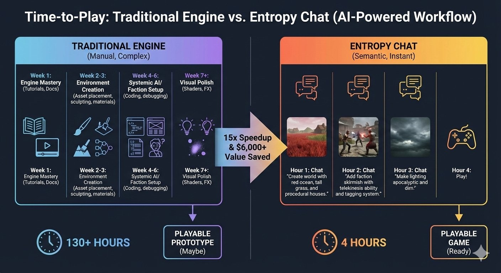

# Entropy Engine

Lightweight, powerful, sophisticated

- Shift from grunt work to creative leadership
- Command and coordinate your creative work through a centralized, agentic chat
- Built for the modern LLM-powered era with a semantic-first architecture

What’s included

- End-to-end game creation tools
- Video capture and editing tools
- Pre-built functionality with no plugins required
- Native integration across tools for a unified workflow

Why it matters

- Replace fragmented tools with a single intelligent system
- Instant cost savings upon adoption
- Continued efficiency gains as your business grows
- Compounding ROI through automation, reuse, and semantic coherence

## Run

Many controls exist in the level editor, while others have not been added, so you may wish to update the saved state json file directly and place files in the project folder directly.

Example Saved State JSON file to get you started:
<a href="./example_project.json" target="_blank">example_project.json</a>

Generate a Landscape Heightmap via CLI:
- `cargo run --bin heightmap --release`

Note: For now, if you're just getting started, you can go ahead and use the heightmap.png for the soilmap and rockmap as well. Then for the PBR textures, just fetch them from somewhere like Poly Haven.

Level Editor: 
- `cargo run --bin editor --release`

Example Game:
- `cargo run --bin game --release` (needs your game files to run)

## Features

### Current Features:

These are mostly hardcoded in Rust, but should ultimately be controllable via the Addon Scripts.

- GLB (gltf) Import
- GLB (gltf) animations
- Physics with Rapier
- Shadow Mapping
- Magic particle effects (ex. fire from heavens, snow, etc)
- JavaScript Scripting (for game mechanics and behaviors, not just for creating addons themselves)
- Professional transform gizmo (as well as egui inputs)
- Rendered images and videos
- Rendered text with fonts
- In-Game UI Pipeline
- Procedural scattering of models
- Mini-Map
- Screen capture
- Vector animations
- Video export
- Do level design via LLM powered chat
- Wry webview embed for advanced rich text editing

### Current Mechanics

These are hardcoded in Rust currently but should be enabled by Game Scripts (not Addon Scripts).

- Basic game behaviors (melee, chase, inventory, quests, etc)
- Sprinting/Stamina
- Dialogue (integrates with UI and scripting)
- Aiming (with crosshair ui), ammo, and reloading
- NPC Swarm Systems
- Enemy looting
- Procedural recoil for ranged weapons
- Ranged weapon types (manual, semi-automatic, automatic)

### Currently Available In The Default Addon Bundle

The default addon bundle is automatically loaded in for all users without any need to download or install.

- Interactive, windy, hair particles (grass)
- Deferred rendering / lighting
- PBR Materials and Creation
- Water Planes
- Quadtree landscapes with texture maps
- Skybox Pipeline
- Point lighting
- Heightmap creation CLI (specify features and flat areas too)

### Future Plans

I have been developing a comprehensive addon engine which enables the creation of high performance addons using JavaScript. All the stuff will
become addons actually. The whole goal is to have an addon for everything, and the Rust is just the engine for that.
The addons have replicated and enhanced several existing features from water planes to hair particles.
Next, I will need to make sure addons work for everything, so they are powerful can be quickly iterated on.