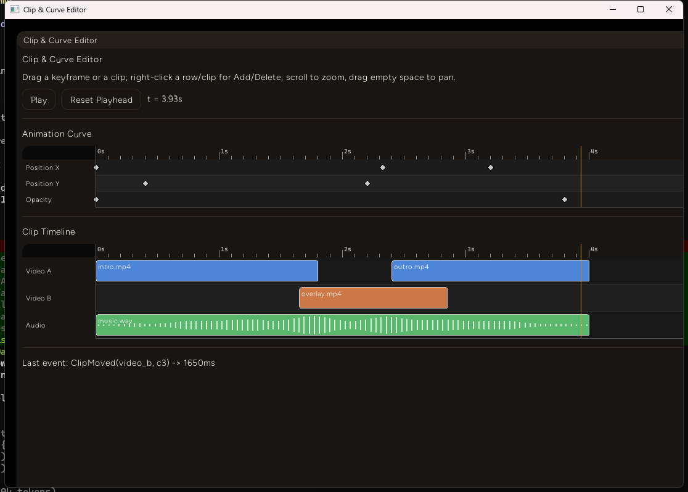
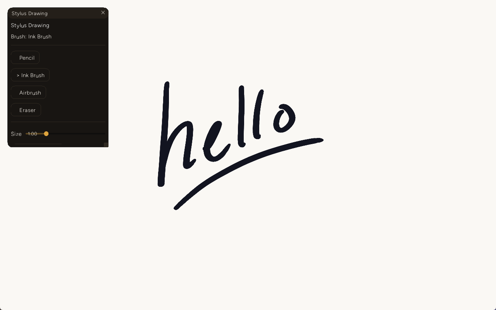
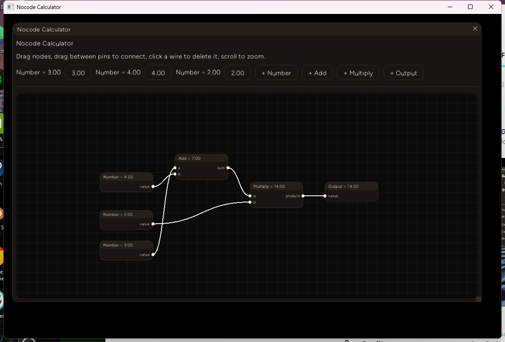

# Entropy Engine

**A native Rust + TypeScript app framework** — zero-copy without the WebView/Chromium overhead. The Rust core handles windowing, rendering, physics and audio; your TypeScript addons handle logic, UI and content, running in an embedded [Deno](https://deno.com/) runtime with direct access to a powerful native API.

**Entropy Engine is experimental and in beta, and some things may not work as expected**

---

## Embedding Quickstart

1. `cargo new my_app` and add `entropy-engine` as a dependency.
2. Write your app's logic as one or more addons (see [Writing Addons](#writing-addons)), and bundle it with Deno:
   ```bash
   mkdir -p dist
   deno bundle src/index.ts > dist/bundle.js
   ```
   (`>` won't create a missing `dist/` directory for you - make sure it exists first.)
3. Point your Rust `main.rs` at the bundle:
   ```rust
   fn main() {
       entropy_engine::EntropyApp::new()
           .with_bundle("dist/bundle.js")
           .run()
           .expect("Couldn't run app");
   }
   ```

No project picker, no forced data model. Your addons persist their own data under a directory you control with `.with_data_dir(...)` (defaults to `./data`) — see [Persisting your own data](#persisting-your-own-data).

Currently, Entropy has only been tested on Windows machines. Mac and Linux support coming soon.

Build sessions on this engine - what actually worked, what fought back, real numbers from real runs - get written up on [Indie Machine](https://indie-machine.com), a Rust-centric build log. Recent entries: [FFT ocean water via wgpu compute](https://indie-machine.com/posts/fft-ocean-water), [replacing egui with an in-house immediate-mode GUI kit](https://indie-machine.com/posts/replacing-egui-with-entropy-gui), and [building a Media Foundation-backed media player addon](https://indie-machine.com/posts/entropy-media-player).

---

## Writing Addons

Everything you build — game logic, UI panels, custom render pipelines, procedural content — is a TypeScript **addon**. An addon registers itself once, then reacts to lifecycle hooks and calls into the native `Entropy` API.

```ts
const addon = Entropy.Addon.register({
  name: "my-addon",
  version: "0.1.0",
  description: "Spawns a cube and reacts to the frame loop",
});

addon.onInit(() => {
  Entropy.Model.createProcedural({ type: "cube" });
});

addon.onUpdate((time, playerPos, playerDir) => {
  // runs every frame
});

addon.onCleanup(() => {
  // torn down when the addon unloads
});
```

### Lifecycle hooks

The object `Entropy.Addon.register()` returns:

| Hook | Fires |
|---|---|
| `onInit(fn)` | Once, right after your addon registers |
| `onAllAddonsInitialized(fn)` | Once every addon in the bundle has registered |
| `onUpdate(fn)` / `onUpdatePlus(addonName, fn)` | Every frame, with `(time, playerPos, playerDir)` |
| `onAction(fn)` | On a dispatched game action (attack, interact, ...) |
| `onCleanup(fn)` | When the addon unloads |

### Persisting your own data

There's no "project" concept for an embedded app — addons own their persistence directly, under whatever directory you passed to `.with_data_dir(...)` (or `./data` by default):

- `addon.IO.save(data)` / `addon.IO.load()` — one JSON file per addon, named after it.
- `addon.GameState.save(key, data)` / `addon.GameState.load(key)` — shared state under any key you choose, readable by any addon.
- `addon.Scripts.read(filename)` / `addon.Scripts.write(filename, content)` — plain text files.

Pick whatever filenames make sense for your app — `projects.json`, `save1.json`, `settings.json` — the directory is yours.

### The API surface

Namespaces on the global `Entropy` object (most are also available scoped to your addon on the object `Addon.register()` returns). Full typed signatures live in [`addon.d.ts`](./examples/studio-bundle/src/addon.d.ts) — paste it into an LLM for reliable addon code generation, or reference it directly in an editor with TS support.

| Namespace | For |
|---|---|
| `Model`, `Visual`, `Mesh` | Load GLB/GLTF models, spawn procedural/custom meshes, edit geometry live |
| `Landscape`, `Landscape3D`, `Quadscape`, `Noise` | Heightmap terrain, 3D landscapes, procedural noise fields |
| `Pipeline`, `Compute`, `Buffer`, `Texture` | Custom WGSL render/compute pipelines, GPU buffers and textures |
| `UI`, `UI.Widget` | Windows, tabs, HUD drawing, and widgets (buttons, sliders, code editor, node graph, piano roll, minimap, ...) |
| `Audio` | Synth playback, one-shot notes and drum voices |
| `Behavior`, `Entity` | Reusable per-entity behavior hooks, transforms, impulses, stats |
| `Input`, `Camera`, `Gizmo`, `Selection` | Keyboard/mouse/gamepad, camera control, 3D manipulation gizmos, mesh selection |
| `Particles`, `Lighting` | Hair/grass particle fields, point lights, procedural sky |
| `Yumon` | Imitation-learning NPC brains — train by demonstration instead of hand-authoring behavior trees |
| `Composer` | Register reusable games/editors/renderers that other addons (or Studio) can look up by name |

---

## Examples

Check out some examples in isolation!

All studio-bundle examples share one binary - pass the example's name as an arg:

```bash
cd examples/studio-bundle/

npm run build-daw
cargo run --bin example --release -- daw

npm run build-fft-water
cargo run --bin example --release -- fft-water

npm run build-fft-river
cargo run --bin example --release -- fft-river
```

Run `cargo run --bin example` with no name for the full list (also: `game2d`,
`level-editor-2d`, `light-hive`, `mcp-tools-demo`, `media-player`, `node-graph`,
`theme-gallery`).

---

## Gallery

| | |
|-|-|
|  |  |
|  |  |
|  | |

## MCP

```bash
claude mcp add --transport http entropy-engine http://127.0.0.1:47100/mcp
```

All tools registered with `registerTool` in an addon will be accessible via MCP, simply startup your app, and the MCP server will be active as well.