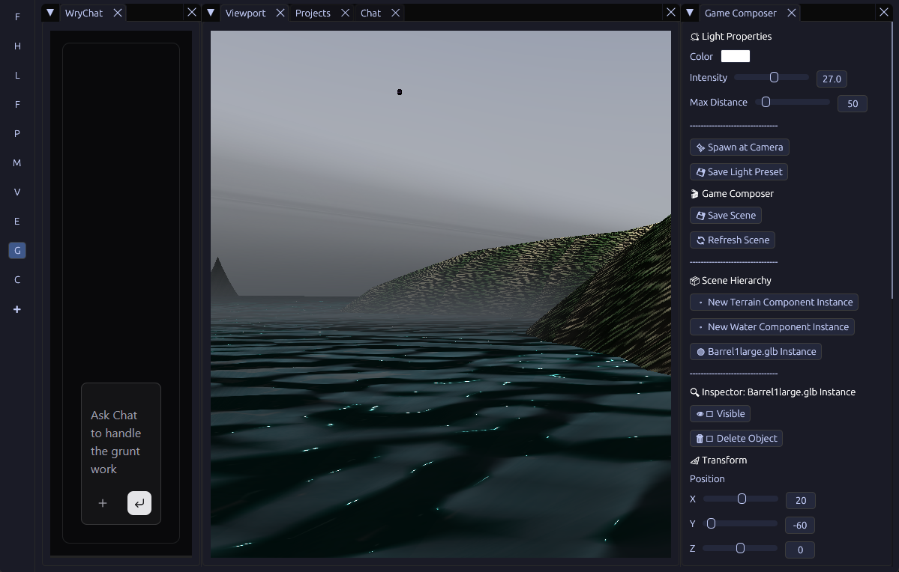
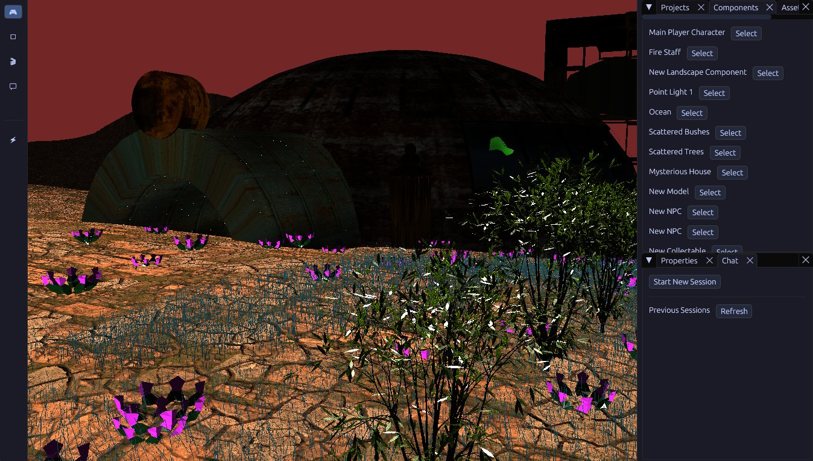

# Entropy Engine

Lightweight, powerful, sophisticated. End-to-end game creation suite. Texture creation, audio creation, model creation - not to mention level design. 
Entropy Engine provides you with a suite of first-class, high-performance addons, tied together by a universal chat.
Entropy Engine helps you create professional games and creative content with next-generation technology.

- Shift from grunt work to creative leadership
- Command and coordinate your creative work through a centralized, agentic chat
- Built for the modern LLM-powered era with a semantic-first architecture

What’s included

- End-to-end game creation tools
- Video capture and editing tools
- Pre-built functionality with no extra plugins required
- Native integration across tools for a unified workflow

Why it matters

- Replace fragmented tools with a single intelligent system
- Instant cost savings upon adoption
- Continued efficiency gains as your business grows
- Compounding ROI through automation, reuse, and semantic coherence

## Getting Started

It is recommended to read the Entropy Book to get started: 
[Entropy Book](./public/entropy-book/src/SUMMARY.md)

There is an [example FPS-RPG game](./scripts/addons/studio-bundle/src/fps_rpg_game.ts) and an [example tower defense game](./scripts/addons/studio-bundle/src/tower_defense_game.ts) as well, which should make getting started much easier.

You can supply the [Rust-powered JavaScript addon API](./scripts/addons/studio-bundle/src/addon.d.ts) to an LLM to generate games and addons for this engine with incredible ease. Although to load an addon, it will need to be a bundle JavaScript file.

## Features

### Current Features:

- GLB (gltf) Import
- GLB (gltf) animations
- Physics with Rapier
- Shadow Mapping
- Magic particle effects (ex. fire from heavens, snow, etc)
- JavaScript Scripting (for game mechanics and behaviors, not just for creating addons themselves)
- Professional transform gizmo (as well as egui inputs)
- Rendered images and videos
- Rendered text with fonts
- In-Game UI Pipeline
- Procedural scattering of models
- Mini-Map
- Screen capture
- Vector animations
- Video export
- Do level design via LLM powered chat
- Wry webview embed for advanced rich text editing

### Current Mechanics

These are hardcoded in Rust currently but should be enabled by Game Scripts (not Addon Scripts).

- Basic game behaviors (melee, chase, inventory, quests, etc)
- Sprinting/Stamina
- Dialogue (integrates with UI and scripting)
- Aiming (with crosshair ui), ammo, and reloading
- NPC Swarm Systems
- Enemy looting
- Procedural recoil for ranged weapons
- Ranged weapon types (manual, semi-automatic, automatic)

### Currently Available In The Default Addon Bundle

The default addon bundle is automatically loaded in for all users without any need to download or install.

- Interactive, windy, hair particles (grass)
- Deferred rendering / lighting
- PBR Materials and Creation
- FFT Water Planes
- Quadtree landscapes with texture maps
- Skybox Pipeline
- Point lighting
- Heightmap creation CLI (specify features and flat areas too)

### How to approach addons

This addon will act as the "Source of Truth". It should:

* Register a Component: Use Entropy.Composer.registerComponent so point lights show up in the Game Composer's library.
* Register a Renderer: Provide a function that calls addon.Lighting.createPointLight, Model.createMesh, or similar (using the _transform passed by the Composer).
* Register an Editor: Use Entropy.Composer.registerEditor to provide the UI for various properties, possibly setting uniforms or clearing and recreating meshes.
* Register your tools: Use addon.registerTool to add a handler for LLMs to use via the universal chat

More info is in the [documentation](./public/entropy-book/src/SUMMARY.md)