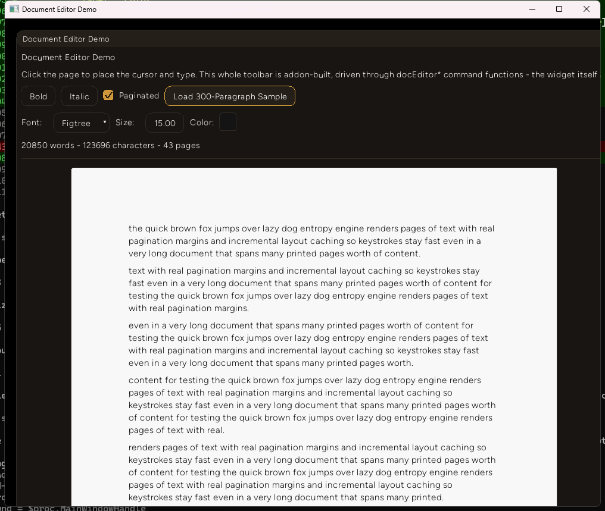

# Entropy Engine

**A native Rust + TypeScript app framework** — zero-copy without the WebView/Chromium overhead. The Rust core handles windowing, rendering, physics and audio; your TypeScript addons handle logic, UI and content, running in an embedded [Deno](https://deno.com/) runtime with direct access to a powerful native API.

**Entropy Engine is experimental and in beta, and some things may not work as expected**

---

## Embedding Quickstart

1. `cargo new my_app` and add `entropy-engine` as a dependency.
2. Write your app's logic as one or more addons (see [Writing Addons](#writing-addons)), and bundle it with Deno:
   ```bash
   mkdir -p dist
   deno bundle src/index.ts > dist/bundle.js
   ```
   (`>` won't create a missing `dist/` directory for you - make sure it exists first.)
3. Point your Rust `main.rs` at the bundle:
   ```rust
   fn main() {
       entropy_engine::EntropyApp::new()
           .with_bundle("dist/bundle.js")
           .run()
           .expect("Couldn't run app");
   }
   ```

No project picker, no forced data model. Your addons persist their own data under a directory you control with `.with_data_dir(...)` (defaults to `./data`) — see [Persisting your own data](#persisting-your-own-data).

Currently, Entropy has only been tested on Windows machines. Mac and Linux support coming soon.

Build sessions on this engine - what actually worked, what fought back, real numbers from real runs - get written up on [Indie Machine](https://indie-machine.com), a Rust-centric build log. Recent entries: [FFT ocean water via wgpu compute](https://indie-machine.com/posts/fft-ocean-water), [replacing egui with an in-house immediate-mode GUI kit](https://indie-machine.com/posts/replacing-egui-with-entropy-gui), and [building a Media Foundation-backed media player addon](https://indie-machine.com/posts/entropy-media-player).

---

## Writing Addons

Everything you build — game logic, UI panels, custom render pipelines, procedural content — is a TypeScript **addon**. An addon registers itself once, then reacts to lifecycle hooks and calls into the native `Entropy` API.

```ts
const addon = Entropy.Addon.register({
  name: "my-addon",
  version: "0.1.0",
  description: "Spawns a cube and reacts to the frame loop",
});

addon.onInit(() => {
  Entropy.Model.createProcedural({ type: "cube" });
});

addon.onUpdate((time, playerPos, playerDir) => {
  // runs every frame
});

addon.onCleanup(() => {
  // torn down when the addon unloads
});
```

### Lifecycle hooks

The object `Entropy.Addon.register()` returns:

| Hook | Fires |
|---|---|
| `onInit(fn)` | Once, right after your addon registers |
| `onAllAddonsInitialized(fn)` | Once every addon in the bundle has registered |
| `onUpdate(fn)` / `onUpdatePlus(addonName, fn)` | Every frame, with `(time, playerPos, playerDir)` |
| `onAction(fn)` | On a dispatched game action (attack, interact, ...) |
| `onCleanup(fn)` | When the addon unloads |

### Persisting your own data

There's no "project" concept for an embedded app — addons own their persistence directly, under whatever directory you passed to `.with_data_dir(...)` (or `./data` by default):

- `addon.IO.save(data)` / `addon.IO.load()` — one JSON file per addon, named after it.
- `addon.GameState.save(key, data)` / `addon.GameState.load(key)` — shared state under any key you choose, readable by any addon.
- `addon.Scripts.read(filename)` / `addon.Scripts.write(filename, content)` — plain text files.

Pick whatever filenames make sense for your app — `projects.json`, `save1.json`, `settings.json` — the directory is yours.

### The API surface

Everything below lives on the global `Entropy` object, and most of it is also available pre-scoped to your addon on the object `Addon.register()` returns (so you can write `addon.Model.load(...)` instead of `Entropy.Model.load(...)`). Full typed signatures live in [`addon.d.ts`](./examples/studio-bundle/src/addon.d.ts) — paste it into an LLM for reliable addon code generation, or reference it directly in an editor with TS support.

This section describes every namespace in plain language. Click a heading to expand it.

#### Table of contents

- [Addons, lifecycle & behaviors](#addons-lifecycle--behaviors)
- [Models, meshes & visuals](#models-meshes--visuals)
- [Terrain & procedural world](#terrain--procedural-world)
- [Custom rendering & GPU compute](#custom-rendering--gpu-compute)
- [UI windows & widgets](#ui-windows--widgets)
- [Input, camera & controls](#input-camera--controls)
- [Audio](#audio)
- [Particles & lighting](#particles--lighting)
- [Gameplay systems](#gameplay-systems)
- [Persistence & files](#persistence--files)
- [Video](#video)
- [Networking](#networking)
- [Yumon (imitation-learning NPCs)](#yumon-imitation-learning-npcs)
- [Composer (cross-addon registry)](#composer-cross-addon-registry)
- [Utilities & misc](#utilities--misc)

<a id="addons-lifecycle--behaviors"></a>
<details>
<summary><strong>Addons, lifecycle & behaviors</strong></summary>

How addons register themselves, hook into the frame loop, and share reusable per-entity logic. (Frame-loop hooks like `onInit`/`onUpdate` are documented above in [Lifecycle hooks](#lifecycle-hooks) — this table covers the rest.)

| Call | What it does |
|---|---|
| `Addon.register(metadata)` | Registers your addon (name, version, description, which side panel category it shows up in) and hands back the scoped API object used throughout this doc as `addon`. |
| `AddonAtom.register(metadata)` | Same as `Addon.register`, for a lighter-weight "atom" addon (no full Studio tab lifecycle). |
| `Addon.onCleanup(fn)` / `Addon.setVisibility(name, visible)` | Global-scope versions of the per-addon cleanup hook and visibility toggle. |
| `registerTool(definition, callback)` | Exposes a function as an MCP tool (see [MCP](#mcp)) — external agents can call it by name over the network. |
| `getAddon(name)` | Looks up another addon's scoped API object by name, so addons can call into each other. |
| `Behavior.register(id, hooks)` | Registers a reusable behavior (`onUpdate`, `onInteract`, `onAttack`) under an id you can attach to any `Model`/`Visual` via `behaviorId`, instead of writing bespoke per-entity logic. |
| `Entity.applyImpulse` / `setVelocity` / `setXZVelocity` / `setRotation` | Physics nudges and direct transform sets for a spawned entity by id. |
| `Entity.playAnimation(id, name)` | Plays a named animation clip on a model that has one. |
| `Entity.setStats(id, { health, stamina })` | Overwrites an entity's health/stamina, e.g. from a behavior or UI panel. |

</details>

<a id="models-meshes--visuals"></a>
<details>
<summary><strong>Models, meshes & visuals</strong></summary>

Getting geometry on screen — whether it's a loaded `.glb` file, a hand-built mesh, or a procedural primitive — and editing that geometry after the fact.

| Call | What it does |
|---|---|
| `Model.load(config)` | Loads a `.glb`/`.gltf` file from your app's art assets directory, optionally with physics, player/NPC behavior, and a bone-animation rig. |
| `Model.createProcedural(config)` | Spawns a built-in primitive shape (currently `"cube"`) without needing a model file. *(Known gap: this currently renders nothing — see the Entropy engine notes for `Model.createMesh` as the working alternative.)* |
| `Model.createMesh(config)` | Spawns a mesh from raw vertex/index arrays you supply yourself — the go-to for addon-generated geometry (procedural shapes, imported data, generated terrain chunks). |
| `Model.clearMesh(id)` / `Model.clearMeshes()` | Removes one or all addon-spawned meshes. |
| `Model.setBoneTransform(config)` | Directly poses a single bone on a loaded, rigged model (position/rotation/scale), for hand animation or IK-style rigs. |
| `Visual.load(config)` | Like `Model.load`, but attaches a named, pre-registered visual (see `registerVisual`) instead of pointing at a file path. |
| `AlphaModel.load(config)` | Loads a model with alpha-blended (transparent) rendering — for glass, foliage, particles-as-meshes, etc. |
| `registerVisual` / `getVisual` / `getVisualProvider` | Registers a mesh + pipeline combo under a friendly name so `Visual.load`/`Model.load` can reference it by name instead of repeating shader/geometry wiring everywhere. |
| `Mesh.getData(id)` | Reads back a mesh's live vertex/index buffers, e.g. for physics or custom collision. |
| `Mesh.updateVertices` / `appendGeometry` / `removeGeometry` | Edits a mesh's geometry live at runtime — move vertices, add faces, delete faces — for sculpting tools or destructible geometry. |
| `Mesh.getVertexWorldPosition` / `recalculateNormals` | Reads one vertex's world-space position, or recomputes lighting normals after an edit. |
| `Selection.setMode(mode)` | Switches what a click selects: vertex, edge, face, or whole object — for building modeling/editing tools. |
| `Selection.getSelected` / `raycast` / `highlightElements` / `clear` | Reads the current selection, casts a screen-space ray into the scene to pick something, highlights elements, or clears selection. |
| `Gizmo.show(config)` / `hide` / `updatePosition` / `getState` | Shows a draggable 3D manipulation handle (translate/rotate/scale) on an object, for level-editor-style tools. |

</details>

<a id="terrain--procedural-world"></a>
<details>
<summary><strong>Terrain & procedural world</strong></summary>

Heightmap terrain, arbitrary 3D landscapes, and the noise fields used to generate them.

| Call | What it does |
|---|---|
| `Landscape.create(config)` | Builds a heightmap terrain mesh from either raw height data or a generated noise field, at a given resolution and world size. |
| `Landscape.updateTexture` / `updatePbrTexture` | Swaps in a new ground texture (diffuse/mask, or a full PBR normal + AO-roughness-metallic set) for one of the terrain's material layers (primary/rockmap/soil). |
| `Landscape.getHeightAt(x, z)` | Samples the terrain's height at a world-space point — for placing objects on the ground or driving gameplay logic. |
| `Landscape3D.create(config)` | Builds a terrain using 3D noise, creating unique underhangs, caves, and floating terrain pieces. |
| `Quadscape.create(config)` | An alternate landscape construction path using a quadtree mesh instead of `Landscape`'s single mesh. |
| `Noise.create(config)` | Generates a procedural noise field (Perlin, fractal Brownian motion, etc.) you can feed into terrain heights or textures. |

</details>

<a id="custom-rendering--gpu-compute"></a>
<details>
<summary><strong>Custom rendering & GPU compute</strong></summary>

For addons that want to write their own WGSL shaders instead of using the engine's default PBR pipeline — custom render passes, compute shaders, and the buffers/textures that feed them.

| Call | What it does |
|---|---|
| `Pipeline.create(config)` | Compiles a custom vertex/fragment WGSL shader pair into a render pipeline you can attach to any mesh via `pipelineId`. |
| `Pipeline.createCompute(config)` | Compiles a WGSL compute shader into a dispatchable pipeline. |
| `Compute.dispatch(config)` | Runs a compute pipeline over a given workgroup count, with whatever buffer/texture bindings it needs. |
| `Buffer.create(config)` / `Buffer.write(id, data)` | Allocates a raw GPU buffer (uniform/storage/vertex/index) and uploads data into it — the building block for feeding custom shaders. |
| `Texture.create` / `createStorage` / `createEx` | Creates a GPU texture from raw pixel data, as a writable storage texture, or with full format/usage control. |
| `Texture.update(id, data)` | Overwrites an existing texture's pixels — for procedurally-generated or video-fed textures. |
| `Texture.load(filename)` | Loads a texture from an image file. |
| `Composite.register(name, outputTexId, pipelineId, bindings)` | Registers a full-screen compositing pass (e.g. combining multiple render targets into one final image). |

</details>

<a id="ui-windows--widgets"></a>
<details>
<summary><strong>UI windows & widgets</strong></summary>

Entropy's own immediate-mode GUI kit (`entropy_gui`) — every panel, tool window, and HUD element an addon draws is built from these calls, redeclared each frame.

| Call | What it does |
|---|---|
| `UI.createWindow(config)` / `UI.createTab(config)` | Opens a floating window or a tab within Studio's shell, returning an id you pass to every `Widget.*` call to draw into it. |
| `UI.drawRect` / `UI.drawText` | Draws a raw rectangle or text string directly in screen space — for HUD overlays outside the widget system. |
| `UI.clear()` | Clears drawn HUD elements. |
| `UI.setTheme(config)` | Overrides colors, corner radius, spacing, and padding for your addon's UI — every field optional, unset ones fall back to the default theme. |
| `UI.selectDialogueOption(index)` | Programmatically picks a dialogue-tree option (see `DialogueSystem` under Behaviors). |
| `Widget.label` / `button` / `checkbox` | Basic text, click, and boolean-toggle widgets. |
| `Widget.slider` / `numericInput` | Drag-to-adjust and type-a-number inputs for numeric values. |
| `Widget.dropdown` | A select-one-of-N dropdown. |
| `Widget.colorInput` | An RGBA color swatch/cycler. |
| `Widget.textInput` | A single-line text field. |
| `Widget.hyperlink` | A clickable link-styled label that opens a URL. |
| `Widget.codeEditor` | A syntax-aware multiline code editor panel. |
| `Widget.miniMap` | A top-down map view with draggable brush painting, markers, and polylines — used for terrain/mask painting tools. |
| `Widget.snarl` | A node-graph editor (drag nodes, wire connections) for visual behavior/logic graphs. |
| `Widget.pianoRoll` | A step-sequencer grid for note/drum patterns, with a movable playhead. |
| `Widget.keyframeTimeline` | A per-property animation curve editor: draggable keyframes on a scrubbable timeline. |
| `Widget.tracks` | A multi-track clip editor (like a video/audio timeline) with draggable, resizable clips. |
| `Widget.docEditor` + `docEditorToggleBold/Italic`, `docEditorSetFontFamily/Size/Color`, `docEditorSetPaginated`, `docEditorLoadSample`, `docEditorFontNames` | A real multi-page word-processor widget — paginated or continuous, mixed bold/italic/font/size/color per run of text. The document text lives natively on the Rust side (not round-tripped as JSON every frame); you build your own toolbar out of ordinary widgets and drive formatting with the `docEditor*` calls. |
| `Widget.html(windowId, html, options)` | Renders an HTML string (with `<style>`/inline CSS) as real, laid-out UI — block/flex layout, inherited text color, images — no JavaScript is ever executed. Useful for showing fetched web content or writing UI as markup instead of widget calls. |
| `Widget.collapsingHeader` / `horizontal` / `separator` | Layout helpers: an expandable section, a left-to-right row, and a visual divider. |

</details>

<a id="input-camera--controls"></a>
<details>
<summary><strong>Input, camera & controls</strong></summary>

Reading raw input, moving the camera, and ready-made camera control schemes so you don't have to hand-roll orbit/pan math.

| Call | What it does |
|---|---|
| `Input.onMouseDown/Move/Up`, `onKeyDown/Up` | Subscribes to raw mouse/keyboard events; each returns an unsubscribe function. |
| `Input.onGamepadButton` / `onGamepadAxis` | Subscribes to gamepad button presses and stick positions. |
| `Input.onStylusDown/Move/Up` | Subscribes to real pressure + tilt pen/stylus input (Windows only, genuine pen hardware — never fires for mouse or finger touch). |
| `Input.isKeyPressed` / `isCtrlPressed` / `isShiftPressed` / `isAltPressed` | One-shot polling checks instead of subscribing to events. |
| `Input.isPointerOverUI()` | True if the cursor is over an Entropy UI window/widget right now — check this before treating a click as a world/game interaction, since UI and world input aren't otherwise mutually exclusive. |
| `Camera.getTransform` / `setTransform` | Reads or sets the camera's position and look-at target directly. |
| `Camera.setOrthographic(enabled, viewHeight)` | Switches between perspective and true orthographic projection (constant apparent size regardless of depth) — for 2D-style or isometric views. |
| `Camera.screenToWorldRay(x, y)` | Converts a screen pixel coordinate into a world-space ray, for click-to-pick logic. |
| `Controls.enable("orbit" \| "pan", options)` | Turns on a ready-made camera control scheme (shift-drag-to-orbit, drag-to-pan, configurable trigger/buttons/speed/pitch limits) instead of wiring `Input` events and spherical math yourself. |
| `Controls.disable` / `isEnabled` / `getFormat` | Turns controls off, or checks what's currently active. |

</details>

<a id="audio"></a>
<details>
<summary><strong>Audio</strong></summary>

| Call | What it does |
|---|---|
| `Audio.playSynth(config)` | Plays a synthesized waveform (sine/square/saw/noise) with a frequency, duration, filter cutoff, and gain — quick one-shot sound effects with no audio files. |
| `Audio.playNote(config)` | Like `playSynth`, but with a full ADSR envelope (attack/decay/sustain/release), resonance, and named drum voices (kick/snare/hihat/clap/tom) — built for music/rhythm tools like the piano roll widget. |
| `Audio.playTestTone()` | Plays a fixed test tone, useful for confirming audio output is wired up at all. |

</details>

<a id="particles--lighting"></a>
<details>
<summary><strong>Particles & lighting</strong></summary>

| Call | What it does |
|---|---|
| `Particles.createHair(config)` | Spawns a field of grass/hair-style particles (grid size, blade height/width/density, wind strength/speed, brownian jitter, base/tip color) simulated on the GPU. |
| `Lighting.createPointLight(config)` | Creates or updates (by `id`) a point light — position, color, intensity, falloff, specular strength. |
| `Lighting.removePointLight(id)` | Despawns a point light. |
| `Lighting.updateSun(config)` | Configures the procedural sky/sun: horizon and zenith color, sun direction, color, and intensity. |
| `Lighting.setPointLightShader(wgslSource)` | Replaces the built-in point-light shading function with your own WGSL — validated before swap-in, so a broken shader is rejected instead of crashing the app. Call with no argument to reset to default. |
| `Lighting.configureShadows(config)` | Tunes the directional light's shadow map: resolution, depth bias, slope scale, and covered area. Point lights don't cast shadows. |

</details>

<a id="gameplay-systems"></a>
<details>
<summary><strong>Gameplay systems</strong></summary>

Small, ready-made systems for common game mechanics, so you don't have to build inventory/quest/pickup logic from scratch.

| Call | What it does |
|---|---|
| `Collectable.create(config)` | Spawns a pickup (health/ammo/quest item/currency) at a position with a model and value, firing a callback when a player collects it. |
| `Collectable.remove(id)` | Despawns a pickup. |
| `Quest.create(id, config)` | Registers a quest with a title and a list of objectives. |
| `Quest.updateObjective` / `getStatus` | Marks an objective complete, or reads a quest's current state. |
| `Inventory.addItem` / `removeItem` / `hasItem` | Basic per-player item stack management. |
| `Humanoid.create()` | Creates a procedural humanoid character instance. |

</details>

<a id="persistence--files"></a>
<details>
<summary><strong>Persistence & files</strong></summary>

There's no built-in "project" concept — addons own their save data directly under whatever directory you passed to `.with_data_dir(...)` (see [Persisting your own data](#persisting-your-own-data) above for the full picture).

| Call | What it does |
|---|---|
| `IO.save(data)` / `IO.load()` | Saves/loads one JSON file per addon, named after your addon automatically. |
| `IO.saveImage(filename, width, height, data)` | Writes raw pixel data out as an image file. |
| `IO.listModels()` / `pickAndImportModel()` | Lists available model files, or opens a native file picker to import a new one. |
| `GameState.save(key, data)` / `GameState.load(key)` | Shared state under any key you choose, readable by any addon in the bundle — for data that needs to cross addon boundaries. |
| `Scripts.list()` / `read(filename)` / `write(filename, content)` | Reads/writes plain text files (scripts, configs, logs) in your addon's data directory. |

</details>

<a id="video"></a>
<details>
<summary><strong>Video</strong></summary>

Windows/Media Foundation-only. Playback and offscreen export, both backed by real hardware decode/encode.

| Call | What it does |
|---|---|
| `Video.open(path)` | Opens a video file, returning a handle plus its duration, dimensions, and frame rate. |
| `Video.bindTexture(handle, textureId)` | Streams decoded video frames into a texture you can render on any mesh/sprite. |
| `Video.play` / `pause` / `seek` / `setVolume` / `close` | Standard playback transport controls. |
| `Video.poll(handle)` | Reads current playback position and play/pause state. |
| `Video.export(config)` | Renders your addon's current scene offscreen and encodes it to an H.264 MP4 at a given fps/duration. Returns immediately — export advances one frame per real render frame, so the window and your addon's own update loop keep running throughout instead of freezing. |
| `Video.pollExport()` | Polls for export progress/completion — output path, frames captured so far, elapsed time, or an error. |

</details>

<a id="networking"></a>
<details>
<summary><strong>Networking</strong></summary>

| Call | What it does |
|---|---|
| `Net.getText(url)` | Fetches a URL's raw text (e.g. a webpage's HTML) — a single blocking call, meant to be made once (like from `onInit`) and cached, since calling it from a per-frame render callback stalls that frame. Commonly paired with `UI.Widget.html` to render a real fetched page. |

</details>

<a id="yumon-imitation-learning-npcs"></a>
<details>
<summary><strong>Yumon (imitation-learning NPCs)</strong></summary>

An alternative to hand-authored behavior trees: NPCs whose behavior is trained from demonstrated examples instead of scripted logic.

| Call | What it does |
|---|---|
| `Yumon.create(name)` | Creates a new Yumon-driven NPC brain by name. |
| `Yumon.tick(name)` | Advances the NPC one step, returning its current state (position, battery, health, stamina, boredom, storage, last action). |
| `Yumon.sleep(name)` | Pauses/rests the NPC. |
| `Yumon.brain.create(id, archetype)` | Creates a brain of a given archetype (a predefined behavior/model family). |
| `Yumon.brain.observe(...)` | Feeds the brain one training example: world state, self state, action taken, rotation, and the reward it earned — this is how you "demonstrate" instead of script. |
| `Yumon.brain.infer(id)` / `testInfer(arch, context)` | Asks the trained brain what action it would take given the current context. |
| `Yumon.brain.sleep(id, epochs)` | Runs a training pass over accumulated observations for a number of epochs. |
| `Yumon.brain.save(id)` / `load(archetype)` | Persists or restores a trained brain. |
| `Yumon.brain.getState(id)` | Reads training diagnostics: current loss, epoch, whether it's actively training, and more. |
| `Yumon.brain.augment(id)` | Augments the training set (e.g. synthetic variations) to improve generalization. |

</details>

<a id="composer-cross-addon-registry"></a>
<details>
<summary><strong>Composer (cross-addon registry)</strong></summary>

A lookup registry so addons (or Studio itself) can find and use each other's editors, renderers, and games by name, without importing each other directly.

| Call | What it does |
|---|---|
| `Composer.registerEditor` / `getEditor` | Registers a render function as "the editor UI for addon X" so Studio (or another addon) can look it up and embed it. |
| `Composer.registerRenderer` / `getRenderer` | Registers a named render function other code can invoke by id. |
| `Composer.registerGame` / `getGame` | Registers a full game/mode by name so it can be launched generically. |
| `Composer.registerTextureGenerator` / `getTextureGenerator` | Registers a function that procedurally generates a PBR texture set (diffuse/normal/ARM) given parameters and a resolution. |
| `Composer.registerComponent` / `getComponents` | Registers a reusable "component" definition (a named bundle of parameters) other addons can instantiate. |
| `Composer.registerInstance` / `getInstances` | Registers/reads a specific instance of a component with its own defaults. |
| `Composer.registerAction` / `getAction` | Registers an arbitrary named function other addons can call by `(addonName, actionName)`. |
| `Composer.getNPCs` / `updateNPCPosition` | Reads all registered NPCs' positions, or moves one. |
| `Composer.setRolePipeline(role, pipelineId)` | Assigns a custom render pipeline to a semantic role (e.g. "player", "terrain") instead of a specific mesh. |
| `Composer.enableOverride` / `disableOverride` / `enableGameComposerOverride` / `disableGameComposerOverride` | Lets one addon temporarily take over rendering/control from Studio's default composition. |
| `Composer.setGlobalSettings` / `getGlobalSettings` | Reads/writes app-wide settings (currently: global landscape size/height/offset) shared across addons. |

</details>

<a id="utilities--misc"></a>
<details>
<summary><strong>Utilities & misc</strong></summary>

| Call | What it does |
|---|---|
| `println(msg)` | Logs a message from your addon's JS runtime out to the Rust console. |
| `generateUUID()` | Generates a UUID — required for any `id` field that must be UUID-parseable (e.g. `Model.load`'s `id`). |
| `Window.getSize()` | Returns the current window's pixel dimensions. |
| `setGameMode(enabled)` | Toggles whether the app is in "playing" mode vs. editing/authoring mode. |
| `onGameStarted(fn)` / `onGameStopped(fn)` | Fires when a named game (registered via `Composer.registerGame`) starts or stops. |
| `onProjectChanged(fn)` / `onAllProjectsLoaded(fn)` | Addon-scoped hooks that fire when the active project changes, or once every project in a multi-project setup has loaded. |

</details>

---

## Examples

Check out some examples in isolation!

All studio-bundle examples share one binary - pass the example's name as an arg:

```bash
cd examples/studio-bundle/

npm run build-daw
cargo run --bin example --release -- daw

npm run build-fft-water
cargo run --bin example --release -- fft-water

npm run build-fft-river
cargo run --bin example --release -- fft-river
```

Run `cargo run --bin example` with no name for the full list (also: `game2d`,
`level-editor-2d`, `light-hive`, `mcp-tools-demo`, `media-player`, `node-graph`,
`theme-gallery`).

---

## Gallery

| | |
|-|-|
|  |  |
|  |  |
|  |  |

## MCP

```bash
claude mcp add --transport http entropy-engine http://127.0.0.1:47100/mcp
```

All tools registered with `registerTool` in an addon will be accessible via MCP, simply startup your app, and the MCP server will be active as well.