# Welcome to Entropy

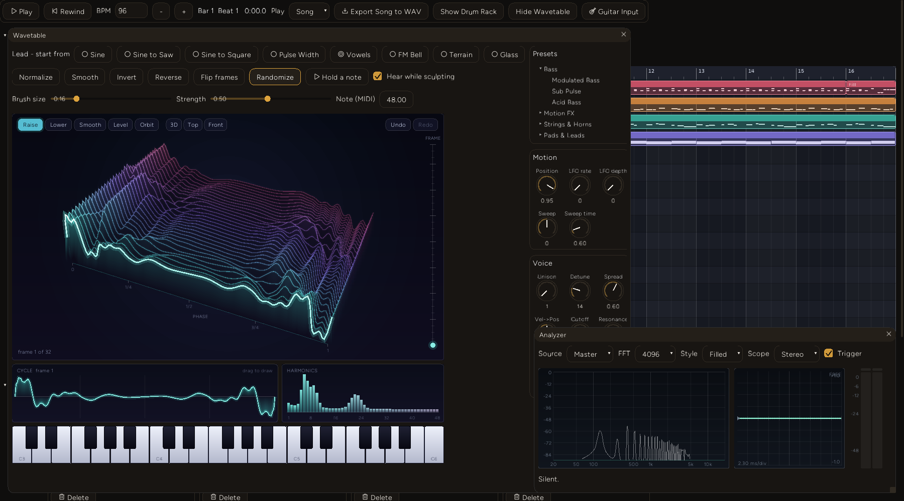

**Entropy Engine is a desktop software framework for high-performance, creative apps.** TypeScript without the WebView/Chromium overhead. The Rust core handles all of the intensive processing, while your TypeScript acts as a true scripting layer. Get access to a comprehensive native UI kit (including piano roll, kanban, timeline views), GPU, Video, and Audio capabilities, and unified input paradigms.

**Entropy Suite is the deep creation powerhouse.** Entropy Suite enables artists, writers, coders, and more to create using innovative, powerful, open source tooling. Built with Entropy Engine. See [Gallery](#gallery)

**Entropy Agent is the (upcoming) agentic marketing harness.** Entropy Agent logs and captures your creative sessions (creating games, music, writing, and more) and drafts content for you to share to drive your marketing outputs as you create. The key is to work on something original, novel, or new so that your content is equally as unique and helpful in the sea of content that exists today. TBD: connect webcam to capture physical creation sessions.

**Entropy is experimental and in beta, and some things may not work as expected**

|                          | React Native | Flutter | **Entropy** |
| ------------------------ | ------------ | ------- | ----------- |
| TypeScript               | **✓**        | —       | **✓**       |
| Native                   | **✓**        | **✓**   | **✓**       |
| Cross-platform UI        | **✓✓✓**      | **✓✓✓** | ✓           |
| GPU / rendering          | ✓            | ✓✓      | **✓✓✓**     |
| 3D                       | —            | △       | **✓✓✓**     |
| Physics                  | —            | △       | **✓✓✓**     |
| Audio                    | △            | △       | **✓✓✓**      |
| Game systems             | —            | △       | **✓✓✓**     |
| Creative-tool primitives | △            | ✓       | **✓✓✓**     |
| Low-level extensibility  | ✓            | ✓       | **✓✓✓**     |
| TypeScript productivity  | **✓✓✓**      | —       | **✓✓✓**     |
| Ecosystem                | **✓✓✓**      | **✓✓✓** | —           |

---

## Building Entropy and all example addons

From this directory, run `node scripts/build-all.mjs`. It builds the default Studio bundle first
(which Cargo embeds), then runs `cargo build` alongside all 23 standalone example addon bundles.
Extra arguments go to Cargo, for example `node scripts/build-all.mjs --release --locked`.
Set `ENTROPY_BUNDLE_JOBS` to change the number of simultaneous Deno bundle processes (default 3).
You can also run `npm run build:all -- --release` from `examples/studio-bundle`.

The command needs Node, Deno, Cargo, and the Studio bundle's installed npm dependencies.

## Embedding Quickstart

**Have production needs to extend the TypeScript API itself? Fork Entropy Engine and build new Rust components as needed.**

Building just a simple app or prototype? Need to use the existing API to build an app? Follow below:

1. `cargo new my_app` and add `entropy-engine` as a dependency.
2. Write your app's logic as one or more addons (see [Writing Addons](#writing-addons)), and bundle it with Deno:
   ```bash
   mkdir -p dist
   deno bundle src/index.ts > dist/bundle.js
   ```
3. Point your Rust `main.rs` at the bundle:
   ```rust
   fn main() {
       entropy_engine::EntropyApp::new()
           .with_bundle("dist/bundle.js")
           .run()
           .expect("Couldn't run app");
   }
   ```

No project picker, no forced data model. Your addons persist their own data under a directory you control with `.with_data_dir(...)` (defaults to `./data`) — see [Persisting your own data](#persisting-your-own-data).

Entropy is developed on Windows and now also builds and runs on Linux (tested on Ubuntu 24.04, X11) - see [Linux](#linux) for setup and for which features are still Windows-only. Mac support coming soon.

The [ML Graph demo](docs/ML_GRAPH_ARCHITECTURES.md) edits and trains Burn models through a node graph. Its architecture view includes executable LSTM, sparse MoE, and conditioned U-Net nodes, with small deterministic CPU training tasks for the Yumon NPC, Yumon Pet, and Mini-Pic presets. Run it with `cargo run --bin example -- ml-graph-demo`; use **Tiny Config** before training a reference preset.

[Guitar Tabs](docs/GUITAR_TABS.md) teaches a tab by playing it: paste an ASCII tab, check it in a spreadsheet, then play along while a neon fretboard shows where the fingers go and [Guitar-to-MIDI](docs/GUITAR_TO_MIDI.md) checks every note, at your own pace or in real time, switching between pick and chord detection as the song goes. Run it with `cargo run --bin example -- guitar-tabs`; no guitar needed to try it (click the neck).

Build sessions on this engine - what actually worked, what fought back, real numbers from real runs - get written up on [Indie Machine](https://indie-machine.com), a Rust-centric build log. Recent entries: [FFT ocean water via wgpu compute](https://indie-machine.com/posts/fft-ocean-water), [replacing egui with an in-house immediate-mode GUI kit](https://indie-machine.com/posts/replacing-egui-with-entropy-gui), and [building a Media Foundation-backed media player addon](https://indie-machine.com/posts/entropy-media-player).

---

## Writing Addons

Everything you build — game logic, UI panels, custom render pipelines, procedural content — is a TypeScript **addon**. An addon registers itself once, then reacts to lifecycle hooks and calls into the native `Entropy` API.

```ts
const addon = Entropy.Addon.register({
  name: "my-addon",
  version: "0.1.0",
  description: "Spawns a cube and reacts to the frame loop",
});

addon.onInit(() => {
  Entropy.Model.createProcedural({ type: "cube" });
});

addon.onUpdate((time, playerPos, playerDir) => {
  // runs every frame
});

addon.onCleanup(() => {
  // torn down when the addon unloads
});
```

### Lifecycle hooks

The object `Entropy.Addon.register()` returns:

| Hook | Fires |
|---|---|
| `onInit(fn)` | Once, right after your addon registers |
| `onAllAddonsInitialized(fn)` | Once every addon in the bundle has registered |
| `onUpdate(fn)` / `onUpdatePlus(addonName, fn)` | Every frame, with `(time, playerPos, playerDir)` |
| `onAction(fn)` | On a dispatched game action (attack, interact, ...) |
| `onCleanup(fn)` | When the addon unloads |

### Persisting your own data

There's no "project" concept for an embedded app — addons own their persistence directly, under whatever directory you passed to `.with_data_dir(...)` (or `./data` by default):

- `addon.IO.save(data)` / `addon.IO.saveDebounced(data, delayMs?)` / `addon.IO.load()` - one JSON file per addon, named after it.
- `addon.IO.store.read/write/list/remove(path)` — as many files as you need in the addon's own folder (`<data_dir>/<addon name>/`), with atomic writes. The DAW's song library is built on it.
- `addon.GameState.save(key, data)` / `addon.GameState.load(key)` — shared state under any key you choose, readable by any addon.
- `addon.Scripts.read(filename)` / `addon.Scripts.write(filename, content)` — plain text files.

Pick whatever filenames make sense for your app — `projects.json`, `save1.json`, `settings.json` — the directory is yours.

### The API surface

Everything below lives on the global `Entropy` object, and most of it is also available pre-scoped to your addon on the object `Addon.register()` returns (so you can write `addon.Model.load(...)` instead of `Entropy.Model.load(...)`). Full typed signatures live in [`addon.d.ts`](./examples/studio-bundle/src/addon.d.ts). Paste it into an LLM for reliable addon code generation, or reference it directly in an editor with TypeScript support.

This section describes every namespace in plain language. Click a heading to expand it.

#### Table of contents

- [Addons, lifecycle & behaviors](#addons-lifecycle--behaviors)
- [Models, meshes & visuals](#models-meshes--visuals)
- [Terrain & procedural world](#terrain--procedural-world)
- [Custom rendering & GPU compute](#custom-rendering--gpu-compute)
- [UI windows & widgets](#ui-windows--widgets)
- [Input, camera & controls](#input-camera--controls)
- [Audio](#audio)
- [VST3 instruments](#vst3-instruments)
- [Particles & lighting](#particles--lighting)
- [Persistence & files](#persistence--files)
- [Video](#video)
- [Networking](#networking)
- [Composer (cross-addon registry)](#composer-cross-addon-registry)
- [Utilities & misc](#utilities--misc)

<a id="addons-lifecycle--behaviors"></a>
<details>
<summary><strong>Addons, lifecycle & behaviors</strong></summary>

How addons register themselves, hook into the frame loop, and share reusable per-entity logic. Frame-loop hooks such as `onInit` and `onUpdate` are documented above in [Lifecycle hooks](#lifecycle-hooks); this table covers the rest.

| Call | What it does |
|---|---|
| `Addon.register(metadata)` | Registers your addon (name, version, description, which side panel category it shows up in) and hands back the scoped API object used throughout this doc as `addon`. |
| `AddonAtom.register(metadata)` | Same as `Addon.register`, for a lighter-weight "atom" addon (no full Studio tab lifecycle). |
| `Addon.onCleanup(fn)` / `Addon.setVisibility(name, visible)` | Global-scope versions of the per-addon cleanup hook and visibility toggle. |
| `registerTool(definition, callback)` | Exposes a function as an MCP tool (see [MCP](#mcp)); external agents can call it by name over the network. |
| `getAddon(name)` | Looks up another addon's scoped API object by name, so addons can call into each other. |
| `Behavior.register(id, hooks)` | Registers a reusable behavior (`onUpdate`, `onInteract`, `onAttack`) under an id you can attach to any `Model`/`Visual` via `behaviorId`, instead of writing bespoke per-entity logic. |
| `Entity.applyImpulse` / `setVelocity` / `setXZVelocity` / `setRotation` | Physics nudges and direct transform sets for a spawned entity by id. |
| `Entity.playAnimation(id, name)` | Plays a named animation clip on a model that has one. |
| `Entity.setStats(id, { health, stamina })` | Overwrites an entity's health/stamina, e.g. from a behavior or UI panel. |

</details>

<a id="models-meshes--visuals"></a>
<details>
<summary><strong>Models, meshes & visuals</strong></summary>

Getting geometry on screen, whether it is a loaded `.glb` file, a hand-built mesh, or a procedural primitive, and editing that geometry after the fact.

| Call | What it does |
|---|---|
| `Model.load(config)` | Loads a `.glb`/`.gltf` file from your app's art assets directory, optionally with physics, player/NPC behavior, and a bone-animation rig. |
| `Model.createProcedural(config)` | Spawns a built-in primitive shape (currently `"cube"`) without needing a model file. *(Known gap: this currently renders nothing; use `Model.createMesh` for working addon-generated geometry.)* |
| `Model.createMesh(config)` | Spawns a mesh from raw vertex/index arrays you supply yourself. It is the main route for procedural shapes, imported data, and generated terrain chunks. |
| `Model.clearMesh(id)` / `Model.clearMeshes()` | Removes one or all addon-spawned meshes. |
| `Model.setBoneTransform(config)` | Directly poses a single bone on a loaded, rigged model (position/rotation/scale), for hand animation or IK-style rigs. |
| `Visual.load(config)` | Like `Model.load`, but attaches a named, pre-registered visual (see `registerVisual`) instead of pointing at a file path. |
| `AlphaModel.load(config)` | Loads a model with the untested bindless renderer. |
| `registerVisual` / `getVisual` / `getVisualProvider` | Registers a mesh + pipeline combo under a friendly name so `Visual.load`/`Model.load` can reference it by name instead of repeating shader/geometry wiring everywhere. |
| `Mesh.getData(id)` | Reads back a mesh's live vertex/index buffers, e.g. for physics or custom collision. |
| `Mesh.updateVertices` / `appendGeometry` / `removeGeometry` | Edits a mesh's geometry live at runtime: move vertices, add faces, or delete faces for sculpting tools and destructible geometry. |
| `Mesh.writeVertices(id, firstVertex, vertices)` | Overwrites whole vertices (the 12-float `mesh` layout: position, normal, uv, color) from `firstVertex` on in one GPU write, for geometry animated every frame such as Mesha's simulated hair and cloth. |
| `Mesh.getVertexWorldPosition` / `recalculateNormals` | Reads one vertex's world-space position, or recomputes lighting normals after an edit. |
| `Selection.setMode(mode)` | Switches what a click selects: vertex, edge, face, or whole object for modeling and editing tools. |
| `Selection.getSelected` / `raycast` / `highlightElements` / `clear` | Reads the current selection, casts a screen-space ray into the scene to pick something, highlights elements, or clears selection. |
| `Gizmo.show(config)` / `hide` / `updatePosition` / `getState` | Shows a draggable 3D manipulation handle (translate/rotate/scale) on an object, for level-editor-style tools. |

</details>

<a id="terrain--procedural-world"></a>
<details>
<summary><strong>Terrain & procedural world</strong></summary>

Heightmap terrain, arbitrary 3D landscapes, and the noise fields used to generate them.

| Call | What it does |
|---|---|
| `Landscape.create(config)` | Builds a heightmap terrain mesh from either raw height data or a generated noise field, at a given resolution and world size. |
| `Landscape.updateTexture` / `updatePbrTexture` | Swaps in a new ground texture (diffuse/mask, or a full PBR normal + AO-roughness-metallic set) for one of the terrain's material layers (primary/rockmap/soil). |
| `Landscape.getHeightAt(x, z)` | Samples the terrain's height at a world-space point for placing objects on the ground or driving gameplay logic. |
| `Landscape3D.create(config)` | Builds a terrain using 3D noise, creating unique underhangs, caves, and floating terrain pieces. |
| `Quadscape.create(config)` | An alternate landscape construction path using a quadtree mesh instead of `Landscape`'s single mesh. |
| `QuadPlanet.create(config)` / `update` / `sample` | The same quadtree idea wrapped around whole planets, streamed on the Rust side: six cube-face quadtrees per planet, procedural terrain or real Earth elevation (SRTM-derived tiles), meshed straight into your pipeline within a triangle budget. `sample`/`normal`/`findLandingSite` query the ground the chunks are built from; `geocode`/`placeName` look places up on OpenStreetMap. See the [QuadPlanet example](#quadplanet) and [docs/QUADPLANET.md](docs/QUADPLANET.md). |
| `Noise.create(config)` | Generates a procedural noise field (Perlin, fractal Brownian motion, etc.) you can feed into terrain heights or textures. |

</details>

<a id="custom-rendering--gpu-compute"></a>
<details>
<summary><strong>Custom rendering & GPU compute</strong></summary>

For addons that want to write their own WGSL shaders instead of using the engine's default PBR pipeline: custom render passes, compute shaders, and the buffers and textures that feed them.

| Call | What it does |
|---|---|
| `Pipeline.create(config)` | Compiles a custom vertex/fragment WGSL shader pair into a render pipeline you can attach to any mesh via `pipelineId`. |
| `Pipeline.createCompute(config)` | Compiles a WGSL compute shader into a dispatchable pipeline. |
| `Compute.dispatch(config)` | Runs a compute pipeline over a given workgroup count, with whatever buffer/texture bindings it needs. |
| `Buffer.create(config)` / `Buffer.write(id, data)` | Allocates a raw GPU buffer (uniform/storage/vertex/index) and uploads data into it, the building block for feeding custom shaders. |
| `Texture.create` / `createStorage` / `createEx` | Creates a GPU texture from raw pixel data, as a writable storage texture, or with full format/usage control. |
| `Texture.update(id, data)` | Overwrites an existing texture's pixels for procedurally generated or video-fed textures. |
| `Texture.load(filename)` | Loads a texture from an image file. |
| `Composite.register(name, outputTexId, pipelineId, bindings)` | Registers a full-screen compositing pass (e.g. combining multiple render targets into one final image). |

</details>

<a id="ui-windows--widgets"></a>
<details>
<summary><strong>UI windows & widgets</strong></summary>

Entropy's own immediate-mode GUI kit (`entropy_gui`). Every panel, tool window, and HUD element an addon draws is built from these calls and redeclared each frame.

| Call | What it does |
|---|---|
| `UI.createWindow(config)` / `UI.createTab(config)` | Opens a floating window or a tab within Studio's shell, returning an id you pass to every `Widget.*` call to draw into it. A floating window takes the pointer (clicks, drags, wheel) from every panel or earlier window beneath it. |
| `UI.createWindow({ glass: true })` | Frosted glass: the window samples a blurred copy of the frame behind it instead of the theme's opaque fill. Needs the host app to run the blur pass (`EntropyApp::with_glass_blur(true)`), otherwise there is nothing in the target to sample. |
| `UI.createWindow({ decorations: false })` | Strips the title bar, outer border and resize handle, leaving only the rounded background - a plain floating card. It also stops dragging, so pair it with a fixed/centered position. Default `true`. |
| `UI.drawRect` / `UI.drawText` | Draws a raw rectangle or text string directly in screen space for HUD overlays outside the widget system. |
| `UI.clear()` | Clears drawn HUD elements. |
| `UI.createTab({ title, onRender, scroll })` | A full-work-area tab. `scroll: false` lays it out to the window instead of inside a page-long vertical scroll, for an app that fills the window itself with `Widget.bar` and `Widget.split` (the DAW does). |
| `UI.setTheme(config)` | Overrides colors, corner radius, spacing, and padding for your addon's UI. Every field is optional; unset fields use the default theme. |
| `UI.selectDialogueOption(index)` | Programmatically picks a dialogue-tree option (see `DialogueSystem` under Behaviors). |
| `Widget.label` / `button` / `checkbox` | Basic text, click, and boolean-toggle widgets. `label`/`button` take optional `fontSize` (default 14) and `alpha` (0-1, for a caller-driven fade - there is no engine-side tweening) overrides; `button` also takes `frame: false` for a borderless icon-tile look (fill/border only appear on hover), `selected` for a toggle that is on, `accent` (RGBA) for the one filled primary action in a bar, and `minWidth`. `label` also takes `color`, `monospace` (fixed-width digits for a readout that changes as you watch) and `wrap` (break at spaces to fit the width). |
| `Widget.slider` / `numericInput` | Drag-to-adjust and type-a-number inputs for numeric values. |
| `Widget.knob` | A rotary drag-to-adjust control - the circular counterpart to `slider`. Drag vertically (up raises the value, down lowers it). Set `size: "small"` for a compact horizontal layout with left label, smaller dial, and right value. |
| `Widget.dropdown` | A select-one-of-N dropdown. |
| `Widget.segmented` | Two to five mutually exclusive options as one row of buttons, where a dropdown would hide them. Same `options`/`selectedIndex`/`onChange` as `dropdown`, plus `label`, `compact` and an `accent` tint. |
| `Widget.colorInput` | An RGBA color swatch/cycler. |
| `Widget.textInput` | A single-line text field. |
| `Widget.hyperlink` | A clickable link-styled label that opens a URL. |
| `Widget.codeEditor` | A syntax-aware multiline code editor panel. |
| `Widget.miniMap` | A top-down map view with draggable brush painting, markers, and polylines for terrain and mask painting tools. |
| `Widget.snarl` | A node-graph editor (drag nodes, wire connections) for visual behavior/logic graphs. `height` sets the canvas height in points; omit it to fill the space left in the window. |
| `Widget.pianoRoll` | A step-sequencer grid for note/drum patterns: a key column, a ruler in bars and beats, notes shaded by velocity, a hover preview of where a click paints, and a playhead. `rowHeight` fixes the rows; `fillHeight` stretches them to the room left (18-56 points); rows that do not fit scroll under the wheel. `color`, `highlightRows` (tint a scale's roots) and `showVelocity` (a velocity lane underneath) style it. |
| `Widget.keyframeTimeline` | A per-property animation curve editor: draggable keyframes on a scrubbable timeline. |
| `Widget.tracks` | A multi-track clip editor (like a video/audio timeline) with draggable, resizable clips. `options.placeholderLaneHeight` draws empty (placeholder) lanes slimmer than `laneHeight`. |
| `Widget.oscilloscope` | Draws a triggered waveform from the master mix or a track. It supports mono, stereo, and XY modes, afterglow, gain, and a fixed width for side-by-side layouts. |
| `Widget.spectrum` | Draws a log-frequency spectrum from the master mix or a track, with filled or bar styles, peak hold, hover readout, configurable FFT size, range, tilt, and fall speed. |
| `Widget.levelMeter` | Draws a stereo peak and RMS meter with peak hold and a click-to-clear clip latch for the master mix or a track. |
| `Widget.musicVisualizer` | Live preview of a music-video visualizer style (see `Video.exportMusicVideo`), fed by the master mix or a track. It uses the export's own renderer, so the preview matches the file. |
| `Widget.kanban` | A kanban board with columns, movable cards, selection, deletion, and add-card callbacks. Your addon owns the board data. |
| `Widget.sheetGrid` | A spreadsheet grid: lettered column headers (A, B, C...), numbered rows, multi-cell range selection (Shift+click, drag-select, Shift+arrows), arrow-key/Tab/Enter navigation, inline cell editing (double-click, or type over a selected cell), per-column drag-to-resize divider (double-click to reset, `options.colWidths`, `onColumnResized`), and an optional colored border per cell. Right-click a row/column header to insert or delete it. `editing` shares one edit session with your own formula bar, however the user started typing - see `SheetGridConfig`'s doc comment. `options.maxHeight` scrolls the rows inside a capped box with the column header fixed above it. Your addon owns the cells, clipboard, formula evaluation (arithmetic, comparisons, text, logic, math), and number formatting (currency, percent, decimal, integer). You can reference the `sheet` example to see how this may be done. |
| `Widget.chart3d` | A live 3D chart view (surface terrain with neon crests, 3D bar columns with directional face shading, or parallel ribbons with skirts) rendered with painter's-order depth sorting, orbit camera (presets: 3D, Top, Front, Reset), and ray-picked hover inspection. Built to map spreadsheet cell ranges to live 3D visualisations. Config: `series`, `mode`, `height`, `width`, `showToolbar`, `camera`. Callbacks: `onModeChange`, `onHover`. |
| `Widget.heatmap` | A 2D matrix heatmap view with 6 built-in colormaps (Turbo, Magma, Viridis, Phosphor, Warm, Cool), automatic or custom min/max value scaling, contrast-adaptive cell numeric value labels, optional row and column header labels, gradient colorbar legend with tick values, interactive cell hover inspection, cell selection, and colormap toolbar switching. Config: `rows`, `cols`, `data`, `colormap`, `rowLabels`, `colLabels`, `minValue`, `maxValue`, `showValues`, `valuePrecision`, `showColorbar`, `showToolbar`, `cellGap`, `cellRadius`. Callbacks: `onCellClick`, `onCellHover`, `onColorMap`. |
| `Widget.treeView` | An indented outliner with disclosure triangles, full-row selection, and optional checkboxes, icons and right-aligned detail text per row. `maxHeight` scrolls the rows inside a capped box, `width` fixes its width. Your addon supplies the visible rows and owns expanded state. |
| `Widget.tabBar` | A non-fullscreen tab strip inside a window (`Entropy.UI.createTab` tabs own the whole work area). Tabs stretch to fill one line, or wrap at natural width when they do not fit; `stretch: false` packs them at natural width from the left (a view switcher in a header). The underline glides to a newly picked tab. Your addon owns `selected`, updates it in `onSelect(id)`, and draws only the selected tab's widgets after the bar. |
| `Widget.wavetable` | A wavetable as sculptable 3D terrain (phase across, frame into the screen, level up) with a single-cycle pen strip, the selected frame's harmonics and a keyboard. Mouse and pen both work: a pen presses with its own pressure, leans the brush with its tilt, and its eraser end lowers; the pen's side button, the right mouse button and Alt orbit. Config: `table`, `tool` (`raise`/`lower`/`smooth`/`level`/`orbit`), `radius`, `strength`, `frame`, `height`, `width`, `keyboard`, `held`. Callbacks: `onEdit` (save now), `onStrokeStart`/`onStrokeEnd`, `onFrame`, `onTool`, `onKeyDown`/`onKeyUp`. |
| `Widget.reverbEq` | A track's reverb and EQ as one neon picture. Top: a 3D room the size of the reverb's room, with a source, a listener and the first reflections off every wall pulsing along their paths; its floor is a waterfall (frequency across, time toward you, level up). The **Decay** view draws the reverb's tail as it will sound, shaped by the EQ; **Live** draws what the track is playing. Drag orbits, the wheel zooms. Bottom: a six-band EQ over the track's live spectrum: drag a node for frequency and gain, the wheel over it for Q, right-click or double-click to switch it. Config: `source` (track id), `reverb` (`roomSize`, `time`, `damping`, `mix`), `eq` (`bands`, `output`), `selectedBand`, `view`, `caption`, `height`, `width`. Callbacks: `onBand(index, band)` on every step of a drag, `onEditEnd` (save now), `onSelect`, `onView`. |
| `Widget.fretboard` | A guitar neck for learning tabs, in the same neon style: a tab highway scrolling toward a "now" line (steps coloured waiting, current, hit, partly played or missed, with chord names and bar lines), and the neck with frets spaced as on a guitar, where the fingers go (`targets`, with the suggested finger), the next notes (`upcoming`), and what the guitar is heard playing (`heard`, right or wrong, their strings vibrating). Config: `tuning`, `firstFret`/`lastFret`, `muted`, `highway`, `highwayBars`, `highwaySpan`, `caption`, `status`, `flash`, `lowOnTop`. Callback: `onPick(string, fret)` when the neck is clicked. See `FretboardConfig`. |
| `Widget.physModString` | A physically modeled bowed string, drawn the same neon-terrain style as `Widget.wavetable`: up to four strings side by side, nut to bridge, the sounding one glowing with its live cycle shape. Dragging inside the bowing zone (the bridge half of the active string) moves the bow; the right mouse button, Alt or a pen's barrel button orbit. Config: `instrument`, `bowPosition`, `bowForce`, `bodySize`, `activeString`, `height`, `width`, `keyboard`, `held`. Callbacks: `onBowDrag(position, force)`, `onKeyDown`/`onKeyUp`. |
| `Widget.brass` | A physically modeled brass instrument (trombone, trumpet, horn, tuba) rendered neon-bore style from mouth to bell, with bore profile, sounding wave, slide/valves, and physics view. Config: `instrument`, `height`, `width`, `physicsView`, `slide`, `held`. Callbacks: `onKeyDown`/`onKeyUp`, `onSlideDrag`, `onPlayDrag`, `onPhysicsView`. |
| `Widget.matter` | A physically modeled drum kit (kick, snare, rack tom, floor tom, crash, ride, splash) drawn as interactive pads and 3D vibrating meshes with modal physics visualization. Config: `kit`, `height`, `width`, `pads`, `physicsView`, `exaggeration`. Callbacks: `onStrike`, `onPad`, `onRub`, `onPhysicsView`. |
| `Widget.padGrid` | A drum-machine pad bank: rounded pads with a name, waveform thumbnail (trim range dimmed), colour accent, selection ring, and a `glow` you drive to pulse a pad when it is hit. Kinds: `empty`, `synth`, `sample`, `missing`. Callbacks: `onPadClick`, `onPadClear` (right-click), `onAdd`. |
| `Widget.docEditor` + `docEditorToggleBold/Italic`, `docEditorSetFontFamily/Size/Color`, `docEditorSetPaginated`, `docEditorLoadSample`, `docEditorFontNames` | A multi-page word processor that can be paginated or continuous, with mixed bold, italic, font, size, and color per run. The document text stays on the Rust side; build the toolbar from ordinary widgets and drive formatting with the `docEditor*` calls. |
| `Widget.terminal` + `Terminal.execute`, `poll`, `kill`, `writeInput`, `clear`, `getCwd`, `setCwd`, `listFonts` | High-performance interactive terminal with virtualized line rendering, custom catalog fonts (~60 embedded fonts such as Quicksand, Figtree, Lexend), color-coded command output, background OS process execution, and one-click convenience actions for AI agent MCP connection and tool installation. |
| `Widget.html(windowId, html, options)` | Renders an HTML string with `<style>` and inline CSS as laid-out UI with block/flex layout, inherited text color, and images. JavaScript is never executed. |
| `Widget.collapsingHeader` / `horizontal` / `vertical` / `group` / `separator` / `spacer` | Layout helpers for expandable sections, rows, stacks, framed groups, dividers and empty space. |
| `Widget.bar(windowId, config, left, center?, right?)` | A full-width strip of fixed `height` (a header, a toolbar, a status bar) with a `fill`, an optional `border` hairline (bottom, or top with `borderTop`), and up to three zones: `left` from the left edge, `center` centred, `right` against the right edge. Bars, splits and the next widget stack flush. |
| `Widget.split(windowId, config, main, side?)` | The rest of the window as `main` beside a fixed-width `side` panel (an inspector): `sideWidth`, `sideOpen`, `reserveBottom` (room for a status bar under it), `mainFill`/`sideFill`/`divider` colors, `mainPadding`/`sidePadding`, and `scrollMain`/`scrollSide`. It fills the height when the tab was created with `createTab({ scroll: false })`; inside a scrolling page it is `minHeight` tall. |
| `Widget.card(windowId, config, render)` | A boxed group on a filled, rounded background (`fill`, `stroke`, `radius`, `padding`, and an optional fixed `width`). In a column it spans the width; in a row it wraps its content. |
| `Icons.get(name, style?)` / `label(name, text, style?)` / `has` / `names` | Phosphor icons (1,530, by kebab-case name such as `play` or `arrow-counter-clockwise`) as characters: `get` returns a string you put in any label, `label` returns `"<icon> <text>"`, so every widget shows them with no extra option. Styles are `regular`, `bold` and `fill`. **Known limit:** in the real window only `regular` draws; `bold` and `fill` glyphs are laid out (they take space) but come out blank, although the headless pixel tier draws them. Use `regular`. An unknown name logs once and returns an empty string. Rust: `entropy_gui::icons`. The fonts are in `src/fonts/phosphor/` (Light and Thin are there but not embedded). |

</details>

<a id="input-camera--controls"></a>
<details>
<summary><strong>Input, camera & controls</strong></summary>

Reading raw input, moving the camera, and ready-made camera control schemes so you don't have to hand-roll orbit/pan math.

| Call | What it does |
|---|---|
| `Input.onMouseDown/Move/Up`, `onKeyDown/Up` | Subscribes to raw mouse/keyboard events; each returns an unsubscribe function. |
| `Input.onGamepadButton` / `onGamepadAxis` | Subscribes to gamepad button presses and stick positions. |
| `Input.onStylusDown/Move/Up` | Subscribes to real pressure and tilt pen/stylus input. Windows only; it never fires for mouse or finger touch. |
| `Input.isKeyPressed` / `isCtrlPressed` / `isShiftPressed` / `isAltPressed` | One-shot polling checks instead of subscribing to events. |
| `Input.isPointerOverUI()` | True if the cursor is over an Entropy UI window/widget. Check this before treating a click as a world or game interaction, since UI and world input are not otherwise mutually exclusive. |
| `addon.Input` | Input listeners and `isPointerOverUI()` scoped to the addon returned by `Addon.register()`. In a multi-app bundle, its listeners run only while that app is selected. |
| `Camera.getTransform` / `setTransform(position, target, up?)` | Reads or sets the camera's position and look-at target directly. The optional `up` vector (world +Y by default, kept until changed) lets a camera stand anywhere on a sphere. |
| `Camera.setOrthographic(enabled, viewHeight)` | Switches between perspective and true orthographic projection, with constant apparent size regardless of depth, for 2D-style or isometric views. |
| `Camera.screenToWorldRay(x, y)` | Converts a screen pixel coordinate into a world-space ray, for click-to-pick logic. |
| `Controls.enable("orbit" \| "pan", options)` | Turns on a ready-made camera control scheme (shift-drag-to-orbit, drag-to-pan, configurable trigger/buttons/speed/pitch limits) instead of wiring `Input` events and spherical math yourself. |
| `addon.Controls.enable("orbit" \| "pan", options)` | The same camera controls, active only while the addon's app is selected. |
| `Controls.disable` / `isEnabled` / `getFormat` | Turns controls off, or checks what's currently active. |

</details>

<a id="audio"></a>
<details>
<summary><strong>Audio</strong></summary>

| Call | What it does |
|---|---|
| `Audio.playSynth(config)` | Plays a synthesized waveform (sine/square/saw/noise) with a frequency, duration, filter cutoff, and gain for quick one-shot sound effects without audio files. |
| `Audio.playNote(config)` | Like `playSynth`, but with a full ADSR envelope (attack/decay/sustain/release), resonance, and named drum voices (kick/snare/hihat/clap/tom) for music and rhythm tools such as the piano-roll widget. |
| `Audio.playTestTone()` | Plays a fixed test tone, useful for confirming audio output is wired up at all. |
| `Audio.renderPatternToWav(events, suggestedName?, sampleEvents?, wavetableEvents?, physModEvents?, vst3Events?, trackBuses?, brassEvents?, matterEvents?, ...)` | Renders scheduled note events, and optional sample hits (`{startTime, path, gain, semitones, start, end, hold}`), wavetable notes (`{table, startTime, freq, duration, ...}`), bowed-string notes (`{instrument, startTime, freq, bowForce, bowVelocity, bowPosition, ...}`), VST3 track notes, brass notes, and drum-kit hits, to a WAV file. An optional argument `trackBuses` mixes every event whose `track` names a bus through that bus's character chain and gain first, the same code the live bus runs without live playback. The last argument `options` can carry `path` (write to that exact file), `folder` (write `<suggestedName>` into that directory) or `tempFile` (a temp file); with none it opens a native save dialog. Returns `{success, path?, durationSeconds, error?, vst3Warnings}` - a VST3 track that fails to render is left out and reported in `vst3Warnings` rather than failing the whole export. |
| `Audio.ensureTrackBus(trackId, config)` / `removeTrackBus(trackId)` | Creates or updates a persistent track bus with gain, mute, solo, and an ordered effect chain, or tears it down. Bus changes apply to notes already ringing. |
| `Audio.playNoteOnTrack(trackId, config)` | Plays a note through an existing track bus so its gain, mute, solo, and effects apply. The built-in oscillators also take `filterEnv` (octaves the filter opens above `cutoff` as the note starts), `filterDecay` (seconds) and `drive` (tanh, 1 = clean): the DAW's Acid knob. |
| `Audio.playWavetableOnTrack(trackId, config)` | Plays one timed wavetable note through a track bus. `config`: `table`, `freq`, `velocity`, `gain`, `position` (0-1 across the frames), `lfoRate`/`lfoDepth`, `sweep`/`sweepTime`, `velToPosition`, `unison` (1-7), `detuneCents`, `spread`, `cutoff`, `resonance`, ADSR, `duration`. The note reads the table as it is at every sample, so sculpting changes a note already sounding. Returns `{ok, error?}`. |
| `Audio.playPhysModOnTrack(trackId, config)` | Plays one timed physically modeled bowed-string note through a track bus. `config`: `instrument`, `freq`, `velocity`, `gain`, `bowForce`/`bowVelocity`/`bowPosition`, `vibratoRate`/`vibratoDepth`, `damping`, `brightness`, `bodySize`/`bodyMix`, `attack`/`release`, `duration`. Returns `{ok, error?}`. |
| `Audio.playBrassOnTrack(trackId, config)` / `prepareBrass(trackId, config)` | Plays one timed physically modeled brass note through a track bus; `prepareBrass` builds the player ahead of its first note. `config`: `instrument` (`"trombone"`, `"trumpet"`, `"horn"`, `"tuba"`), `freq`, `velocity`, `gain`, `breath`, `lipTension`, `aperture`, `vibratoRate`/`vibratoDepth`/`vibratoDelay`, `attack`/`release`, `articulation` (`"tongued"`, `"legato"`, `"glissando"`), `attackSkill`, `breathNoise`, `slideTime`, `brassiness`, `mute` (`"open"`, `"straight"`, `"cup"`, `"harmon"`), `hand`, `bellFacing`, `quality`, `duration`. Returns `{ok, error?}`. |
| `Audio.brassNoteOn(trackId, config)` / `brassNoteOff(voice)` / `brassSetControl(voice, which, value)` | A brass note held until released; returns `{ok, voice}`; `brassSetControl` moves live controls (`"breath"`, `"lipTension"`, `"vibratoDepth"`, `"bend"`) while sounding. |
| `Audio.prepareMatter(trackId, config)` / `playMatterOnTrack(trackId, config)` / `holdMatterOnTrack(trackId, config)` / `removeMatter(trackId, kitId?)` | Physically modeled drum kit on a track bus: `prepareMatter` builds the kit ahead of hits; `playMatterOnTrack` strikes a piece (`"kick"`, `"snare"`, `"rack-tom"`, `"floor-tom"`, `"crash"`, `"ride"`, `"splash"`) or rubs a stroke (`"sweep"`, `"swirl"`); `holdMatterOnTrack` holds a continuous rub tool; `removeMatter` tears down the kit. |
| `Audio.playPianoOnTrack(trackId, config)` | Plays one timed physically modeled grand piano note through a track bus with nonlinear felt hammer dynamics, Railsback dispersion, and soundboard modal resonance. `config`: `preset` (`"ConcertGrand"`, `"StudioGrand"`, `"BrightGrand"`, `"WarmGrand"`), `freq`, `velocity`, `gain`, `sustainPedal`, `unaCorda`, `soundboardResonance`, `sympatheticCoupling`, `hammerHardness`, `inharmonicityScale`, `quality` (`"Draft"`, `"Live"`, `"Render"`), `duration`. Returns `{ok, error?}`. |
| `Audio.preparePiano(trackId, config?)` / `pianoNoteOn(trackId, freq, velocity)` / `pianoNoteOff(trackId, freq)` / `pianoSetPedal(trackId, which, value)` | Real-time keyboard performance on a physically modelled grand piano voice: zero allocations on the audio thread, continuous sustain and una corda pedals (`which`: `"sustain"` or `"una_corda"`). |
| `Audio.physModNoteOn(trackId, config)` / `physModNoteOff(voice)` / `physModSetBow(voice, which, value)` | A note held until released (a key, a latch): returns `{ok, voice}`; `physModSetBow` moves `"force"`/`"velocity"`/`"position"`/`"vibratoDepth"` on the held note while it sounds - a bow drag, a knob turn, or an AI tool call all reach the same voice. |
| `Audio.wavetableNoteOn(trackId, config)` / `wavetableNoteOff(voice)` / `wavetableSetPosition(voice, position)` | A note held until released (a key, a latch): returns `{ok, voice}`; `position` moves it through the table while it sounds. |
| `Audio.loadSample(path, bins?)` | Decodes a wav/flac/mp3/ogg/m4a file (first 12 seconds only) into memory and returns `{ok, seconds, fullSeconds, truncated, sourceRate, channels, peak, waveform}`. Call it when a sample is assigned so the first hit does not wait on the decode. |
| `Audio.playSampleOnTrack(trackId, path, config?)` | Plays a sample through an existing track bus. `config`: `gain`, `semitones` (pitch by playback rate), `start`/`end` (fractions of the file), `hold` (seconds before fading out; omit for a one-shot). Returns `{ok, error?}`. |
| `Audio.previewSample(path, config?)` / `stopPreview()` | Auditions a file on a shared preview bus (`"sample-preview"` for `analyze`), cutting off the previous audition. |
| `Audio.analyze(source?, fftSize?)` | Returns peak, RMS, spectrum peak, spectral centroid, and audio-thread progress for `"master"` or a track id. Returns `null` for an unknown source. |
| `AudioEffect.createDelay` / `createReverb` / `setDelayParams` / `setReverbParams` / `destroy` | Creates reusable delay and reverb effects, updates them live, and attaches them to track buses by id. |
| `AudioEffect.createEq({bands, output?})` / `setEqParams(id, config)` | A six-band parametric EQ for a bus (low cut, low shelf, two bells, high shelf, high cut; each `{kind, enabled, freq, gain, q}`), RBJ biquads. Settings glide over ~20 ms, so it is safe to call on every step of a drag; a flat EQ is an exact bypass. Inline like the character effects. `Audio.renderPatternToWav`'s track buses take the same config as `eq`. |
| `AudioEffect.createCharacter({kind, amount, pattern?, bpm?, beat?})` / `setCharacterParams(id, config)` | One-knob bus effects (see [docs/DAW_QUICK_MOVES.md](docs/DAW_QUICK_MOVES.md)): `pump` (beat-synced ducking), `gate` (rhythmic chopping; `pattern` 0 eighths, 1 sixteenths, 2 syncopated), `grit` (saturation into bit and sample-rate reduction, loudness-compensated), `space` (close and dry to distant and washed out) and `fader` (a declicked gain). They replace the signal rather than adding a wet copy, so chain them after delay and reverb. `beat` (0-4) puts pump and gate's bar clock on the song's position. |

</details>

<a id="vst3-instruments"></a>
<details>
<summary><strong>VST3 instruments</strong></summary>

Host installed VST3 instruments on a track bus. This API is Windows-only. Create the track bus with `Audio.ensureTrackBus` before loading a plugin.

| Call | What it does |
|---|---|
| `Vst3.scan(refresh?)` / `scanPoll()` | Lists installed VST3 plugins from the standard folders, introspected out-of-process so a crashing plugin does not take the DAW down. `scan` runs on a background thread and returns `{ scanning: true }` while in flight (so it never blocks the frame), then the cached result; poll `scanPoll()` each frame for the result. `refresh` rescans. |
| `Vst3.load(trackId, { path, state? })` / `unload(trackId)` | Loads or unloads a plugin on a track. `state` restores base64 plugin state captured earlier. |
| `Vst3.noteOn(trackId, config)` / `allNotesOff(trackId)` | Sends MIDI note events to the loaded instrument or silences all active notes. |
| `Vst3.openEditor(trackId)` / `closeEditor(trackId)` | Opens or closes the plugin's native editor window when the plugin provides one. |
| `Vst3.pollState(trackId)` / `saveState(trackId)` | Reads base64 plugin state for persistence. |
| `Vst3.findParameters` / `setParameter` | Searches the plugin's exposed parameters and writes a normalized value. |
| `Vst3.takePeak(trackId)` / `stats()` | Reads a track's recent output peak or runtime statistics for all hosted plugins. |
| `Guitar.listInputs()` | Lists audio inputs on every host cpal has (WASAPI by default) with channel count and default rate. |
| `Guitar.start({ device?, channel?, sampleRate?, bufferFrames?, polyphony?, mode?, trackId?, waveform?, wavetable?, vst3Track?, ... })` / `stop()` / `target(...)` / `setPosition(p)` | Opens an input and turns a guitar into note events. `polyphony: "mono"` (pick mode, the default) follows one note at a time with velocity and 14-bit pitch bend; `"poly"` (chord mode) hears several strings at once (chords, arpeggios left to ring), without bend. Notes play the built-in voice on a track (`waveform` sine, triangle, saw, square, or `wavetable` with a `wavetable` note config: it reads that table live and follows bends; `setPosition` moves it through the table) and/or a hosted VST3 instrument. Returns what the driver actually granted, including anything it would not do as asked. |
| `Guitar.set(settings)` / `target(target)` | Changes pick or chord mode (`polyphony`, switched instantly), responsiveness (`fast`/`balanced`/`accurate`), sensitivity, gate, bend range, reference pitch or the output while playing. |
| `Guitar.status()` | One snapshot for a panel: level, detected note/frequency/cents/confidence, every note sounding and a likely fingering for them, tracker state, callback timing and errors. |
| `Guitar.calibrate(playing, seconds?)` | Listens to the room (sets the gate) or to soft and hard notes (sets the velocity range). |
| `Guitar.record("start" \| "stop")` | A take: notes with latency-compensated times and bend points. |
| `Wavetable.ensure(id, {preset?, frames?})` / `remove(id)` / `info(id)` | Creates a wavetable (32 frames of 2048 samples, a stack of sines) named by an id you choose, or replaces it with a preset (`sine`, `saw`, `square`, `pwm`, `vowels`, `bell`, `terrain`, `glass`). `info` adds undo state and where a sounding note is reading. The table lives engine-side and is read lock-free by the audio thread, band-limited per octave pair so high notes do not alias. |
| `Wavetable.op(id, name, arg?)` | Whole-table operations: `normalize`, `smooth`, `invert`, `reverse`, `flip_frames`, `randomize`, `undo`, `redo`. |
| `Wavetable.stamp(id, stamps)` | Brush dabs (`{tool, frame, phase, radius?, aspect?, angle?, amount?, target?}`) as one undo step: the same brush a stylus uses, so a script can sculpt. |
| `Wavetable.setFrame` / `exportData` / `importData` | Write one frame from samples; save the whole table as base64 (16-bit) and load it back. |
| `Wavetable.harmonics(id, frame?, count?)` / `analyzeNote(config, seconds?)` | Read a frame's harmonic amplitudes; play one note offline and read back `{peakDb, rmsDb, peakHz, centroidHz}` with no audio device, to check what a table sounds like. |
| `PhysMod.info(id)` / `remove(id)` | A physically modeled bowed string named by an id you choose (the DAW uses the track's id): unlike a wavetable there is nothing to create ahead of time, since a bowed string carries no persistent editable content, only live bow state - `info` returns `{activeVoices, activity: {bowPosition, bowForce, bowVelocity, energy} \| null}`. |
| `PhysMod.shape(id)` | The loop's current cycle, sampled at 48 points, for the visualization: `{version, points}`. |
| `PhysMod.analyzeNote(config, seconds?)` | Play one note offline and read back `{peakDb, rmsDb, peakHz, centroidHz}` with no audio device, to check what an instrument sounds like. |
| `Brass.info(id)` / `remove(id)` | Reads live state of a physically modeled brass player (`activeVoices`, `playing`, `partial`, `slideExtension`, `mouthPressurePa`, `lipHz`, `resonanceHz`, `valves`, `mute`, `resonances` ladder) or removes it. |
| `Brass.analyzeNote(config, seconds?)` | Plays one brass note offline and reads back `{peakDb, rmsDb, pitchHz, centsOff, centroidHz, harmonicsDb, partial, valves, mouthPressurePa, waveSteepness, attackSeconds}` with no audio device. |
| `Matter.info(id)` / `remove(id)` | Reads live state of a physically modeled drum kit (`activeKits`, `workers`, `focus`, piece levels, vibrations, strike counts, contact times, wire landings) or tears down its shared state. |
| `Matter.analyzeHit(config, seconds?)` / `analyzeStroke(config, seconds?)` | Strikes or rubs a drum piece offline and measures `{peakDb, rmsDb, pitchHz, centroidHz, ringMs, speedOut, contactMs, glideCents, wireLandings}` with no audio device. |

</details>

<a id="particles--lighting"></a>
<details>
<summary><strong>Particles & lighting</strong></summary>

| Call | What it does |
|---|---|
| `Particles.createHair(config)` | Spawns a field of grass/hair-style particles (grid size, blade height/width/density, wind strength/speed, brownian jitter, base/tip color) simulated on the GPU. |
| `Lighting.createPointLight(config)` | Creates or updates a point light by id, including its position, color, intensity, falloff, and specular strength. |
| `Lighting.removePointLight(id)` | Despawns a point light. |
| `Lighting.updateSun(config)` | Configures the procedural sky/sun: horizon and zenith color, sun direction, color, and intensity. |
| `Lighting.setPointLightShader(wgslSource)` | Replaces the built-in point-light shading function with WGSL. A broken shader is rejected before it can replace the active one. Call with no argument to reset to default. |
| `Lighting.configureShadows(config)` | Tunes the directional light's shadow map: resolution, depth bias, slope scale, and covered area. Point lights don't cast shadows. |

</details>

<a id="persistence--files"></a>
<details>
<summary><strong>Persistence & files</strong></summary>

There's no built-in "project" concept. Addons own their save data under the directory passed to `.with_data_dir(...)`; see [Persisting your own data](#persisting-your-own-data) above.

| Call | What it does |
|---|---|
| `IO.save(data)` / `IO.load()` | Saves/loads one JSON file per addon, named after your addon automatically. The write is atomic. |
| `IO.saveDebounced(data, delayMs?, options?)` | Debounced state saving; batches rapid edits and automatically flushes on addon cleanup or unload. |
| `setTimeout(fn, delayMs, key?)` / `clearTimeout(key)` / `flushTimeout(key)` | Rust-side timer tracking. Re-supplying an existing `key` automatically cancels the previous timer on the Rust side without needing `clearTimeout`. |
| `IO.store.read(path)` / `write(path, text)` / `list(path?)` / `remove(path)` | A document store in the addon's own folder, `<data_dir>/<addon name>/`, for apps that keep many files. Paths are relative, `/`-separated `[A-Za-z0-9_.-]` names with no leading dots; writes are atomic (temporary file, flush, rename); `read` answers `null` for a missing file; `remove` takes a file or a whole folder. Every call throws when the app has no data folder. |
| `IO.saveImage(filename, width, height, data)` | Writes raw pixel data out as an image file. |
| `IO.listModels()` / `pickAndImportModel()` | Lists available model files, or opens a native file picker to import a new one. |
| `IO.musicDir()` / `pickSampleFolder()` / `listDir(path)` | Read-only sample browsing: the user's Music folder (or `null`), a native folder picker, and the folders and audio files directly inside a folder. `listDir` is refused outside the Music folder and folders picked with `pickSampleFolder`. |
| `GameState.save(key, data)` / `GameState.load(key)` | Shared state under any key you choose, readable by any addon in the bundle, for data that needs to cross addon boundaries. |
| `Scripts.list()` / `read(filename)` / `write(filename, content)` | Reads/writes plain text files (scripts, configs, logs) in your addon's data directory. |

</details>

<a id="video"></a>
<details>
<summary><strong>Video</strong></summary>

Playback and offscreen export. On Windows both use Media Foundation (hardware decode/encode, any
codec it has installed). On Linux they use OpenH264 on the CPU, which handles H.264 MP4 only, with
AAC audio (see [Linux](#linux)).

| Call | What it does |
|---|---|
| `Video.open(path)` | Opens a video file, returning a handle plus its duration, dimensions, and frame rate. |
| `Video.bindTexture(handle, textureId)` | Streams decoded video frames into a texture you can render on any mesh/sprite. |
| `Video.play` / `pause` / `seek` / `setVolume` / `close` | Standard playback transport controls. |
| `Video.poll(handle)` | Reads current playback position and play/pause state. |
| `Video.export(config)` | Renders your addon's current scene offscreen and encodes it to an H.264 MP4 at a given fps and duration. It returns immediately and advances one frame per real render frame, so the window and addon update loop keep running. |
| `Video.pollExport()` | Polls for export progress or completion: output path, frames captured, elapsed time, or an error. |
| `Video.exportMusicVideo({ wavPath, outputPath, settings })` | Renders a bounced song to an MP4 (H.264 video with the song as AAC audio) with an audio-reactive visualizer. It runs on a background thread at any resolution, and the GPU and window aren't involved. `settings` picks the style (`bars`, `radial`, `wave`, `particles`, `rings`, `horizon`), size, fps, colours, sensitivity, smoothing, glow, bar count, mirroring, title/artist text and font, a progress bar, and an optional background picture. |
| `Video.pollMusicVideo()` / `cancelMusicVideo()` | Polls the running music video's progress. It returns the final result once (`done`, `error`, `cancelled`), then `null`. Cancelling removes the partial file. |
| `Video.musicVideoStyles()` / `musicVideoDefaults()` | The style list (ids and labels) and the default settings. |
| `Video.chooseMusicVideoPath(name)` / `chooseMusicVideoImage()` | Save and open dialogs for the MP4 and a background picture. |

</details>

<a id="networking"></a>
<details>
<summary><strong>Networking</strong></summary>

| Call | What it does |
|---|---|
| `Net.fetchText(url)` / `pollText(id)` / `cancelText(id)` | Starts a non-blocking raw-text fetch, polls its eventual text or error, or releases its pending bookkeeping. A completed `pollText` result is consumed, so retain its text or error. |
| `Net.getText(url)` | Fetches a URL's raw text synchronously. Use it once, such as from `onInit`, and cache the result because calling it from a per-frame render callback stalls that frame. Commonly paired with `UI.Widget.html`. |

</details>

<a id="composer-cross-addon-registry"></a>
<details>
<summary><strong>Composer (cross-addon registry)</strong></summary>

A lookup registry so addons (or Studio itself) can find and use each other's editors, renderers, and games by name, without importing each other directly.

| Call | What it does |
|---|---|
| `Composer.registerEditor` / `getEditor` | Registers a render function as "the editor UI for addon X" so Studio (or another addon) can look it up and embed it. |
| `Composer.registerRenderer` / `getRenderer` | Registers a named render function other code can invoke by id. |
| `Composer.registerGame` / `getGame` | Registers a full game/mode by name so it can be launched generically. |
| `Composer.registerTextureGenerator` / `getTextureGenerator` | Registers a function that procedurally generates a PBR texture set (diffuse/normal/ARM) given parameters and a resolution. |
| `Composer.registerComponent` / `getComponents` | Registers a reusable "component" definition (a named bundle of parameters) other addons can instantiate. |
| `Composer.registerInstance` / `getInstances` | Registers/reads a specific instance of a component with its own defaults. |
| `Composer.registerAction` / `getAction` | Registers an arbitrary named function other addons can call by `(addonName, actionName)`. |
| `Composer.getNPCs` / `updateNPCPosition` | Reads all registered NPCs' positions, or moves one. |
| `Composer.setRolePipeline(role, pipelineId)` | Assigns a custom render pipeline to a semantic role (e.g. "player", "terrain") instead of a specific mesh. |
| `Composer.enableOverride` / `disableOverride` / `enableGameComposerOverride` / `disableGameComposerOverride` | Lets one addon temporarily take over rendering/control from Studio's default composition. |
| `Composer.setGlobalSettings` / `getGlobalSettings` | Reads/writes app-wide settings (currently: global landscape size/height/offset) shared across addons. |
</details>
<a id="prediction--moe-next-actions"></a>

<details>
<summary><strong>Prediction (MoE next-action model)</strong></summary>

Mixture-of-Experts inference (`src/prediction`) over the DAW's recorded actions, for the Suggested Next Steps panel. Each history entry is an action name, its parameters in natural units and the app context after it (instrument family, view, transport, pattern and song fill). Plans come back with predicted parameters, one per parameter spec, so the panel can draw knobs, dropdowns and toggles for each step. The model is optional: it is looked for in `checkpoints/prediction` (`metadata.json` + `model.bin`) or `ENTROPY_PREDICTION_DIR`; with none installed, plans are empty and `status()` says why. A checkpoint trained on another vocabulary version is refused. Train one with the `gen_daw_data` and `train_prediction` bins. Loading and inference run on a dedicated worker thread; UIs use `requestPlan`/`pollPlan` so a frame never waits on the model. Inference runs on the CPU (Burn NdArray) by default; `ENTROPY_PREDICTION_BACKEND=gpu` switches to Wgpu. `cargo run --release --bin bench_prediction` times both.

Example Training Run output:
```
Running `target\release\train_prediction.exe`
Loading sessions from data/daw_sequences.json
20000 sessions, 58972 windows of 48 steps
Eval: 1000 held-out sessions, 2048 windows

Model config: PredictionModelConfig { vocab_size: 75, num_families: 10, num_views: 3, embed_dim: 128, n_layers: 4, attn_heads: 4, ff_dim: 256, max_seq_len: 48, num_experts: 4, top_k: 1, dropout_rate: 0.05, prediction_depth: 5, aux_loss_weight: 0.01, z_loss_weight: 0.001, param_loss_weight: 0.5 }

Training for 20 epochs, 1842 batches/epoch, batch_size=32
Epoch 1/20 [00:04:24] ████████████████████████████████████████ 1842/1842 loss=0.8496                                                                                                                                                                       Epoch 1 train loss 0.8496 (action 0.8192, param 0.0324)
  Eval loss 0.7352  top-1 72.6%  top-3 93.9%  param mse 0.0215
  Saved best checkpoint (0.7352)
Epoch 2/20 [00:03:29] ████████████████████████████████████████ 1842/1842 loss=0.6729                                                                                                                                                                       Epoch 2 train loss 0.6729 (action 0.6521, param 0.0201)
  Eval loss 0.7003  top-1 73.4%  top-3 94.5%  param mse 0.0196
  Saved best checkpoint (0.7003)
Epoch 3/20 [00:03:19] ████████████████████████████████████████ 1842/1842 loss=0.6381                                                                                                                                                                       Epoch 3 train loss 0.6381 (action 0.6182, param 0.0187)
  Eval loss 0.6743  top-1 74.0%  top-3 94.7%  param mse 0.0188
  Saved best checkpoint (0.6743)
```

| Call | What it does |
|---|---|
| `Entropy.Prediction.predictPlan({ history, current?, steps?, alternative? })` | Predicts the next `steps` actions (default 5) with parameters, confidence and the top alternatives per step. `alternative: n` starts the plan from the n-th most likely first action. `[]` with no model installed; throws when one is installed but unusable. Blocks until the worker answers. |
| `Entropy.Prediction.requestPlan({ history, current?, steps?, alternative? })` | Queues the same request on the prediction worker and returns a ticket at once. A newer request supersedes an older one that has not started. |
| `Entropy.Prediction.pollPlan(ticket)` | `{ state, plan, error, elapsed_ms }`, `state` one of `pending`, `done`, `error`, `superseded`, `unknown`. Never waits; safe every frame. |
| `Entropy.Prediction.getActionVocab()` | Every action: id, name, display name, category, Phosphor icon and parameter specs (`kind`: knob, int, choice, toggle, note, track; range, default, unit, choice list). |
| `Entropy.Prediction.getChoiceLists()` | The option lists choice parameters index into (families, views, presets, scales, windows...), as `{ id, label }`. |
| `Entropy.Prediction.vocabVersion()` | The vocabulary version this build speaks. |
| `Entropy.Prediction.status()` | `{ available, checkpoint, message, vocab_version, eval_top1, eval_top3 }` without loading the model. |
| `Entropy.Prediction.predictNextActions(contextActionIds, steps)` | Older entry point: action ids only, no parameters or context. |

</details>

<a id="utilities--misc"></a>
<details>
<summary><strong>Utilities & misc</strong></summary>

| Call | What it does |
|---|---|
| `println(msg)` | Logs a message from your addon's JS runtime out to the Rust console. |
| `generateUUID()` | Generates a UUID required for id fields that must be UUID-parseable, such as `Model.load`'s `id`. |
| `Window.getSize()` | Returns the current window's pixel dimensions. |
| `Clipboard.readText()` / `writeText(text)` | The OS clipboard as plain text (line endings as `\n`; `""` when it holds none). Text fields paste with Ctrl+V on their own. |
| `System.launchExample(name)` | Starts one of this build's own example apps as a separate process (this same executable, `name` as its only argument). `name` must be in `entropy_engine::LAUNCHABLE_EXAMPLES` or the call throws. Fire-and-forget: no handle is kept. |
| `setGameMode(enabled)` | Toggles whether the app is in "playing" mode vs. editing/authoring mode. |
| `onGameStarted(fn)` / `onGameStopped(fn)` | Fires when a named game (registered via `Composer.registerGame`) starts or stops. |
| `onProjectChanged(fn)` / `onAllProjectsLoaded(fn)` | Addon-scoped hooks that fire when the active project changes, or once every project in a multi-project setup has loaded. |

</details>

---

## Examples

Check out some examples in isolation!

All studio-bundle examples share one binary - pass the example's name as an arg:

```bash
cd examples/studio-bundle/

// DAW, Guitar Tabs, Mesha, and CC Manager in one taskbar; floating windows follow their app
npm run build-creative-suite
cargo run --bin example --release -- creative-suite

// audio editor (arrangement, drum rack, guitar input, wavetable synth, quick knobs and moves,
// music video export)
npm run build-daw
cargo run --bin example --release -- daw

// water simulation
npm run build-fft-water
cargo run --bin example --release -- fft-water

// multi-page text editor
npm run build-doc-editor-demo
cargo run --bin example --release -- doc-editor-demo

// hand-drawn 3D worlds you can walk through (Canvas Surfaces, see the MCP section)
npm run build-canvas-surfaces
cargo run --bin example --release -- canvas-surface-demo

// procedural objects you shape, vary and export as GLB (Mesha)
npm run build-mesha
cargo run --bin example --release -- mesha

// quadtree planets you walk on, a ship to fly between them, and the real Earth (QuadPlanet)
npm run build-quadplanet
cargo run --bin example --release -- quadplanet

// speak, organize and conquer the full-scale Earth of 2100 (Allegiance)
npm run build-allegiance
cargo run --bin example --release -- allegiance
```

Run `cargo run --bin example` with no name for the full list (also: `game2d`,
`level-editor-2d`, `light-hive`, `mcp-tools-demo`, `media-player`, `node-graph`,
`theme-gallery`).

The Media Player example (Windows and Linux) loads the MP4s in `public/` into a playlist. Build it with
`npm run build-media-player` from `examples/studio-bundle`, then run
`cargo run --release --bin example -- media-player` from this directory. Enter another MP4 path
to add it. It loads a matching `.srt` or `.vtt` next to a clip when present, or you can enter a
subtitle path. The controls cover seek, volume, speed, repeat, captions and fullscreen.
`cargo test --release --test media_player_live -- --nocapture` runs the real window BDD suite, and
`cargo test --release --test video_export_live -- --nocapture` exports the `video-export-demo` clip
and checks the MP4 it writes. On Linux, `cargo test --test openh264_codec` covers the codec layer
by itself. On a headless Linux box, run the live suites under `xvfb-run -a`.

<a id="quadplanet"></a>
**QuadPlanet** ([how it works](docs/QUADPLANET.md)) wraps the QuadScape quadtree terrain around
whole planets. Three of them (green Verdant with oceans, red desert Ember, frozen Glacia) are each
six cube-face quadtrees streamed around the camera, from a few coarse chunks seen across space
down to meter-sized cells under your boots. You start on Verdant next to your ship: walk over
(W/S, A/D to turn, Shift to run, Space to jump), press **E** to board, lift off with Space or W, and
fly (W thrust, Shift boost, A/D yaw, arrow keys pitch, Space/C climb and sink) or press **T** (or a
**Fly to ...** button) for the autopilot, which arcs across to a sunlit landing site on the next
planet. **E** steps out once landed. Drag to orbit the camera, scroll to zoom, and **L** tints every
chunk by its quadtree level. The fourth planet is **Earth** at its real size, with real terrain:
elevation streamed from the open SRTM-derived Terrain Tiles (cached on disk, with a built-in world
tile for offline use). Type a place into the HUD's **Earth** box (or use the `quadplanet_goto`
tool) to go there: "Matterhorn", "Grand Canyon", "46.0, 7.6", or any name OpenStreetMap knows.
The terrain streaming is Rust-side and exposed to TypeScript as `Entropy.QuadPlanet`.
`npm run test:quadplanet` runs the TypeScript tier, `cargo test --release --lib QuadPlanet` the
terrain tier, and `cargo test --release --test quadplanet_live -- --nocapture` walks, boards,
flies to Ember and on to Glacia, then goes to Earth and the Matterhorn in the real window and
checks the captures (under `xvfb-run -a` on a headless box).

<a id="allegiance"></a>
**Allegiance** ([how to play and how it works](docs/ALLEGIANCE.md)) is a political conquest game on
QuadPlanet's full-scale Earth in the year 2100. Found a party (name, ideology, color), search for your real hometown to start in, and wait on a propaganda-poster loading screen while the real terrain,
OpenStreetMap streets and Mesha houses stream in and cache. Streamed cities, towns and villages
are independent political targets inside future-country territories. Xbox/DualShock controls and
sparse housing-based hover-car traffic are supported. You arrive beside a parked personal flying
car: press E (X/Square) to board, Space (A/Cross) to rise, WASD (left stick) to fly and L
(D-pad down) to land; hold Shift to build boost up to 120 m/s for long trips, and fit garage upgrades. Position, altitude and occupancy are saved with the campaign.
You play in first person with five armed comrades, starting with a guided mission to storm a regime outpost near your hometown and make it your party headquarters. Sky markers and a mini map show nearby towns, cities, military compounds and your HQ. Every town and city has a walled military compound sized to its population: clear its garrison and raise your flag to take the place (civilians are never harmed). Walk into houses to search them for supplies, buy from street shops, use your inventory, and come back at your last checkpoint if you fall (the game autosaves). Mesha trees, shrubs and grass and low-poly street props are drawn instanced and culled. People use Mesha's full human model
nearby, with distance LODs prepared on the loading screen and cached to disk. On the street, pedestrians walk between
real building doors on A* paths. Give speeches as a five-beat mini-game (pick a line for the crowd,
hit the timing, rebut hecklers, out-argue rival orators), hand out pamphlets, and recruit passers-by.
Then build a chain of command (inner circle, bloc commissioners, region chiefs, cell leaders),
manage dues and taxes, scheme, arm your members and take regions by election, coup or war. Wars are
fought in alternating offensives and counterattacks, and you can join them in person. Liberator or
tyrant, govern three quarters of humanity to win. Every screen is drawn with `drawRect`/`drawText`
only. `npm run test:allegiance` runs the TypeScript tier, and
`cargo test --release --test allegiance_live -- --nocapture --test-threads=1` plays it in the real
window and checks the captures (under `xvfb-run -a` on a headless box).

See the [performance investigation and proposed instancing API](docs/ALLEGIANCE_PERFORMANCE.md)
for live profiling observations and optimization priorities.

**Mesha** ([overview](docs/MESHA_APP.md), [catalog and authoring guide](docs/MESHA_CATALOG.md)) is a
library of procedural objects: an office chair, table, table lamp, coffee maker, bottle, mug, window, door, facade, hollow dome building, a walkable two-to-three-storey house (rooms, stairs, porch, dormers), a street car with a fitted
interior behind see-through glazing, gear, bolt and rocks, each a JSON program over a geometry-nodes-style component catalog. Pick one, shape it with
meaningful controls, press **Variation** for another sensible design (lock what you want kept),
compose several into a scene and export ordinary GLB geometry. `npm run test:mesha` and
`npm run mesha:verify` (the parameter fuzzer and contact sheets) run without a window;
`cargo test --release --test mesha_live -- --nocapture` drives the real one.

Mesha viewport: drag the gizmo arrows to move or its rings to rotate (no scale handles).
Right-drag orbits, middle-drag pans, and the wheel zooms. The toolbar's **Zoom** knob
sets a saved 0.1x-3x sensitivity multiplier; scrolling over GUI panels does not zoom the scene.
Transform drags keep object meshes
resident on the GPU; contact shadows refresh when the drag ends.

The DAW is one window with no page to scroll. A header holds the song (with Songs, History and Save
version), the transport (Play, Song or Pattern loop, the position, BPM) and the window toggles and
Export. Under it, **Arrange**, **Piano Roll** and **Mixer** are tabs (keys 1, 2 and 3), so each view
gets the full height: the arrangement's empty channels shrink to slim lanes, and the piano roll's
rows stretch to fill the view (or pick S, M or L), with root notes tinted, a velocity lane, and a
strip showing where the pattern plays in the song. The right-hand **inspector** (key I) holds the
active track's **Sound** (instrument, voice, preview), **Character**, **FX** and **Moves**. A status
bar at the bottom shows hints, the selected clip and export messages.

The DAW's **Music Video** button (the film-strip icon in the header) turns the open song into an MP4 you can post where
a WAV won't go. Pick one of six visualizer styles, a size (HD, Full HD, square, vertical for
Shorts/Reels), a frame rate, a colour theme or your own colours, how hard it reacts, and a
title/artist overlay or background picture. The preview moves with the song while it plays.
**Export MP4...** bounces the song and renders the video in the background, with progress in a
toast. The look is saved with the song. The chart icon in the header puts the Analyzer window away
and brings it back. `cargo test --release --test daw_visualizer_live -- --nocapture`
drives both in the real window and checks the exported file. `cargo test --lib music_video` covers
the renderer and the encoder by themselves.

The DAW's **Reverb & EQ** button (the cube icon in the header) shows the active track's reverb as a 3D room, its tail as a
waterfall, and a six-band EQ (after the reverb on the track's bus, so it shapes the tail too) with
draggable nodes over what the track is playing. Both are saved with the song and apply in the WAV
export. The instrument windows (Drum Rack, Wavetable, Bowed String, Brass, Kit, Water, Guitar Input)
share one **Instruments** menu so the header keeps its room.
`cargo test --test reverb_eq_view_bdd` covers the widget headlessly, and
`cargo test --test daw_space_live -- --nocapture` drives the window in the real DAW.

---

## Linux

Linux support is new: the engine, addon runtime, entropy_gui, audio and MCP server all build and
run, verified with the `theme-gallery` example on Ubuntu 24.04, and Mesha's live BDD suite
(`xvfb-run -a cargo test --release --test mesha_live`) passes there too. Other examples haven't
been exercised on Linux yet.

System packages (Ubuntu/Debian):

```bash
sudo apt install build-essential pkg-config libasound2-dev libudev-dev libxkbcommon-dev \
    libgtk-3-dev libssl-dev libxdo-dev mesa-vulkan-drivers libxkbcommon-x11-0
```

You also need the [Deno CLI](https://deno.com/) for bundling (`npm i -g deno` works too). The
engine compiles in Studio's default bundle, so build that once before the first `cargo build`:

```bash
cd examples/studio-bundle
npm install
npm run build                # dist/bundle.js, required to compile the engine at all
npm run build-theme-gallery  # dist/theme_gallery.js
cd ../..
cargo run --bin example --release -- theme-gallery   # run from the repo root
```

Differences from Windows:

- The swapchain on X11/Vulkan only offers BGRA formats, so the frame is rendered to an offscreen
  `Rgba8Unorm` texture and blitted to the window (`src/core/surface_blit.rs`). Windows is unchanged.
- `libxkbcommon-x11-0` is a runtime dependency (winit loads it to read the X11 keyboard); without
  it every windowed example panics at startup.
- With no audio output device the engine logs a warning and keeps running with audio muted
  (previously it panicked; this applies on Windows too).
- UI icon fallback fonts and the monospace font come from DejaVu/Noto instead of Segoe/Cascadia.
- Video playback (`Entropy.Video`, the media player example, Stunts videos) and video export
  (`video-export-demo`) use Cisco's [OpenH264](https://github.com/cisco/openh264) instead of Media
  Foundation (`src/openh264_codec/`): H.264 in MP4, decoded/encoded on the CPU, with AAC audio
  decoded by symphonia. OpenH264 is built from bundled source, so there's no extra system package.
  Unlike Media Foundation it only handles H.264 - HEVC/VP9/AV1 files report an error on `open`.
  Exports are Constrained Baseline H.264 with the frame size rounded down to even numbers.
  Music videos (`Video.exportMusicVideo`) get their AAC audio track from fdk-aac, also built from
  bundled source.

Still Windows-only (compiled out with `#[cfg(target_os = "windows")]`; these wrap Win32 APIs, so a
Cargo feature alone wouldn't make them work):

| Feature | Why | On Linux |
|---|---|---|
| Screen/window recording (`screen_capture`) | Windows Graphics Capture | not compiled |
| VST3 plugin editor screenshots (live BDD) | `PrintWindow`/GDI | returns an error |
| Pen tilt, barrel and eraser | `WM_POINTER*` message hook | pens report pressure only |
| Embedded webview in the Studio editor | `wry`/WebView2 | not compiled |
| ASIO (`--features asio`) | Steinberg ASIO SDK | ALSA/PulseAudio via cpal |

VST3 hosting compiles on Linux but hasn't been tested there yet.

---

## Gallery

| | |
|-|-|
| 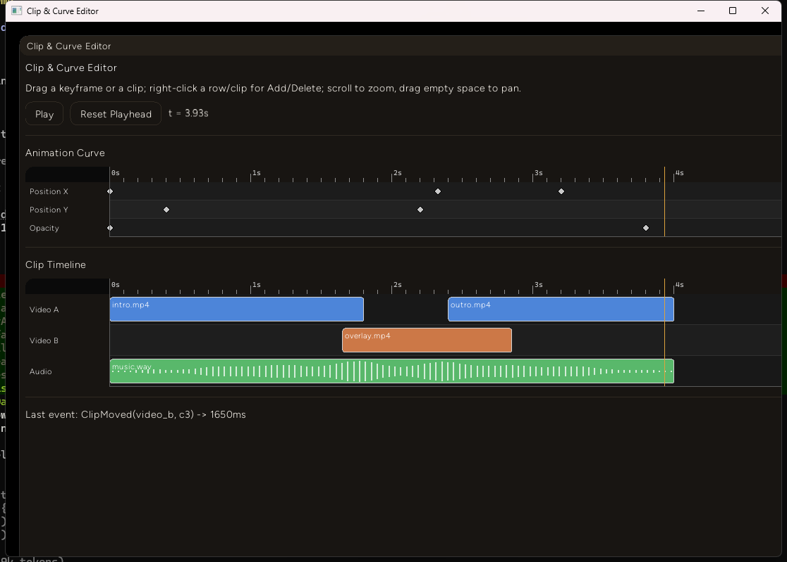 | 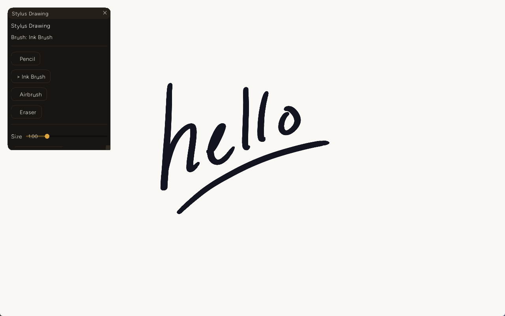 |
| 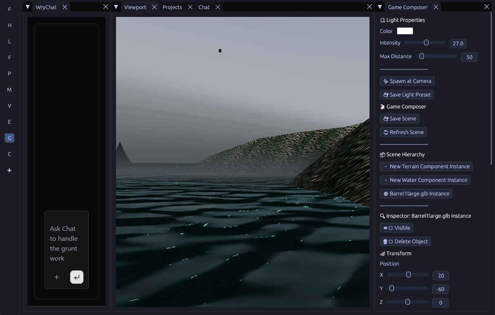 | 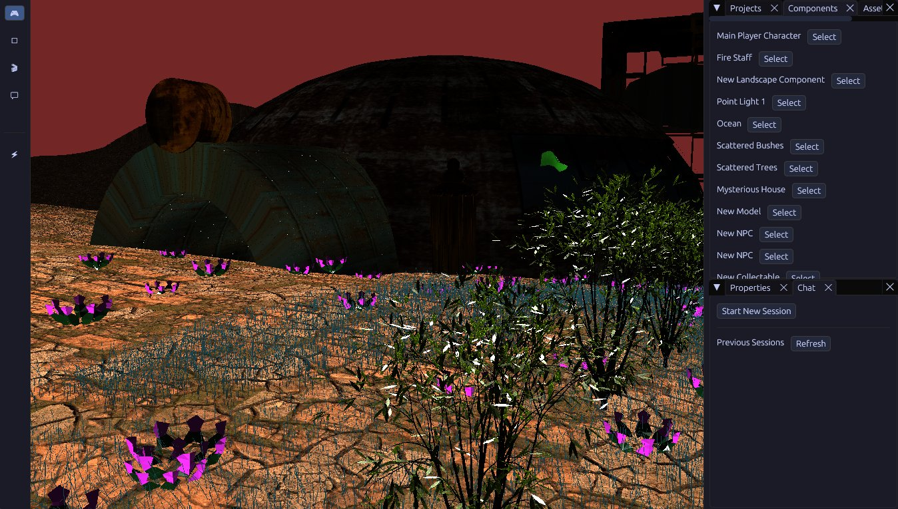 |
| 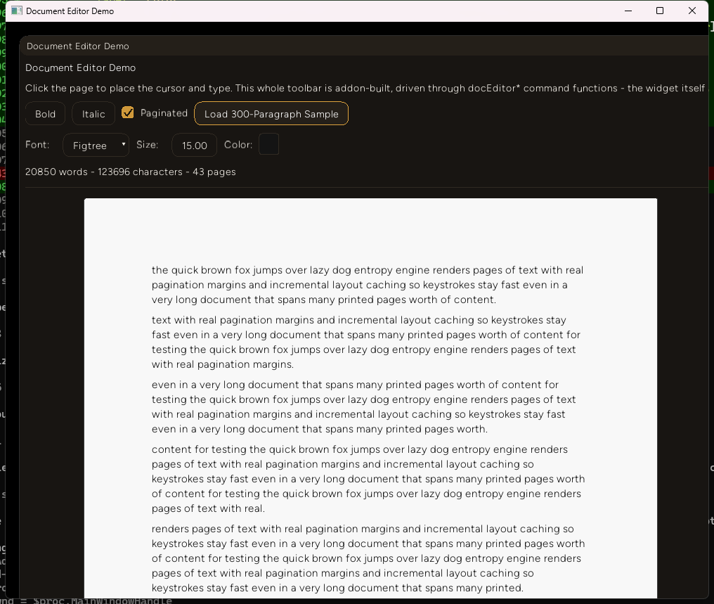 | 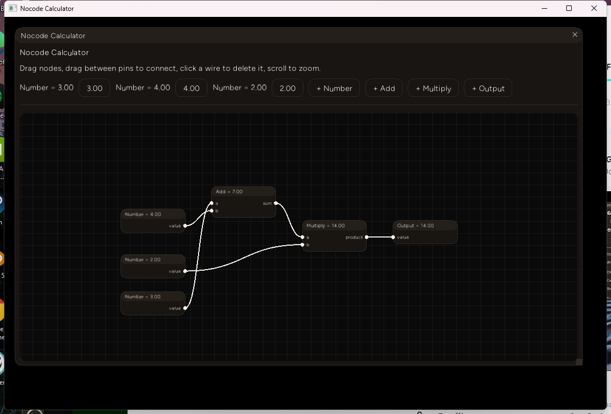 |
| 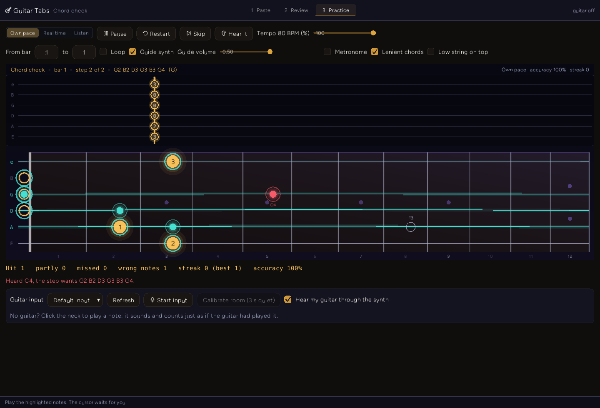 | |
| 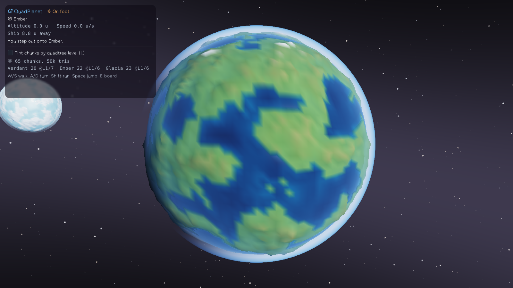 | 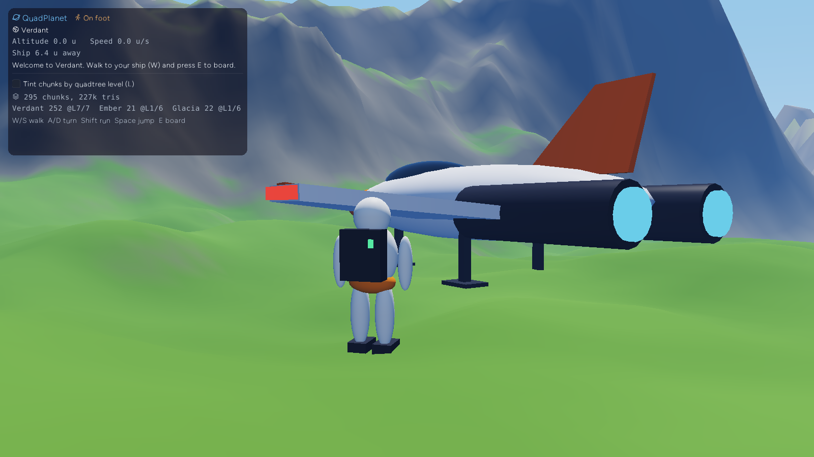 |
| 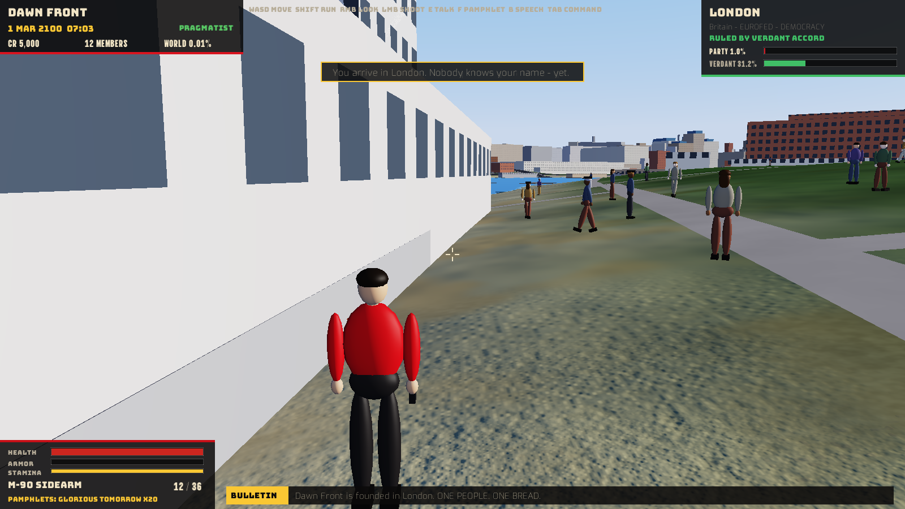 | 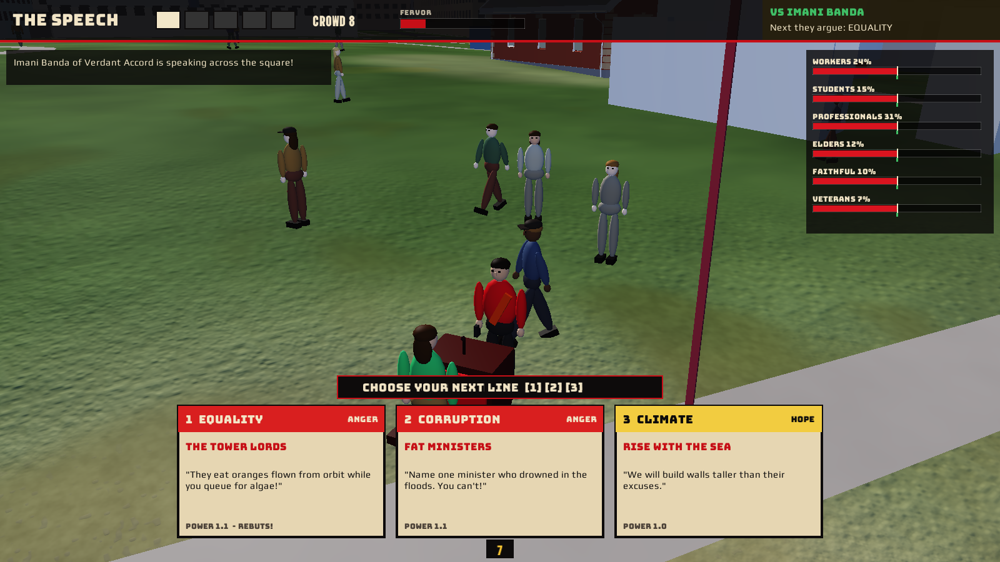 |

## P2P development

The Rust P2P layer provides member-signed publications with maintainer moderation, verified piece storage, and bounded
rarest-first/sequential-ahead scheduling. Sessions require an index-derived `Allowlist` and filter
both message planes through `CatalogTransport`. `Session::download_swarm` learns peer availability
and accepts live playback-window updates. See [the protocol design](docs/P2P_PROTOCOL_DESIGN.md).

```bash
cargo test --jobs 1 --lib p2p -- --test-threads=1
cargo test --jobs 1 --test p2p_tracker_bdd --test p2p_room_bdd --test p2p_scheduler_bdd
cargo test --jobs 1 --test p2p_swarm --test p2p_session -- --test-threads=1
```

The `p2p_peer` test binary requires `--room-index <file> --room-id <64 hex digits>` and
`--curator-key <64 hex digits>` in addition to its transport/content arguments. Members receive
the pinned room id and maintainer public key through trusted configuration. Each author uses a local
`SigningKey` (Ed25519, no account); only the pinned maintainer can moderate. Schema-2 indexes retain
author conflicts, withdrawals, publication removals, content blocks, bans and publishing policy.
Reliable `RoomRecords` messages validate and merge metadata before allowing payload transfers.
Schema-1 room snapshots and wire protocol 1 are rejected; content metadata stays schema 1.
The current snapshot limit remains 4,096 records / 4 MiB. Phase 9 adds the queue-only
`Entropy.P2P.start/command/poll/stop` API and the native forum; see [forum setup and API](docs/P2P_FORUM.md).

Phase 7 adds `tracker`, a standalone public metadata server for one configured room, and
`p2p::rendezvous::RendezvousClient`, an async Rust client. Start a local tracker with public pins:

```bash
cargo run --jobs 1 --bin tracker -- --room-id <64 hex digits> --maintainer-key <64 hex digits> --index ./tracker/room.msgpack --bind 127.0.0.1:47110
```

The client exposes `get_index`, `put_records`, `put_announce`, and `get_peers`; it verifies
snapshots against caller-configured room/maintainer pins and bounds responses. See
[tracker operation and HTTP API](docs/P2P_TRACKER.md) for signed announcements, limits and a
Rust client example. `p2p_session` includes a three-process tracker/discovery/KCP file-transfer
check. Payloads travel between peers; the tracker stores only public signed room metadata.
Announcements expire after 90 seconds and disappear on restart; durable publications survive.
Phase 9 adds `P2pService`, persistent local identities/sequences, room synchronization, bounded
task ownership and the forum addon. Create local member/reader/maintainer profiles with
the prebuilt `p2p_room_setup` executable, then run the prebuilt `example p2p-forum`
with a separate `ENTROPY_P2P_DATA` directory per window. DigitalOcean deployment and physical
NAT/no-relay checks remain later work. Large files/media are still future product surfaces.

## MCP

```bash
claude mcp add --transport http entropy-engine http://127.0.0.1:47100/mcp
```

All tools registered with `registerTool` in an addon will be accessible via MCP, simply startup your app, and the MCP server will be active as well.
