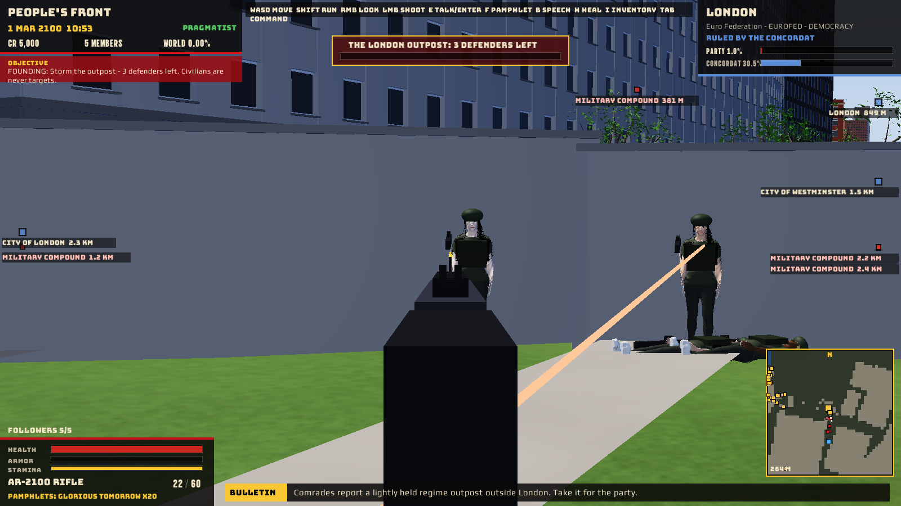
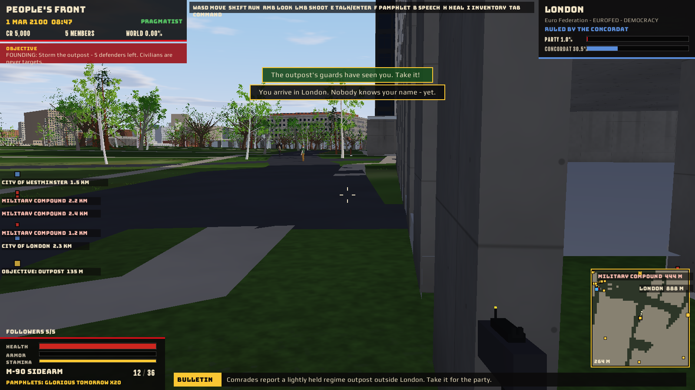
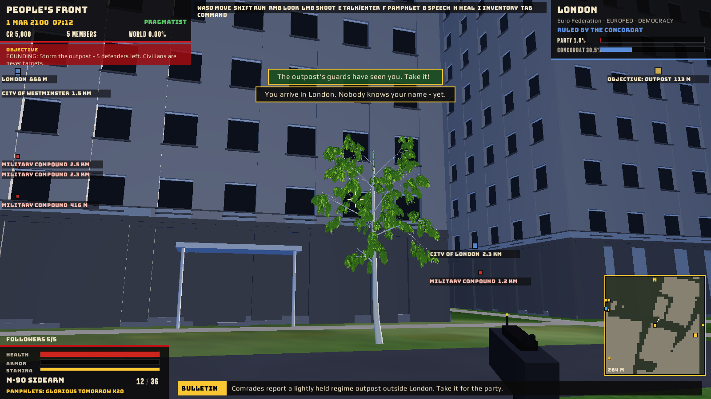

# Allegiance

**Allegiance** is a political conquest game on the full-scale Earth of 2100. You start with five
armed comrades in a real hometown of your choice, and a regime outpost to take for your headquarters. Make speeches, hand out pamphlets and recruit party
members. Build a chain of command, scheme against your rivals, and arm your followers. Then take
the planet one region at a time, by election, by coup or by war. You can do it as a liberator
or as a tyrant.

```bash
cd examples/studio-bundle
npm run build-allegiance
cargo run --bin example --release -- allegiance
```

The world is [QuadPlanet](QUADPLANET.md)'s Earth: real elevation, real OpenStreetMap buildings
and roads, and Mesha houses, all streamed in and cached as you go. The game is an ordinary addon
in `examples/studio-bundle/src/games/allegiance/`. Every screen is drawn with
`Entropy.UI.drawRect` and `drawText`, with no GUI widgets.


## Starting out

**New Campaign** opens the founding screen. Name your party and yourself, and pick an ideology:

| Ideology | Slogan | Strong on | Weak on |
|---|---|---|---|
| Solidarity | ONE PEOPLE. ONE BREAD. | Equality, Jobs | Liberty |
| Order | DISCIPLINE IS FREEDOM. | Security, Tradition | Equality |
| Liberty | BREAK THE SENSORS. | Liberty, Corruption | Security |
| Ascendancy | TOMORROW BELONGS TO US. | Progress, Climate | Tradition |

Then pick a party color and search **Home Town** by name (include a region or country to avoid
ambiguous names), select a result, and press **Begin**. A `latitude, longitude` search also works
offline. The map and **Random Territory** offer quick starts at their regional centers.

The 108 original centers now anchor surrounding territories. Populated places are discovered
from the streamed [OpenMapTiles place layer](https://openmaptiles.org/docs/schema/#place): cities,
towns, villages, hamlets and isolated dwellings. Each gets its own support, members, elections,
army and government; taking one never automatically takes its neighbors. Newly discovered towns
remain independent even if the surrounding hinterland has already fallen. The territory console
lists discovered places, with pagination, for selection and travel. Place definitions and their
political state persist in campaign saves; version-1 saves remain readable.

Countries belong to 2100: western former-US territories form **New America** (Liberty, Free Current),
and eastern territories form **The Workers States of America** (Solidarity, Verdant Accord).
Other territories belong to the existing future federations and assemblies. Countries extend
across the countryside; map land cells show their territories, while settlement markers show
local governors. Party-held hinterland uses your color. Country ideology establishes the incumbent,
not a recruitment lock: every movement can persuade people, give speeches and win support.
Uncommitted civilians are less hostile and initial persuasion has a higher success chance.

**Population and scope.** The fixed world budget is 7.038 billion fictional inhabitants.
Regional numbers include their hinterlands, not just municipal populations. Discovered-place
estimates are currently 100,000 for a city, 15,000 for a town, 2,000 for a village, 250 for a hamlet,
and 25 for an isolated dwelling, deducted from the surrounding territory. These are balance
estimates, not census data or forecasts. Population drives recruitment, taxes, garrisons and
population-weighted victory. Nearby NPCs remain a bounded simulation with a target of 34 civilians,
plus followers and soldiers. A village does not spawn thousands of meshes.

**The loading screen.** Your city streams in while a propaganda poster tracks the progress:
terrain chunks and elevation tiles, OpenStreetMap tiles and buildings, Mesha houses and people
(built once, then read from the mesh cache), and finally the street map. Everything is cached under the data
folder (`../allegiance-data`), so a second visit loads from disk.

People use Mesha's existing `people.human` generator at final quality. The loading screen prepares
two body/hair profiles and two reductions of each full mesh in `mesh-cache/allegiance-people`.
Within 18 m of the camera the complete geometry and smooth normals are retained; beyond that,
medium and distant meshes reduce geometry (the distant tier starts beyond 55 m). Hysteresis
extends these ranges to 22/65 m when moving away to prevent repeated switching. The third-person
player always uses full detail. Skin, hair and party clothing colors vary through uniforms;
weapons, hats, helmets and sashes remain game equipment. Walking and aiming use the game's shader,
with blended shoulder and hip motion; hair and clothes use their settled Mesha geometry.
Generator/version/parameters/LOD identify disk entries. Returning or restarting reuses them.

## The founding mission

Every campaign opens with a guided mission. Comrades have found a lightly held regime outpost a
few hundred metres from your hometown (the gold **OBJECTIVE** marker in the sky and on the mini
map). Lead your five comrades there on foot or by flying car, clear its defenders, and stand at
the flagpole in its courtyard for six seconds to raise your colors. The outpost becomes the party
**headquarters**: a party-colored light beam marks it from the sky, and it shows on the mini map
and the world map. Its **quartermaster** (E at the flag) sells everything every shop sells. The
objective strip tracks each step, and the normal objectives take over once it is done.

## On the street

| Key | Does |
|---|---|
| W A S D | walk (relative to where you look, in first person); Shift runs (stamina); Space jumps |
| Right mouse drag, arrow keys | look around (smoothed: the view glides rather than stepping) |
| Left mouse | fire at the crosshair (hold for automatic weapons); R reloads; 1-9 switch weapons |
| Middle mouse or Z (hold) | aim down sights: the view narrows, the gun's iron sights come up to the crosshair, spread tightens, you turn and walk slower |
| G | call your flying car: it flies itself over the rooftops and lands beside you |
| E | the nearest thing: your car, a house's front door, a shop, the HQ quartermaster, supplies in a house; otherwise talk or confront a rival orator |
| H | use the best healing item you carry |
| I | the inventory (command console) |
| F | hand the nearest person a pamphlet; Q cycles the pamphlet you carry |
| B | take the stage: start a speech |
| V | first person (the default on foot) / over the shoulder; mouse wheel zooms that camera |
| Tab, M or Esc | the command console (time stops while it is open) |

Xbox and DualShock use the same semantic mappings:

| Controller | Action |
|---|---|
| Left stick / click left stick | Analog walk / sprint |
| Right stick / click right stick | Look / first-person toggle |
| A / Cross | Jump; confirm a menu item; deliver or close a speech |
| X / Square | Enter/exit your car or talk; first speech card; rebut a heckler |
| Y / Triangle | Start speech; second speech card |
| B / Circle | Reload; third speech card; close dialogue/console |
| RT / R2 | Fire (hold for automatic weapons) |
| LT / L2 | Aim down sights |
| View / Share | Call your flying car |
| LB/RB / L1/R1 | Cycle weapons; switch console tabs |
| D-pad up/down in play | Hand out / cycle pamphlet |
| D-pad left/right in play | Use the best healing item / open the inventory |
| D-pad or left stick in menus | Move focus; A/Cross activates it |
| Menu / Options | Open/close the command console |

Typing party and hometown names uses a keyboard. Stick drift is filtered with a radial 0.18
deadzone; movement retains analog speed. Disconnects and stale input release held actions.

**Aiming.** Mouse motion plays out over a few hundredths of a second, so turning glides instead of
jumping; the right stick (and the arrow keys) has a response curve for fine aim near the center,
eases up to speed and back down, and turns a little faster once held at full tilt. **Aim assist**
(a percentage in the Inventory tab's Controls, 50% by default, 0% off) slows your turning over a
soldier near the crosshair, draws the crosshair onto them while you aim down sights or fire, and
bends a shot that is a hair off them onto them. The crosshair turns gold while it has a soldier.
**Look speed** sets the sensitivity. Both are kept with the campaign.



**Aerial traffic.** Cabin-sized multicopters with four horizontal rotors cruise above local
rooftops, with some hovering. Housing within 400 m sets traffic density, capped at twelve
cars. Sparse areas have little or no traffic; separated altitude lanes keep dense areas readable.
Tall blocks contribute a provisional apartment estimate from their floor area, since the current
map bridge does not expose residential use. These are ambient vehicles in this iteration.
Your personal flying car is parked beside you on clear ground when you arrive. Press **E**
or **X / Square** within six metres to board. Press **G** (**View / Share** on a controller)
anywhere outdoors to **call it**: it finds clear ground beside you, climbs over the rooftops
between you, flies there and lands; the prompt shows its distance and time to arrival. The HUD changes to flight controls and altitude.

| Flying car | Keyboard | Xbox / DualShock |
|---|---|---|
| Move horizontally | W A S D | Left stick |
| Steer / look | Right mouse drag or arrows | Right stick |
| Take off / rise | Space | A / Cross |
| Descend | C or Control | B / Circle |
| Boost (builds from 35 to 120 m/s while held) | Shift | Click left stick |
| Automatic landing | L | D-pad down |
| Exit after landing | E | X / Square |

The flying car is always filmed from behind; on foot you see through your own eyes, weapon in hand.
Holding boost while moving charges it over eight seconds, from 35 m/s up to 120 m/s (430 km/h)
for long-distance travel; letting go bleeds it off and the car settles back to its 20 m/s cruise.
The HUD shows the charge, speed and altitude. **Garage upgrades** (Hover Garages and the HQ) come
in three tiers each: Turbines (top boost 160 / 200 / 250 m/s), Boost Capacitors (full charge in
6 / 4.5 / 3 s), Gyro Rotors (cruise 26 / 32 / 40 m/s), Lift Fans (climb 12 / 16 / 22 m/s) and an
Altitude Permit (ceiling 1,000 / 1,500 / 2,500 m).

Releasing the controls brakes to a stationary hover. The car stays above terrain and collides
with building walls and roofs across its rotor footprint; it can fly over water but lands only
on clear, dry, level ground. Flight is capped at 500 metres above local terrain (the Altitude Permit raises it). Land before
exiting; you step onto clear ground beside the car. Its location, altitude and whether you are
aboard persist with the campaign; airborne saves resume in a stationary hover. The console
pauses flight. Ambient traffic remains decorative.

The HUD shows your party, the date and the time of day, your funds, members, world support and
reputation. It also shows the region you are in (who rules it, your share against the strongest
rival, the regime's heat, any war or rival rally), your health, armor, stamina and gear, and a
news ticker. An **objective** strip tells you what to do next: give a speech, recruit, appoint
officers, raise support, call an election, stage a coup, then take the next region.

**Sky markers and the mini map.** Towns and cities within 45 km (90 km while flying) carry a
marker high in the sky over them, with their name and distance, colored by who governs them, so
you can see where to fly. Markers behind you or off to the side are pinned to the screen's edge in
their direction. Military compounds within 5 km, the mission objective and your headquarters are
marked too. The mini map (bottom right, north up) is the street map around you: buildings, water,
compounds, shops, your car, your comrades and alerted soldiers. It zooms out while you fly.

**Houses.** Walk to a house's front door and press **E** to go in (office blocks and other
buildings stay closed). You walk its floor inside the outer walls. Many houses hide a footlocker
of supplies (credits, medkits, rations, ammunition boxes, pamphlets, stims, armor patches or
salvage); E beside it takes them, once per house. E at the front door takes you back outside.

**Shops and inventory.** Roughly one non-residential building in seven has a shop, marked by a
street kiosk with a colored awning: green **General Stores** (medkits, stims, rations, armor
patches, ammunition boxes, pamphlets), red **Gunsmiths** (weapons, ammunition, armor and repairs)
and blue **Hover Garages** (car upgrades). E at the kiosk walks in; any shop buys salvage. The
**Inventory** console tab lists what you carry with USE buttons, the car's current performance and
its upgrade tiers. You start with two medkits and three rations.

**Military compounds.** Every town and city keeps a walled military compound on its outskirts:
a headquarters, barracks, depots and hangars ringing a courtyard, four watchtowers, a gate, and
the regime's flag. The number of buildings follows the population it holds (one for a lone
dwelling, about four for a village, seven for a city, ten for a capital territory), with two
defenders per building. Compounds are the target for taking a place by force: defenders hold
their posts until you come within 45 m, shoot near them or hit one of them, then the whole
garrison fights. Up to eight are out at once; more come out as they fall, until the garrison is
spent. Clear them, stand at the flag for six seconds, and the settlement is yours (as a conquest).
**Fallen defenders stay down**: the garrison count drops with each one, whoever shot them, and a
compound you leave half cleared is still half cleared when you come back. Only a regime that
retakes the town brings a fresh garrison. Compounds change hands with their settlement however it
is won or lost.

**Enemy aim settles in.** A soldier who has just found a target is rattled: their first shots go
wide (a fifth of their accuracy), and they tighten up over five seconds of tracking the same
target; switching targets starts over. The founding outpost's guards are green conscripts with
half the accuracy of a garrison's.

**Civilians are never harmed.** Bullets pass through civilians, rival orators and your own
comrades; gunfire only sends civilians running. Soldiers are the only targets.

**Autosave and respawn.** While you are on your feet, out of the fight and in decent health, the
game records a checkpoint every few seconds and saves every 45 seconds (as well as every dawn and
whenever you take a compound). If you fall, your comrades pay a bribe (10% of party funds) and you
come back at full health at the last checkpoint: roaming squads lose you, compound guards return to
their posts, you are protected for four seconds, no new squad comes for 25 seconds, and the game
saves at once.

**People.** The pedestrians are individuals with a name, an audience segment (worker, student,
professional, elder, faithful, veteran) and an opinion of your party. Each one also leans toward
a rival faction. Their first opinion comes from your party's support in the region. They walk
between the doors of real buildings along A* paths, stop, and walk on. They also run from
gunfire. Talk to them (**E**) to persuade them, give them a pamphlet, or invite them to join.
Recruits become named party members you can promote. Members wear your color. A member can walk
with you as a **follower** and fights beside you if armed.

**Pamphlets.** There are three kinds. The Plain Truth is honest: slow, and good for karma.
Glorious Tomorrow is bold promises. What They Hide is lies about your rivals, which hurt your
karma but cut into the strongest rival. Hostile people tear pamphlets up. The Printing Press
makes them cheaper and stronger.

## Speeches

Press **B** where people are and the podium and party flag go up. Passers-by gather in a ring
around you, walking there on A* paths. A speech is **five beats**:

1. **Choose** a line from three cards, with keys 1-3 or a click. Each card has a topic and a
   tone: *hope*, *anger* or *fear*. The crowd is a mix of segments that care about different
   topics and take each tone differently. Poor regions are mostly workers; rich ones have more
   professionals. Your ideology makes some topics stronger. Repeating a topic bores the crowd.
2. **Deliver** it: a marker sweeps a bar, and you press **Space** in the gold. Perfect, good,
   weak or miss multiplies the line. Perfect lines build a combo and **fervor**, which amplify
   everything after. The marker crosses the bar in about 2.4 seconds on the first beat (a little
   faster each beat), and you have 6.5 seconds to deliver.
3. Sometimes a **heckler** interrupts. Press the key they flash before the timer runs out to
   rebut them and the crowd cheers. Miss it and they laugh.

At the end, the crowd's approval gives a score. Listeners' opinions move with their segment's
approval, the most convinced put on the armband and join, and the hat goes round for donations.
Regional support rises with the score and the size of the crowd. Big regions take more speeches,
and speech after speech on the same day returns less. Hope earns karma; fear costs it.

**Rivals.** The Concordat (the incumbent world order), the Iron Vanguard, the Verdant Accord and
the Free Current campaign across the planet every day, hardest where you are strong. They also
send orators: one sets up across the square where the crowd is, a banner on the HUD counts down, and listeners drift
to them. Walk up and press **E** to challenge them to a **debate**. That is a speech with the
rival speaking too, and their next topic is announced. Answer it with the same topic to tear the
argument apart: your line lands harder and theirs softer. Win, and you take support from them.
Leave them unanswered and their speech lands.


## The party

**Membership.** You start with five named comrades who walk and fight beside you. Members attract
members: each brings in friends at a rate that grows with the party's local support, the momentum
of your recent speeches and your reputation, until membership nears what local support can carry.
Competing parties poach members: harder where the strongest rival out-polls you, where the regime
is hot and where your members are unorganized (governing a place halves the losses). A small,
active party grows; a neglected one bleeds to the competition. Poaching at headquarters makes the
news.

**The chain of command.** Members join faster than one person can lead them, and members nobody
organizes pay little and drift away. In the console's **Organization** tab:

- The **Inner Circle** costs no span. The Treasurer raises dues and taxes, the Propaganda
  Minister raises grassroots growth, the Spymaster raises scheme odds and lowers heat, and the
  General makes your troops fight better.
- You can direct **4 + Leadership** officers yourself: Region Chiefs and Bloc Commissioners.
- A **Region Chief** organizes their region and directs 3 + admin/2 **Cell Leaders**. Each cell
  leader organizes 150 + 25 x admin members.
- A **Bloc Commissioner** takes up to 3 + admin/2 chiefs in their bloc off your hands.
- At headquarters you organize a few dozen members yourself. In a region you govern, the state
  organizes thousands.

A named member can also **join the armed forces** (CR 120 to arm). When their home region is at
war, they fight beside you in its streets by name, along with its unnamed militia.

Named members come from your recruits and from talent the growing party turns up. Each has
charisma, admin, combat and loyalty. Disloyal members defect and talk to the authorities.
**Auto-Organize** fills empty posts the way a good chief of staff would. The warnings list says
where the hierarchy is failing.

**Leadership posture** (Overview tab): lead from **inside** (better schemes and dues), from the
**field** (your troops fight 25% harder where you are), or **mixed**.

**Money.** Credits come from dues (organized members pay in full), taxes from regions you govern
(you set the rate, and high taxes breed unrest), and donations from supporters (more with a good
reputation). They also come from speeches and schemes. Credits go to officer salaries, the armed
forces, facilities and governing. Three weeks broke and the party dissolves.

**Facilities.** Printing Press, Pirate Broadcast (daily support everywhere you have members),
Training Camp (troops fight 30% better), Safehouse Network (crackdowns and failed schemes cost
half) and Party Bank (+15% income).

**Schemes**, from any region with members: charity drives, strikes, hijacking the feeds, bribing
officials, smear campaigns, shaking down merchants, infiltrating unions, assassinating a rival's
chief, and gala fundraisers. Each has a cost, a duration, odds and a karma price. Exposed schemes
cost members and raise heat.

## Taking power

Each region has a government (democracy, technocracy, junta or oligarchy), a governing faction,
support shares, unrest, the regime's **heat** toward your party, and a garrison. In the
**Territory** tab:

- **Election.** Democracies vote every 60 days. With 20% support you can force a snap election
  (paid by region size). The biggest share wins, including a plurality, with a boost from your
  recent momentum and your members.
- **Coup.** Arm members (CR 120 each, upkeep daily), then strike at the regime. The odds weigh
  your armed members and their quality against the garrison, plus unrest, Intrigue and your
  Spymaster, minus heat. A coup needs no majority, so **minority rule** is possible, but the
  result is unrest and an underground insurgency. A failed coup costs most of the fighters and
  many members.
- **War.** Declare war with at least 10 armed members in the region. It is fought in rounds.
  You strike (your offensive), they strike back (their counterattack), and so on. Each side
  loses in proportion to the other's strength and quality. The regime calls up reserves from the
  rest of its bloc. The war goes on until one side breaks or you **sue for peace**, which is
  accepted when the enemy is losing or tired. Being there in person matters. When your region is
  at war, soldier squads come for you in the streets. Armed party members of the region fight
  beside you as militia, and every soldier you drop counts for 25 troops in the war. Fallen
  soldiers drop their weapons for you to collect.

Once you govern a region it pays taxes, organizes members, and you travel there free. It is
also a target. The Concordat and the rivals invade party regions more often the more of the
world you hold. Unrest turns into insurgencies. Democracies can vote you out, unless you
**suspend elections**, a tyrant's move. When the regime's heat runs high anywhere, it cracks down
on your members and can send troops after you in the street.

The Concordat brands the party an enemy of the state once you hold 4% of world support or govern
anywhere. From then on, heat rises everywhere.

## Reputation and the ending

Karma runs from -100 to +100. Hopeful speeches, charity, honest pamphlets and elections raise it.
Fear, smears, extortion, coups, wars, assassinations and suspended elections
lower it. Both roads win. A good reputation brings donations, loyalty and willing recruits; a
brutal one brings fear, obedience in the hard-bitten and revulsion everywhere else.

**Govern three quarters of humanity** and the planet is yours. The ending depends on how you got
there: Planetary Liberator, Champion, Pragmatist, Strongman or Tyrant.

## Gear and skills

Weapons: bare fists, the M-90 sidearm, the Kestrel SMG, the Breacher 12 shotgun, the AR-2100
rifle, the Longshot DMR and the Voltaic railgun. Armor: Kevlar vest, ceramic plates and
exo-frame, with repairs. Buy them in the **Armory**, or take them from fallen soldiers.

XP from speeches, recruits, battles, schemes and victories gives a skill point each level.
Skills go up to rank 5:

- **Oratory**: a wider timing window, stronger cards, a louder voice.
- **Persuasion**: more effective pamphlets, talks and recruiting.
- **Leadership**: more direct officers and followers, and better troops.
- **Marksmanship**: tighter spread and more damage.
- **Toughness**: more health.
- **Intrigue**: better and cheaper schemes.

## Travel and time

A campaign day is two real minutes on the street. The sun crosses the sky with the clock, and
each dawn the world turns: income and upkeep, rival campaigns, elections, war rounds, schemes,
crackdowns and talent. The console stops time. **Rest until tomorrow** skips ahead. **Travel**
(Territory tab) takes you to any region's city for a fare and the days on the road, and loads
the new city. The campaign autosaves every day and every 45 seconds of safe play. **Continue** on the title screen picks it up
where you left off.

## Light and weather

The street is lit by one sun that everything agrees on.

- **Sun shadows.** Buildings, houses, trees, shrubs, props, cars and people cast real shadows onto
  the ground, the walls and each other, and people standing in a building's shadow are shaded
  too. Four shadow cascades surround the camera (12, 40, 140 and 520 m), sharpest at your feet.
  Each is a view down the sun's rays a little ahead of where you look, the same size however you
  turn and moved only in whole texels, so shadow edges hold still as you walk. Its far side
  reaches 2.5 km toward the sun, so a tower down the street still shades you. A soft 3 x 3
  filter and a blend across each cascade's edge keep the transitions quiet. The ground does not
  cast (its relief is shaded by its own normals), and the first-person weapon casts nothing.
- **The sun's color** warms toward amber as it sinks and whitens toward noon.
- **Clouds.** A layer of billowing cloud about 2.7 km above the ground drifts across the sky with
  the upper wind, lit on top, grey-blue underneath and silver-edged toward the sun. Their
  shadows sweep across the streets and rooftops.
- **Wind.** Every tree, shrub, fern, flower and tuft of grass bends with the wind in rolling
  gusts, more at the top than at the root and more for a tall tree than for grass. Leaves
  flutter, and the sun glows through them when you look toward it.
- **Weather** is picked per region and day (fair to broken cloud, light to fresh wind) and
  drifts into the next day's, so dawn never jumps. It is cosmetic: it has its own hash and never
  draws from the campaign's random numbers, so it cannot change an election.
- **City surfaces.** Houses and city buildings are drawn in the materials Mesha gave them:
  stretcher-bond brick with mortar joints, trowelled render, concrete with formwork seams and
  tie holes, dressed stone, overlapping roof tiles and slates, metal sheen and timber boards.
  Walls are weathered: grime splashed up from the pavement and rain streaks down from the top.
  Neighbours that share a mesh still differ in tone and where their weathering falls. Lawns and
  meadows mix lusher and drier swards, and near you they are real grass (see Set dressing).

`allegiance_config` turns shadows off (`shadows`), trades their reach and sharpness for speed
(`shadowCascades` 1-4, `shadowMap` resolution), fixes the weather (`weather`) and sets the time of
day (`dayClock`).



## How it is built

| File | What it holds |
|---|---|
| `al_data.ts` | The world of 2100: 108 hinterland anchors, discovered settlements, future countries, 8 power blocs, factions, ideologies, topics, audience segments, speech cards, weapons, armor, skills, facilities, schemes, pamphlets |
| `al_state.ts` | The campaign as plain JSON (the save file), the region lookup (nearest city), support shares, the seeded RNG |
| `al_party.ts` | The chain of command, the ledger, the shop, XP and skills, schemes, followers |
| `al_world.ts` | The daily tick and every strategic rule: grassroots growth, rivals, unrest and heat, crackdowns, elections, coups, wars, counter-offensives, insurgencies, victory and defeat |
| `al_speech.ts` | The speech mini-game as a state machine |
| `al_nav.ts` | The street layer's local tangent frame on Earth, OSM buildings as oriented rectangles with doors, the nav grid, A* with string pulling, wall collision, line of sight |
| `al_street.ts` | Everyone around you: civilians, followers, militia, soldiers, rival orators; crowds, pamphlets, recruiting, hitscan combat |
| `al_player.ts` | You on foot, and the camera |
| `al_aim.ts` | Turning (mouse smoothing, stick curve and easing), aiming down sights, aim assist |
| `al_vehicle.ts` | Personal multicopter placement, stabilized flight, boost build-up, garage upgrades, rotor clearance and landing checks, and the autopilot that brings it when called |
| `al_military.ts` | Military compounds: size by population, layouts, siting on clear ground, garrisons and capture |
| `al_mission.ts` | The founding mission |
| `al_items.ts` | Inventory items, shops and their stock, house supplies |
| `al_interior.ts` | Going inside houses: doors, entry and exit, staying within the walls |
| `al_markers.ts` | Sky markers (projection, pinned to the screen's edge) and the mini map |
| `al_sky.ts` | Sun-shadow cascades around the camera, the day's weather, the clouds' drift and the wind |
| `al_scatter.ts` | Mesha foliage and furniture, low-poly props, the road mask: placement, levels of detail and instanced, culled drawing |
| `apps/quadplanet/qp_buildings.ts`, `apps/mesha/library/city_block.ts` | Mesha city buildings on the map's non-house footprints |
| `al_models.ts`, `al_shader.ts` | People (one mesh each, limbs animated in the vertex shader), the podium, the flag, tracers, low-poly props and military buildings, the first-person weapon; people's and foliage's materials, the wind, the shadow caster (`vs_shadow`) and receiver injected into QuadPlanet's shader |
| `src/core/addon_sun_shadows.rs` | The engine's cascaded sun shadows for addon pipelines (`sunShadows`, `Entropy.Lighting.setSunShadows`) |
| `al_ui.ts`, `al_screens.ts` | The propaganda UI kit and every screen |
| `allegiance_addon.ts` | The engine wiring: terrain, the loading screen, rendering, input, the day clock, saving, MCP tools |

**The street.** Earth is 6,371 km in radius, so within a kilometer the ground is a plane to the
centimeter. The street layer works in a local frame (x east, z north, meters) with heights from
the real terrain. `Entropy.QuadPlanet.buildings` gives every OSM footprint near you as an
oriented rectangle, with its front facing the street. The nav grid (2 m cells, 560 m across)
rasterizes the rectangles and open water. A* paths are string-pulled to straight legs and
budgeted per frame, with fighters on their own budget. The grid follows you and is rebuilt as
the city streams in. Buildings block movement and bullets.

**People in one draw each.** A person is one mesh with one 24-float uniform. uv.y tags each
vertex's limb, and the injected vertex shader swings legs and arms about the hip and shoulder by
the phase and amplitude in the uniform, or raises the arms to aim. Shirt and trousers take their
colors from the uniform, so an armband needs no new mesh. Meshes are shared per look (skin, hair,
hat, weapon).

**City buildings.** Every building on the map that isn't a house (offices, apartment blocks,
shops, civic halls, warehouses) is drawn as Mesha's **City Building** (`architecture.city_block`,
a new library object): storeys of framed windows (head, sill bar, mullion, transom, a stone sill,
hood mouldings on classical fronts) set between piers and spandrels in front of the glazing,
shopfronts with stall risers, fascia, sign boards and awnings, or a lobby with a canopy, a string
course, a two-step cornice, a parapet with coping, and a stair house, roof plant or water tank
on top. Bays follow the size, so one definition fits any footprint. `qp_buildings.ts` picks a
style from the map's height and footprint and the building's seed (towers are glass offices or
concrete blocks, big low sheds warehouses, the rest brick tenements, stucco apartments, concrete
blocks and the odd civic hall), snaps the footprint to 2 m so a street shares meshes, and stretches
the model to the real footprint and height. QuadPlanet's `CityHouses` streams them exactly like
the houses (full detail within 90 m, simplified on a Rust thread to 600 m, cached in
`mesh-cache/quadplanet-buildings`); city.rs marks ground-standing boxes (uv.y 2) and the shader
folds them away where a model has taken over (World `city.z`). The compounds' headquarters,
barracks, depots and hangars are the same object (Barracks and Warehouse presets).



**Set dressing.** Trees are Mesha's full-leaf trees only (oak, maple, birch; conifers, and palms
in the tropics): thousands of leaves near you, and two distance meshes grown from the same seed
and branching (fewer, larger leaves, then simplified), so a tree keeps its shape as it recedes.
Shrubs, boxwood, hydrangeas, ferns, rocks, grass and flowers make the understory. All are
evaluated once on the loading screen and kept in the mesh cache (`mesh-cache/allegiance-scatter`).
Houses get one to three yard trees, shrubs and hedges at their sides, a flower bed and tufts of
grass and ferns; town streets get a row of street trees along each verge; open ground gets stands
of trees with an understory on a 22 m grid anchored to latitude and longitude. Open ground within
46 m of you is carpeted with ground cover on a 2.4 m grid, also anchored to latitude and longitude
(replanted as you move, the same grass where you left it): short lawn patches, drifts of longer
meadow grass, and now and then a clump of poppies or daisies, kept a meter from walls. **Nothing is planted
on a road**: the OpenStreetMap center lines and widths come from `Entropy.QuadPlanet.roads`, and
trunks keep 1.8 m from a road's edge. Other buildings get cafe tables with chairs round them
(Mesha's bistro table and chairs), potted plants by their doors, benches, lamps, bins and crates;
shops get kiosks. A house you walk into has a round table for two just inside the door, with a lamp on it, and a
potted plant by the door (Mesha furniture). Placement is deterministic. Benches, lamps, bins, barriers,
crates, sandbags, kiosks, footlockers, watchtowers and walls are still low-poly stand-ins
(al_models.ts). Everything is drawn instanced: each mesh in each 96 m tile is one draw with a
bounding sphere, so the engine culls tiles out of view; each family is skipped beyond its range.
Records are rewritten only when you move.

**Sun shadows in the engine.** Allegiance draws with its own shader rather than the engine's
deferred PBR path, so shadows are an engine feature any such addon can use
(`src/core/addon_sun_shadows.rs`). A pipeline created with `sunShadows: true` gets a depth-only
caster variant built from the shader's `vs_shadow` entry point, and a receiver bind group appended
after its own (the cascades as a depth texture array, a comparison sampler and the light
matrices). Each frame, before the scene, every caster mesh is drawn into every cascade, culled by
the cascade's own frustum rather than the camera's, with group 0 swapped for a copy of the camera
uniform holding the light's matrix (the eye position stays the camera's, so anything the vertex
stage decides by distance, such as folding away a building's box, decides the same way for its
shadow). The game places the cascades (`Entropy.Lighting.setSunShadows`), since only it knows its
render origin and sun. `vs_shadow` runs the same vertex code as the color pass (the people's limb
swing, the trees' sway), so a shadow matches its pose. `shadowCaster: false` receives without
casting (the terrain), and `shadowCascades` limits a pipeline to the nearest cascades (people).

**The UI.** Rects and texts are retained by the engine until `UI.clear()`, and every text is
rasterized when it is created. So each screen describes its whole frame into a `Painter`, which
resubmits only when the description changed: about 10 times a second at most on the street, and
30 for the speech's timing bar. The engine draws every rect before every text, so overlays that
must cover text are drawn as text with a background fill. Buttons are hit-tested against the last
frame. Fonts: Bungee for headlines, Vina Sans for numbers, Play for prose.

## MCP tools

These tools also drive the live test:

- `allegiance_state`: mode, loading, region, campaign, player, street, nav, speech, terrain, UI.
- `allegiance_new`: start at `hometown` by name, or `hometown` plus exact `lat`/`lon`; legacy `spawn` territory ids remain supported.
- `allegiance_settle`: run the loading screen to the end.
- `allegiance_config`: `fixedStep` for reproducible runs.
- `allegiance_ui`: open a screen, tab or selection.
- `allegiance_click`: a button by id or coordinates.
- `allegiance_key`: a key press.
- `allegiance_controller`: semantic button press/release or `left`/`right` stick vectors (positive Y up).
- `allegiance_speech`: `start` / `choose` / `deliver` / `rebut` / `auto` / `close`.
- `allegiance_act`: street and campaign actions such as `talk`, `pamphlet`, `persuade`,
  `recruit`, `follow`, `approach`, `walk`, `face`, `shoot`, `squad`, `rally`, `followers`,
  `rest`, `days`, `funds`, `organize`, `arm`, `war`, `coup`, `election`, `travel`, `buy`,
  `equip`, `save`, `load`, `view` and `govern`; and for the upgrades `use`, `heal`, `house`,
  `enter`, `loot`, `leave-house`, `shop`, `shop-buy`, `shop-sell`, `shop-close`, `compound`,
  `storm`, `flag`, `die`, `checkpoint` and `to-car`; and for iteration 2 `call-car`, `shoot-guard`
  (real shots, through the trigger's code path, at the nearest defender from a clear firing
  position), `face-guard`, `ads`, `view-building` (stand before the nearest Mesha city block) and
  `view-furniture` (inside a house, look at its table). `face` also takes a relative `turn`. `allegiance_new` takes `mission: false` to
  skip the founding mission. `allegiance_state` also reports the mission, nearby compounds and
  their guards, the capture, inventory, car upgrades, checkpoint, the house you are in, the open
  shop, sky markers, the mini map and set dressing counts.

## Tests

- `npm run test:allegiance` runs the TypeScript tier. It covers the regions tiling Earth and the
  campaign state (deterministic, saveable), support dynamics, the hierarchy and its span of
  control, money and the shop, elections, coups, wars fought in rounds, peace, schemes, travel,
  victory and bankruptcy. It also covers the speech mini-game (beats, grading, hecklers, rival
  debates, crowd mixes), the local frame and building rectangles, nav-grid A* through gaps, water
  and walls, pedestrians walking between doors and gathering for speeches, pamphlets and
  recruiting, fleeing gunfire, hitscan through walls, squads against followers, militia and loot,
  and every screen through a stand-in for `Entropy.UI`. `allegiance_upgrades.test.ts` covers the
  boost build-up and car upgrades, items, shops and house supplies, compound sizes, layouts,
  siting and capture, the founding mission, membership dynamics, entering houses, marker
  projection and the mini map, set dressing and Mesha foliage caching, compound guards, the
  respawn shield, civilians' immunity and the slower speech marker. `allegiance_visuals.test.ts`
  covers the shadow cascades (coverage, depth toward the sun, whole-texel steps), the weather
  (deterministic, continuous across dawn), the cloud offset across render-origin moves, wind
  weights in foliage meshes, surface kinds in house meshes and the shader entry points.
  `npm run typecheck:allegiance` checks the types.
- `cargo test --release --test allegiance_live -- --nocapture --test-threads=1` runs under
  `xvfb-run -a` on a headless box. It plays `tests/features/allegiance_live.feature` in the real
  window: title, founding, loading London, walking, a speech, a conversation, every console tab,
  a street battle and victory. It also plays `allegiance_travel_live.feature`: a rival rally and a
  debate, travel to Paris, save and continue. It checks the tools' replies and the captured
  frames. `allegiance_iteration1_live.feature` covers hometown start, controller movement and menus,
  density-limited traffic, and save/resume. `allegiance_car_live.feature` covers keyboard boarding,
  controller takeoff, hover, rejected airborne exit, airborne save/resume, keyboard flight,
  controller landing and exit, with three captured frames. `allegiance_upgrades_live.feature`
  covers the first-person start with five comrades and the mission marker, storming the outpost
  and founding the HQ, the quartermaster and a garage upgrade, the inventory tab, entering and
  searching a house, falling and respawning, and boosted flight under the sky markers, with six
  captured frames. `allegiance_iteration2_live.feature` covers London's Mesha city buildings and
  street trees, a furnished house, calling the car, real shots at the outpost (the garrison count
  drops with each defender and none come back), aiming down sights with aim assist, and the
  skyline from the car, with seven captured frames; `allegiance_iteration2.test.ts` is its
  TypeScript tier. `allegiance_visuals_live.feature` captures a sunlit London street with and
  without sun shadows (and checks the shadowed frame is darker where the shadows fall), clouds
  over the rooftops, and a garden in the wind. `ENTROPY_ALLEGIANCE_BDD_FEATURE=<file>` plays another feature without rebuilding.
  Every live fixture must exit normally within ten seconds of completing its feature; forced
  closure fails the test. Map and elevation downloads use shared process-lifetime HTTP clients
  to avoid joining network threads from Windows thread-local destructors during shutdown.

## Limits

- Buildings are their fitted rectangles to the nav grid and to bullets. Houses can be entered,
  but inside you are kept within the outer walls only: interior walls, stairs and upper floors
  are not walkable yet. Office blocks and other buildings stay closed.
- Shops are walk-up counters (a menu at the kiosk), not interiors.
- Compounds are placed on the clear ground nearest their planned spot once the street map
  covers them; with no clear ground there, map buildings inside their walls give way. The
  military buildings have no interiors.
- City buildings are closed: only houses can be entered. Their glazing is opaque glass.
- Mouse look is still right-drag (there is no pointer lock), so aiming down sights is on the
  middle button and Z rather than the right button.
- Your personal hover car parks beside you on arrival, with clearance for its rotors; its parking
  location and airborne occupancy persist through save/resume. The personal car is pilotable;
  ambient traffic has no vehicle collisions. Long-distance command-console travel is instant
  (it costs days and credits).
- Settlements become individual targets as their map tiles load or a hometown is selected.
  Coverage depends on mapped place labels. Political hinterlands use nearest regional centers;
  local settlement extents use provisional radii, not surveyed municipal boundaries. The street
  layer simulates the few hundred meters around you; distant battles resolve strategically.
- The sun never sets: the day runs from 07:00 to 19:00.
- First iteration: balance is tuned by simulation and short play sessions, not long campaigns.
