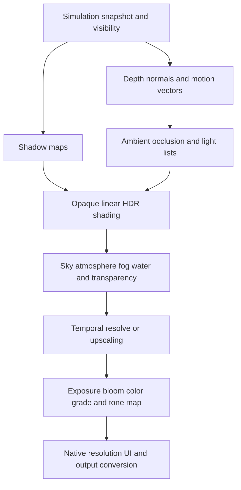

# Allegiance: a path to AAA visual quality

Scope: Allegiance, its QuadPlanet dependencies, relevant Rust rendering/runtime systems, existing screenshots, and primary technical references.

Tentative: these plans are subject to change and should be discussed before implementation.

## Recommendation

Invest in a **beautiful, playable London district first**, supported by reusable Entropy rendering and content tools. Keep the Earth-scale campaign, political identity, and TypeScript gameplay architecture. Build a dependable Rust rendering foundation beneath them, then prove the visual direction with detailed environments, believable people, and coordinated atmosphere and effects.

The largest immediate visual gains should come from **coherent lighting and shadows, materials, character animation, and street composition**. Smoke, sparks, water, and cloth will make those improvements feel alive. Expensive effects layered onto the current figures and building boxes would still look like a prototype.

Crimson Desert is a useful reference for environmental movement, atmosphere, material richness, and physical response. Matching an entire AAA production would also require sustained art, animation, audio, design, tools, and QA investment. A strong agentic team can contribute in those areas, in addition to engineering.

This is a recommendation document, not an implemented upgrade or a measured performance assessment. I inspected the two existing public screenshots; I did not launch the native game, capture new frames, build Rust, measure GPU costs, or play a long campaign. The source findings below distinguish current behavior from hypotheses and proposed targets.

## Progress

First visual pass, aimed at the roadmap's largest gains (coherent light and shadow, materials, a
world in motion) without leaving Allegiance's own shader. See [Light and weather](ALLEGIANCE.md#light-and-weather).

| Roadmap item | Done | Still open |
|---|---|---|
| 4.3 Sun shadows; section 2's "does not sample a shadow map" and "shadow deformation" findings | Engine-level cascaded sun shadows for unlit addon pipelines (`src/core/addon_sun_shadows.rs`, `sunShadows`/`shadowCaster`/`shadowCascades`, `Entropy.Lighting.setSunShadows`). Four texel-snapped cascades, 3 x 3 PCF, cascade blending, normal-offset and metric depth bias. The caster runs the same vertex code as the color pass, so people's limb poses and the trees' sway match their shadows | Shadowed local lights; a debug view of the cascades; measured GPU cost on target hardware |
| 4.3 Materials | Procedural city surfaces from Mesha material ids: brick, render, concrete, stone, roof tiles, metal, timber; per-building tone and weathering placement. Textured PBR material sets in the forward shader (base color, normal, roughness, height as mipmapped texture arrays; parallax occlusion near the camera; checkerboard for missing maps), starting with fieldstone | More sets (brick, concrete, tiles, timber); a GGX BRDF and environment lighting; compressed textures and streaming |
| 5.2 One wind field; clouds and moving cloud shadows | World wind (velocity in the World uniform) drives foliage sway and the clouds' drift; a cloud layer with lit tops, dark undersides and silver edges; its shadows on everything | Rain, wetness, fog volumes, banners and cloth in the same wind |
| 5.3 Vegetation with wind weights and leaf transmission | Mesha plants packed with per-vertex bend weights and a leaf flag: gusting sway, leaf flutter, sun through leaves. Ground cover (lawn, meadow drifts, wildflowers) on open ground near the player, anchored to latitude/longitude and kept off roads and walls | Impostors, shadow LOD for foliage; OSM land use (parks, plazas) to decide lawn versus paving |
| 5.2 Cosmetic weather that cannot change outcomes | Weather from its own hash of region and day, continuous across dawn | Weather states with transitions and audio |
| 4.4 HDR, exposure, tone map | Not yet: the ACES curve is still per material | Linear HDR target, bloom, grade |

## 1. What is already worth preserving

Allegiance has an unusually useful combination of systems:

- A strategic campaign over 113 regions, with elections, coups, wars, party organization, money, reputation, and persistent state.
- A street layer where speeches, debates, persuasion, recruiting, followers, and combat feed the larger campaign.
- A real Earth foundation with camera-relative rendering, terrain LOD, elevation streaming, OpenStreetMap buildings, and cached Mesha houses.
- Mostly independent TypeScript rule modules and existing automated coverage.
- A recognizable propaganda-poster identity: cream paper, strong faction color, condensed headlines, and speech cards.
- Engine building blocks for PBR, shadows, skinned models, particles, procedural vegetation, GPU compute, and audio. Their existence does not establish their suitability or integration with Allegiance.

Preserve the campaign/street separation. It is the right way to make a planet feel consequential without simulating every pedestrian on Earth. Preserve procedural generation as a content multiplier, while introducing deliberate authoring where the player spends time.

## 2. Findings from the current implementation

Paths below are relative to `entropy-engine/`. Function names provide stable search anchors if line numbers move.

| Finding | Evidence | Consequence and recommendation |
|---|---|---|
| Allegiance bypasses the general PBR lighting path | [`allegiance_addon.ts`](../examples/studio-bundle/src/games/allegiance/allegiance_addon.ts), `onInit`: `layout: "mesh"`, `pbr: false`, custom `ALLEGIANCE_SHADER` | Engine lighting improvements need explicit integration. Changing the flag alone will not work: its fragment output and bindings do not satisfy the G-buffer contract. |
| The custom world already has procedural surface detail and atmospheric haze | [`qp_shader.ts`](../examples/studio-bundle/src/apps/quadplanet/qp_shader.ts), `Surface`, `atmosphere_segment`, `fs_main` | Extend these strengths. Its lighting uses specular intensity/shininess and approximate sky ambient, rather than a shared metallic/roughness material system with environment lighting. |
| Tone mapping is embedded in the material shader | `qp_shader.ts`, `finish`: ACES-style curve followed by a `1/2.2` power | Move lighting into a linear HDR scene target and apply exposure/tone mapping/output conversion once. G-buffer float textures elsewhere in Entropy are not proof of an end-to-end HDR Allegiance pipeline. |
| Allegiance's shader does not sample a shadow map | `qp_shader.ts` bindings and lighting; [`al_shader.ts`](../examples/studio-bundle/src/games/allegiance/al_shader.ts) | Adding shadow casters to the generic engine cannot make these surfaces receive shadows. Add an explicit receiving path and compatible caster variants. |
| Generic shadow deformation does not match Allegiance | [`shadows.wgsl`](../src/core/shaders/shadows.wgsl) uses group-1 model transform; Allegiance transforms and animates through its extra `Item` uniform | Shadows must use the same object placement and limb/skinning deformation as color/depth passes. A shadow pass drawing the mesh is insufficient if it draws the wrong pose or origin. |
| Custom pipeline state is restrictive | [`addon_pipeline.rs`](../src/core/addon_pipeline.rs), `create_addon_pipeline`: hardcoded alpha blend, back-face culling, depth writes, `Less`, sample count 1; [`PipelineConfig`](../src/deno/addon_ops.rs) | Add explicit blend, depth, cull, sample, and attachment contracts before smoke, double-sided cloth, water, or temporal rendering. |
| Mixed render paths need a correctness audit | [`render_addon_frame.rs`](../src/core/render_addon_frame.rs): PBR-pass entry condition omits `pbr_addon_models`; later `has_pbr` checks only cubes/landscapes before deciding to clear depth | These are source-level hazards for a future mixed scene, not reproduced Allegiance bugs. Add model-only and PBR-mesh-plus-custom-world regression scenes before migrating characters. |
| The non-PBR mesh loop creates a transform bind group per mesh per frame | `render_addon_frame.rs`, `Mesh Transform Bind Group` | Cache compatible groups and invalidate on resource changes. Profile the result; no CPU saving has been measured here. |
| People are procedural figures with shader-driven limbs | [`al_models.ts`](../examples/studio-bundle/src/games/allegiance/al_models.ts), `al_shader.ts` | Keep as distant placeholders if useful. Close interaction needs authored rigs, locomotion, gestures, faces, clothing, and silhouette variety. |
| People use individual mesh submissions and uniform writes | `allegiance_addon.ts`, `ensureDrawn`, `drawPeople`, 24-float items, 160 m distance cutoff | CPU mesh data is cached by appearance, but that is not evidence of shared native GPU geometry for every spawned mesh. Introduce asset handles, packed instance updates, visibility, and character LOD. |
| Streaming budgets are not strict deadlines | [`qp_city.ts`](../examples/studio-bundle/src/apps/quadplanet/qp_city.ts), `generate`/`update`, evaluates a whole house before checking time; [`streamer.rs`](../src/heightfield_landscapes/QuadPlanet/streamer.rs) joins scoped build threads within the update | Existing parallel work can still hold the frame. Move generation to persistent jobs with bounded completion/upload queues. Measure cold-cache and travel frames. |
| The street and camera use simplified collision | [`al_nav.ts`](../examples/studio-bundle/src/games/allegiance/al_nav.ts), building rectangles/grid; [`al_player.ts`](../examples/studio-bundle/src/games/allegiance/al_player.ts), `bodyCamera`, ground-height clamp | Detailed buildings need matching collision. The inspected camera function does not sweep against walls; add a collision-aware camera and a consistent movement/query system. |
| Normal simulation uses variable, clamped frame delta | `allegiance_addon.ts`, `onUpdatePlus`; optional `fixedStep` replaces the delta | Introduce a real fixed-tick accumulator with bounded catch-up and render interpolation. The current test override is not the same as that architecture. |
| Save loading trusts a versioned JSON cast | `allegiance_addon.ts`, `save`/`loadSave` | Add validation, migrations, recoverable slots and explicit persistence ownership before expanding persistent world detail. Verify the storage layer's durability guarantees rather than assuming them. |
| UI intentionally limits refresh frequency | `drawUi`: 10 Hz play/dialogue, 30 Hz speech, 20 Hz other modes; [`al_ui.ts`](../examples/studio-bundle/src/games/allegiance/al_ui.ts), `Painter`, approximate `textWidth` | Keep caching for stable labels; let timing bars, aim feedback, and transitions animate each rendered frame. Add reliable text measurement, layers, and scalable layout. |
| Daylight and presentation are limited | [`ALLEGIANCE.md`](ALLEGIANCE.md): daylight-only clock; no `Entropy.Audio` calls found in the Allegiance directory | Add a curated full lighting cycle and a game-audio event layer. Entropy's extensive audio code still needs gameplay integration. |

The [London street screenshot](../public/allegiance-street-london.png) shows broad flat facades, sparse street dressing, simple figures, and little visible contact grounding. The [debate screenshot](../public/allegiance-debate.png) has a stronger visual identity in its cards than in its environment. These are observations of existing repository images, not claims about a fresh native run.

## 3. Translate Crimson Desert into Allegiance's own visual language

Pearl Abyss' official engine showcase describes interactive shallow water, fluid-driven volumetric fog, atmospheric day/night lighting, GPU cloth/hair, and optional ray-tracing enhancement. It does not disclose enough implementation detail to reproduce BlackSpace or establish Entropy performance. Treat it as an outcome reference. [Pearl Abyss, Dev Archives, March 2025](https://crimsondesert.pearlabyss.com/en-US/News/Notice/Detail?_boardNo=40).

For Allegiance, the equivalent should be a **physically grounded Earth of 2100 under political tension**. Preserve regional architecture; add flood adaptations, improvised infrastructure, surveillance hardware, patched clothing, faction posters, and civic spaces where people gather. Use faction color in cloth, paint, signs, and controlled UI accents. Let the world retain material variety and believable light.

| Desired impression | Allegiance expression | First implementation | Later investment |
|---|---|---|---|
| Atmosphere with depth | Backlit river mist, dusty sunlight, smoke around a contested square | Height fog, local fog volumes, coherent sun/sky | Temporally accumulated volumetrics; localized fluid response |
| A world in motion | Banners, coats, trees, paper and smoke share gusts | One world wind field; authored deformation masks | Hero cloth simulation and local turbulence |
| Convincing water contact | Rain puddles, wet shoes, ripples at the embankment | Wetness materials and bounded ripple patches | Shoreline-aware shallow water and regional ocean patches |
| Weight and impact | Railgun heat trail, masonry dust, sparks, recoil, displaced litter | Layered, surface-aware effect recipes | Bounded debris physics and select breakable props |
| Character presence | Speaker gestures, eye contact, shifting listeners, wary soldiers | Authored rigs and a small animation set | Facial performance, richer animation blending and cloth |
| Large-scale beauty | Readable skyline through changing light and haze | Authored skyline and clean LOD transitions | Regional biome libraries and richer cloud lighting |

An effect should help explain an event. A speech could build from quiet murmurs to coordinated gestures, moving banners and paper caught in a gust. A crackdown should change posture, crowd movement, sound and lighting before filling the screen with smoke. Keep the speaker, enemies, exits, prompts and crosshair readable.

## 4. Rust rendering foundations

### 4.1 Establish an explicit game render path

Create a versioned game-renderer interface while keeping existing addons operational. Initially use a small, explicit pass schedule with named resources; evolve it into a frame graph as dependencies grow. Resource lifetimes, pass dependencies and history ownership must be clear before adding many effects. Filament's frame-graph notes are a useful architectural reference, not a requirement to adopt its engine. [Filament FrameGraph](https://google.github.io/filament/notes/framegraph.html).

Recommended first path: **forward HDR lighting for Allegiance, with shared PBR material code, depth/normal/velocity outputs, and clustered local lights when needed**. This is a closer migration from its custom single-color shader than immediately forcing the whole world into the current deferred path. Reuse tested BRDF and light code from Entropy; validate it against calibration scenes. A repaired deferred path remains an alternative if measured light counts justify it. Avoid maintaining two different material models indefinitely.

Proposed dependencies:

This is a dependency sketch; some passes can merge and AO can use prior-frame data if deliberately designed. Document color space, depth convention, coordinates, sample count, resource ownership, and resize behavior for every attachment.

Add explicit opaque, alpha-tested, alpha-blended and additive material states. Define sorting, depth writes and two-sided rendering. Support last-known-good pipelines during shader reload, readable WGSL errors, and pipeline warmup before entering play. Separate graphics quality settings from gameplay state.

### 4.2 Solve planetary precision and depth once

Keep double-precision world positions on CPU and camera-relative float positions on GPU. Reuse the existing render origin. Every new system must agree on it: shadows, probes, particles, collision, lights, water and debug drawing.

The current world writes logarithmic fragment depth. Screen-space AO, reflections, soft particles, water intersections and temporal reprojection must reconstruct that exact depth; they cannot assume standard perspective depth. For the first migration, retain the working convention and add an explicit linear view-depth output where consumers need it. Evaluate reverse-Z float depth in a separate prototype before choosing it. A change would require matching camera projection, clears, comparisons, reconstruction and every participating pipeline.

Maintain previous camera and object transforms across origin shifts. Convert history consistently or invalidate it on a rebase, teleport, camera cut, resize or major LOD discontinuity. Do not interpret a coordinate rebase as physical motion. Test walking across a rebase threshold, travel to another continent, high altitude, and low-angle surface viewing.

### 4.3 Lighting, material response and shadows

First deliver a material calibration scene with rough metal, smooth metal, painted metal, stone, cloth, skin, glass and wet asphalt. Use a consistent linear workflow and a documented metallic/roughness convention. Import normals and tangents correctly; support tiled textures, detail normals, trim sheets, decals, and packed roughness/metalness/occlusion data. Base color should not contain baked sun shadows.

Add prefiltered environment lighting and a BRDF lookup, then local reflection probes for interiors and sheltered streets. Use probes/baked indirect lighting for the authored district before committing to fully dynamic global illumination. Define how probe lighting blends with time of day. Screen-space reflections can later enrich wet ground, with probe fallbacks for missing off-screen information. Filament provides a primary reference for material and lighting conventions. [Filament rendering documentation](https://google.github.io/filament/Filament.md.html).

Implement stable sun-shadow cascades for street-scale detail and distant coverage. Begin with a small fixed cascade count and measured resolution presets. Include texel stabilization, cascade blending, filtered sampling, slope/normal bias controls, and debug visualizations. All relevant world/character deformation must be shared by color, shadow and velocity variants. Extend to a tightly budgeted set of shadowed local lights after the sun is correct.

Add ambient occlusion for grounding, but do not use it to replace missing direct shadows or darken every surface uniformly. Validate feet, podium bases, curb edges, wall corners, and thin geometry. Local lights should make flashlights, floodlights, windows and brief muzzle flashes influence nearby surfaces.

### 4.4 HDR, exposure and temporal stability

Use an HDR scene color target such as `RGBA16Float`, subject to adapter support and memory budget. Remove per-object display conversion on this new path. Start with fixed art-directed exposure for comparison shots, then add bounded automatic exposure with controlled adaptation. Apply modest bloom, a coherent grade, and one final tone map. Composite UI at output resolution so effects do not blur text.

Build anti-aliasing deliberately: a spatial fallback first, then temporal accumulation once motion vectors and history resets are correct. Vegetation, moving limbs, cloth and particles need velocity/reactivity handling. Test slow pans over rooflines, fences and foliage, fast camera turns, wet highlights and disocclusion behind people. Offer motion blur, camera shake, depth of field and chromatic effects as separate settings; keep defaults restrained.

Temporal upscaling is a later integration decision. AMD's FSR2 documentation illustrates required inputs including depth, motion vectors, jitter and reactive masks. It is not a drop-in guarantee for this wgpu/WGSL engine; validate backend interop or porting cost before selecting any SDK. Do not use frame generation to hide simulation or streaming stalls. [AMD temporal upscaling integration](https://gpuopen.com/manuals/fidelityfx_sdk2/techniques/super-resolution-temporal/).

### 4.5 Visibility, instancing and resource lifetime

Introduce immutable mesh/material assets and lightweight instances. Share GPU geometry for repeated people, props and building modules. Submit packed transform, tint, animation and visibility data through reusable buffers instead of allocating individual objects every frame. Cache bind groups; sort opaque work by pipeline/material where useful.

Start with CPU frustum culling, distance/size-based LOD and instance batching. Entropy already has instanced draw support and GPU-culling work under [`src/alpha`](../src/alpha/mod.rs); review its assumptions before reuse. Add hierarchical depth occlusion and indirect draws only when profiling shows value and supported adapters have a fallback.

Track mesh/texture bytes, resource counts, upload bytes, shader variants and cache residency. Give instances generational handles and explicit release rules. Audit Allegiance travel/hot-reload cleanup, its `meshCache` and `freeItems`, along with native addon cleanup. Their presence warrants a lifetime audit; this review did not prove a memory leak.

## 5. Effects and environment systems

### 5.1 A reusable VFX runtime

Promote particles into a native system with persistent emitter handles, deterministic seeds where needed, GPU simulation, pooled allocations, bounded lifetimes, distance culling and quality presets. The existing [`particle_system.rs`](../src/procedural_particles/particle_system.rs) is a starting point, not a complete authored effects pipeline.

Support billboard flipbooks, mesh particles, ribbon/trail emitters, velocity stretching, color/size curves, soft depth intersections and explicit additive/premultiplied blending. Add collision only where the result warrants its cost: simple planes, sampled depth, or a small set of world queries. Render smoke at reduced resolution when appropriate and budget by screen coverage/overdraw, not particle count alone.

Make effects data assets that combine emitters, brief lights, decals, sounds, camera response and animation events. Preview them in a small sandbox with play/pause/seek, background choices, frame timings and hot reload. Start with these six recipes:

| Recipe | Required layers | Readability/quality gate |
|---|---|---|
| Rifle shot and impact | Short muzzle flash/light, recoil, selective tracer, material-specific spark/dust, casing and sound | Target remains visible; emitters pool and expire; impacts stay attached to the surface |
| Voltaic railgun | Brief bright core, fading trail/ribbon, restrained distortion, impact flash and scorch | Strong silhouette without a full-screen white wash; reduced-flash option |
| Street smoke | Soft smoke, local lighting response, wind drift and gradual dissipation | No hard ground intersections or black fringes; bounded overdraw |
| Rally | Animated banners, occasional paper, crowd gesture waves, spatial cheering | Emotion is carried by people and timing; cards and opponents remain readable |
| Rain and wet street | Camera-local rain, sparse splashes/ripples, wetness accumulation, rain audio | Rain avoids interiors; distant particles reduce; wetness changes roughness coherently |
| Masonry damage | Surface decal, dust puff, a few bounded debris pieces and sound | Consistent collision/material identity; debris sleeps and expires |

### 5.2 Shared wind, weather and volumetrics

Create one world-environment service with wind direction/speed, gust phase, precipitation, humidity, wetness and lighting time. TypeScript selects weather states and transitions; Rust/GPU systems sample consistent fields. Coordinate banners, hair cards, trees, litter, smoke and rain.

Begin with analytic height fog and a few local volumes. Then add a low-resolution volumetric grid with sun shadows, jitter, history rejection and controlled temporal accumulation. Keep light shafts subordinate to scene readability. Delay fluid simulation until localized reactive fog is visibly important in the slice. A small interaction volume is a more practical initial target than city-scale fluid simulation.

Add full day/night only with enough supporting art and behavior: street lights, window emission, safe exposure, nighttime crowd schedules, and navigable silhouettes. Use slower presentation transitions than the current compressed daylight loop if shadows and exposure become distracting. Start clouds with a low-cost layer and moving cloud shadows; evaluate volumetric clouds later.

### 5.3 Water, vegetation and secondary motion

Audit and extract reusable pieces from [`fft_water_addon.ts`](../examples/studio-bundle/src/apps/fft_water_addon.ts) and [`fft_river_water_addon.ts`](../examples/studio-bundle/src/apps/fft_river_water_addon.ts). These compute-shader experiments are not currently Allegiance water. The river source explicitly describes UV-scroll advection; do not treat it as a physical shallow-water solver.

Start London with shoreline-aware river rendering, depth attenuation, reflection fallback, foam near obstacles, and small interaction ripples. Derive land/water masks explicitly: QuadPlanet documents that elevation alone incorrectly floods below-sea-level land. Later add a bounded shallow-water solver for local interactions and FFT ocean patches for locations that need them. No global full-resolution water simulation is necessary.

Add regional tree and planting assets with authored wind weights, trunks that meet the ground, leaf transmission, shadow LOD and distant impostors. Reuse procedural grass/tree modules only after verifying material, depth, shadow and coordinate compatibility. Avoid uniformly carpeting roads and plazas with foliage.

Begin cloth with authored secondary animation and shader deformation for banners/coats. Add simulation to a few hero garments with collision proxies, fixed updates and distance LOD. Hair cards are a practical initial choice; strand rendering and simulation are a later investment.

## 6. Characters, crowds and game feel

The first animation set should cover idle variants, walk/run, starts/stops, turns, jump/land, aim/fire/reload, stagger/death, talking, pointing, cheering, clapping, fear and escape. Add blend spaces, upper-body layers, additive recoil, head/eye tracking, animation events and foot placement. Define whether movement is simulation-driven or root-motion-driven for each state. Avoid letting both move the character independently.

Named leaders and conversation partners need faces, readable expressions, distinctive clothes and controlled camera framing. Civilian variety should reflect occupation, climate and regional culture, with consistent scale and quality. Recolored identical bodies will remain conspicuous at speech distance.

Use three crowd tiers: near people with full navigation/animation, mid-distance people with reduced update frequency and simplified animation, and distant visual crowds with aggregate simulation. Persistent named members retain identity as they move between tiers. Introduce spatial queries, local avoidance, group destinations and occupancy around a podium. Migrate heavy queries to Rust if profiling warrants it; retain political opinions, persuasion and campaign consequences in TypeScript.

Improve the player controller with acceleration/deceleration, slope and step rules, a stable ground contact model, and collision queries matching authored geometry. Reuse Rapier where suitable, but do not run two competing authorities for the same body. Add a wall-swept shoulder camera, configurable FOV/sensitivity, first-person weapon presentation, remappable actions, controller support and input buffering. Test walking along walls, backing into corners, climbing curbs and talking in tight spaces.

Combat needs consistent hit feedback, surface response, recoil, reload timing and enemy reactions. Presentation events must not change authoritative hit outcomes. Upgrade soldier behavior with cover use, search, suppression and coordinated movement only after the collision/navigation foundation supports them. Add selected breakable props first; structural building destruction multiplies navigation, persistence, art and streaming scope.

## 7. TypeScript architecture and the Rust boundary

Keep `al_world`, `al_party`, `al_state`, and `al_speech` as readable, testable rule systems. Rust should own graphics resources, high-frequency geometry work, physics/query acceleration, animation evaluation, audio playback and asynchronous jobs. TypeScript should own campaign decisions, game modes, authored effect choices, encounter rules, UI and content configuration.

Split the large `allegiance_addon.ts` orchestration into services for lifecycle, campaign/save, street simulation, render presentation, input/camera, environment, audio, UI and test tools. Make dependencies explicit so a mock is easy to substitute. Prefer narrow interfaces over replacing the game with a generic framework.

Recommended contracts, all **proposed APIs, not existing Entropy features**:

| Contract | TypeScript responsibility | Rust responsibility |
|---|---|---|
| `Scene.submitInstances(batch)` | Stable entity IDs; packed changed transforms, appearance and animation parameters | Validate layout/version; update persistent GPU storage; draw/cull |
| `Animation.setParameters(handle, state)` | Gameplay state, desired speed, aim target and gesture | Evaluate/blend skeletons, pose LOD, emit animation markers |
| `Effects.emit(recipe, event)` | Choose recipe from weapon, surface or political event | Simulate/render pooled effects, lights and decal lifetimes |
| `WorldJobs.request/poll/cancel` | Request assets or district data; consume bounded completions | Worker ownership, priorities, backpressure, cancellation and cache |
| `WorldQuery.batch` | Ask navigation, camera or hit queries with stable IDs | Spatial acceleration and bounded result batches |
| `AudioScene.emit/update` | Semantic event, surface, region and intensity | Voice management, spatial playback and mixer routing |

Specify buffer alignment, field units, maximum counts, ABI version, bounds checks and copy/ownership rules. A typed array crossing V8 is not automatically zero-copy. Batch native calls and reuse staging arrays; measure bridge time, allocation and GC before claiming an improvement. Return bounded event queues or snapshots, not huge serialized world objects every frame.

Use a fixed simulation tick, initially evaluate 60 Hz for player/combat and lower frequencies for distant AI. Bound catch-up after pauses and stream stalls; interpolate visuals between completed states. Keep campaign time, simulation time and presentation time distinct. Use named RNG streams for campaign, street behavior and cosmetic effects so increasing particle quality cannot change election results. Replay input/events against a versioned seed and content manifest.

Have gameplay emit semantic events such as `SpeechBeatDelivered`, `CitizenRecruited`, `WeaponFired`, `SurfaceHit`, `RegionCaptured`, and `WeatherChanged`. Presentation subscribers can coordinate gestures, VFX, audio, HUD and camera. Define stable event IDs and consumption rules to prevent repeated audio/effects after retries, save/load or interpolation.

Add runtime validation and migration to saves, multiple slots, backup/recovery, campaign seeds and content versions. Decide explicitly which street details persist: named citizens, local damage, ownership, loot and active encounters. Save stable IDs and meaningful state, not renderer handles. Keep large serialization and disk work off interactive frames using immutable snapshots and completion/error reporting. Add explicit teardown for jobs, audio, effects and assets on travel/hot reload.

## 8. Environment content and tools

Earth geography provides recognizable placement, not finished level design. Use OSM as a base, with an authored override layer for landmarks, sidewalks, doors, stairs, plazas, cover, sightlines and important interiors. Correct the visual/collision gap before populating a street densely. Make traversal routes readable and make speech locations feel chosen.

Create a modular regional kit: facade bays, corners, roof pieces, entrances, pavements, curbs, barriers, lamps, bins, benches, street trees, utility boxes and signage. Add trim sheets, decals, grime/wetness masks and controlled material variation. Preserve weathering at believable scales. For 2100, author a restrained set of future adaptations instead of replacing every city with the same futuristic blocks.

Mesha remains useful for repeatable buildings and props. Move expensive evaluation to asset cooking or isolated background jobs; do not require synchronous procedural generation while the player turns a corner. Add versioned generation recipes, deterministic seeds, artist overrides, LODs, collision proxies and thumbnail previews.

Build a content import/cook pipeline with units/orientation checks, glTF validation, tangents, texture color-space metadata, mipmaps, texture compression appropriate to supported adapters, LOD generation, bounds and dependency hashes. Include asset provenance/license records and data attribution in shipped packages. Confirm third-party terrain/map service terms, caching and redistribution permissions during production planning.

Author district manifests that include geometry, materials, collision, navigation, lighting/probes, audio zones, effect presets and spawn rules. Package a complete offline vertical slice. For the global game, offer explicit downloadable regional content and reliable coarse fallbacks. A network failure should produce a useful retry/fallback state rather than an indefinite loading experience.

Tools should include material and character viewers, lighting/weather presets, a district override editor, collision/nav visualization, VFX preview, LOD/streaming overlays, asset budget reports and one-button capture of fixed reference shots. Adapt existing Mesha/level-editor capabilities where practical. Artists need rapid preview in the actual game renderer.

## 9. UI, audio and the political experience

Keep the poster aesthetic, but improve typography, contrast, spacing and information hierarchy. The public street screenshot's thin secondary text is difficult to read against dark translucent panels. Use actual glyph metrics, robust wrapping, localization-ready strings, configurable text/UI scale and contrast-safe panel backgrounds. Preserve faction information through icons/labels as well as color.

Give the UI explicit ordering and clipping so overlays do not depend on the current rectangle-before-text workaround. Update stable labels on change; animate timing-critical bars and feedback at frame rate. Support keyboard/controller navigation, focus, remapping, subtitle controls, reduced flashes and reduced motion. Test 1080p, 1440p, 4K, ultrawide and high DPI, including long translated strings.

Make political progress visible locally: new posters, staffed offices, gathering supporters, patrol changes, flags, services and propaganda after a region changes hands. Provide recurring named relationships and encounters that connect an individual's response to the strategic simulation. Improve first-hour guidance without overwhelming the street with instructions. Run long campaign simulations and human playtests for pacing, repetitive speeches, economy, retaliation and alternate routes to power.

Build spatial sound around footsteps by surface, clothing, weapon tails, impacts, nearby conversations, distant traffic, birds, river and wind. Add indoor/outdoor ambience, simple obstruction/occlusion and reverb zones. Speech delivery needs timing, voice/gesture alignment, crowd response and distinct rival personality. Music should respond to exploration, gathering, tension and conflict through semantic game events. Reuse Entropy's mixer/DSP where it fits; verify game voice limits, streaming and latency rather than assuming DAW capabilities establish a game-audio runtime.

## 10. Performance targets and validation

Select representative hardware during the first milestone. No GPU was benchmarked for this review, and the numbers below are **proposed engineering budgets**, not current measurements or promised performance. Use a 60 fps target at an agreed internal resolution on a chosen mainstream desktop GPU; keep a lower preset and optional 30 fps quality mode. Log GPU/driver/backend, CPU, memory, resolution and settings with every result.

An initial steady-state 60 fps planning envelope:

| Work | Starting budget | Measurement |
|---|---:|---|
| TypeScript game tick and bridge | 2 ms CPU | Tick duration, native op count/bytes, allocation and GC |
| Native simulation, visibility, uploads, render submission | 5 ms CPU | Per-stage timings; bounded uploads and queue waits |
| Shadows, depth and visibility work | 3 ms GPU | Timestamped passes and draw/triangle counts |
| Opaque lighting, materials and sky | 5 ms GPU | Material complexity, light counts, bandwidth |
| Water, fog and effects | 3 ms GPU | Coverage/overdraw, resolution and active emitters |
| Temporal resolve, post-processing and UI | 2 ms GPU | Per-pass timings and history/resource costs |

CPU and GPU budgets overlap and must not be summed into a single frame total. The GPU allocation totals 13 ms, leaving margin under 16.67 ms. Treat both budgets as hypotheses to revise from captures. Track median, p95, p99 and worst frames; target p95 within 16.67 ms on the reference scenario and investigate every steady-play stall above 33 ms. Loading screens have separate goals. A fast average with repeated traversal hitches fails the quality gate.

Set explicit texture/mesh/render-target budgets after choosing hardware, leaving VRAM headroom for the driver and transient peaks. Establish counts for visible crowds, shadow casters, decals and effect coverage from real stress scenes. Do not choose an arbitrary million-particle or city-wide NPC target.

Retain the existing BDD driver and add quality scenarios in `tests/features/`, with focused native assertions and human-reviewed captures. Pixel-color thresholds currently prove broad content presence, not convincing lighting or animation.

| Scenario | What must be established |
|---|---|
| Sunlit square with a moving person | Feet and props cast/receive aligned shadows; correct pose in shadow/depth/color |
| Slow pan past fences, roofs and foliage | Stable edges, limited shimmer, no obvious temporal trails |
| Turn, teleport and origin rebase | No stale history, giant motion vectors, shadow jumps or misplaced effects |
| Imported PBR character inside custom world | Correct mixed-pass occlusion, no accidental depth clear or omitted model-only pass |
| Heavy rally followed by a battle | Bounded effects/audio/AI work; readable actors and controls; stable frame pacing |
| Cold-cache travel and offline return | Placeholders remain coherent, cancellation works, uploads stay bounded, playable fallback |
| Wall/curb/interior traversal | Camera stays outside walls; collision matches the visible space; no stuck crowds |
| Rain, night and reflective ground | Stable exposure, appropriate wetness, no rain indoors, usable silhouettes |
| Repeated travel, save/load and hot reload | Resource counts settle; persistent IDs survive; jobs and voices do not accumulate |
| Graphics-preset changes | Simulation outcomes remain identical; effects degrade predictably; resources resize correctly |

Capture release builds on target hardware, with repeatable seeds and packaged data. Use warmed steady-state and cold-cache runs separately. Keep normal time-budgeted streaming in performance runs: the existing `fixedStep` mode uses unlimited streaming/generation budgets and is unsuitable as a representative benchmark. Add a reproducible replay mode that retains production budgets. GPU screenshot tolerances should accommodate legitimate cross-vendor differences, with temporal clips and manual review for image quality.

## 11. Delivery sequence and investment

These are dependency-ordered planning envelopes, not delivery estimates derived from a measured implementation. Staffing, content availability and target platforms remain undecided. Re-estimate after the initial renderer/asset spikes.

| Milestone | Deliverable | Exit gate | Primary owners |
|---|---|---|---|
| M1: rendering foundation | Compatible depth/origin contract, HDR, sun shadows, PBR/IBL, cached resources, mixed-path regression scenes | A character and a small street look coherent in motion; no frame-time regression without explanation | Rendering engineer, technical artist |
| M3: signature atmosphere | Wind, wetness, fog, water, six VFX recipes, UI polish and quality settings | The same playable route remains readable and meets target budgets in rain, night and conflict | Rendering/VFX, technical art, gameplay, QA |
| M4: production scaling | Second contrasting district, repeatable content cooking, region overrides, save migration and campaign testing | A second district reaches the bar without bespoke renderer hacks; content cost is understood | Tools/runtime, content team, design, QA |
| M5: optional advanced features | Selected dynamic GI/RT, richer cloth, clouds, fluid interaction or destruction | Measured quality gain justifies cost and retains a supported fallback | Specialist engineering and art |

But do not defer full path tracing, global fluid simulation, planet-wide detailed interiors, general structural destruction, massive fully simulated crowds, strand hair, and vehicle simulation except in the case that it is unreasonable to do. Hardware ray tracing should remain an optional quality tier; do not assume backend support or available SDK integration from Entropy's `wgpu = 27.0.1` declaration. Validate adapter capabilities and integration feasibility in a focused spike before budgeting it.