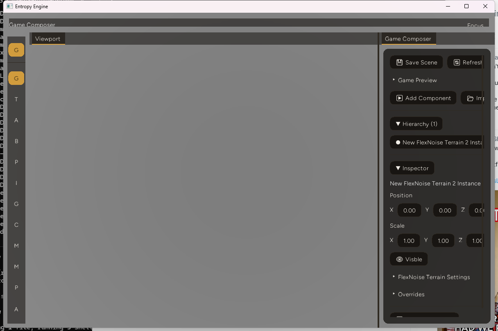

Entropy Engine's entire editor chrome - app shell, docking, panels, every widget, a hand-rolled video timeline, the JS-addon UI system - ran on `egui` + `egui-wgpu` + `egui-winit` + `egui_dock`, plus `egui-snarl` for a node-graph editor and `egui_code_editor` for script editing. All six of those crates are gone now, replaced by `entropy_gui`, an in-house immediate-mode kit living at `src/entropy_gui/`. This post covers what that migration actually involved, what it cost, and what still doesn't work.

## Why rip out a working UI library

The short version: egui worked, but the team wanted a foundation they controlled - a specific dark theme ("Slate": warm-black surfaces, one teal accent, 6px corner radii throughout) and tighter integration with the engine's existing rendering primitives, rather than fighting egui's `Style`/`Visuals` system from outside. Two research passes catalogued every egui/`egui_dock`/`egui-snarl`/`egui_code_editor` API actually used across the 13 call-site files before a line of the new kit got written, and surveyed what the engine already had lying around that a GUI kit needs anyway: `fontdue` for glyph rasterization (already used per-widget in `src/renderer_text/text_due.rs`), `lyon_tessellation` for rounded-rect geometry (already feeding the engine's native `Vertex` format), and an existing 2D screen-space wgpu pipeline with the right bind-group layout.

## The alias trick that made this a "safe" migration

The riskiest part of swapping out a UI library used across 13 files and ~239 call sites isn't the widget code - it's the import surface. `entropy_gui` was built as the real library, then `src/lib.rs` aliases the old crate names onto it:

```rust
pub mod entropy_gui;
pub use entropy_gui as egui;
pub use entropy_gui::backend::wgpu_renderer as egui_wgpu;
pub use entropy_gui::backend::winit_input as egui_winit;
pub use entropy_gui::dock as egui_dock;
```

This only works because the real `egui` crate is gone from `Cargo.toml` - no naming collision. I checked `src/core/pipeline.rs` against this claim directly rather than trusting the migration notes: it still imports `crate::egui`, `crate::egui_wgpu`, `crate::egui_dock`, still calls `egui_ctx.run(raw_input, |ctx| {...})` and gets back something it treats as `FullOutput`, still calls `egui_wgpu::ScreenDescriptor`. None of that changed. The call sites that *did* change are exactly the two deferred widgets (below) plus `src/core/egui_theme.rs`, which needed its content - not its structure - rewritten with the Slate color tokens.

## What's actually different under the alias

The alias makes the migration look invisible from the call sites, but the implementation underneath is not a clone of egui - it diverges in a few deliberate places:

**Single-pass, not two-phase.** egui's own docs describe the real integration loop: `ctx.run(raw_input, |ctx| {...})` produces a `FullOutput`, and tessellation into triangles happens as a *separate* step - `ctx.tessellate(full_output.shapes, pixels_per_point)`. That two-phase split exists so egui can do things like defer layout by a frame (the `Grid` widget uses `Context::request_discard` to hide first-frame misplacement). `entropy_gui` doesn't need any of that - one frame per redraw, no cross-frame shape retention. Widgets tessellate straight into a per-frame draw list as they're called; `ctx.tessellate()` is kept only as a thin, signature-compatible adapter so `pipeline.rs`'s call site didn't need touching.

**`Id` is a hashed `u64`, not `Uuid`.** Deliberate divergence from the engine's dominant `Uuid` convention elsewhere. Widget ids need to be a deterministic function of a label/parent-path (via `.with()`-style salting) so the same logical widget resolves to the same id across frames - that's what `Memory` lookups (scroll offset, open/closed state, drag state, text-edit cursor) key off of. A random id would break all of that.

**`Memory` is a closed enum, not `Any`-boxed.** `WidgetState` is `ScrollOffset | Open | Drag | TextEdit | WindowRect` - the full stateful-widget set was known from the API catalog up front, so there's no speculative `Any`-boxed generic store to maintain.

**Docking is a hand-rolled arena tree that copies egui_dock's actual shape.** I pulled egui_dock 0.18's own docs rather than going from memory: it represents docking as a binary tree where internal nodes are `Split` (storing a fraction) and terminal nodes are `Leaf` (holding tabs), addressed via `NodeIndex`. `entropy_gui`'s `dock/tree.rs` reimplements exactly that shape - `Node::{Leaf{tabs,...}, Split{fraction,...}}`, `NodeIndex(usize)` - and preserves an already-reverse-engineered semantic from the old `render_egui.rs`: the split `fraction` is always the *first* child's share (left for horizontal splits, top for vertical), regardless of whether the call was `split_left`, `split_right`, or `split_below`. Get that backwards and the app's already-tuned split ratios silently break. The source comment in `dock/tree.rs` calls this out explicitly so it doesn't read as an inconsistency later.

**Clipping is scissor-rect based**, matching the engine's existing convention elsewhere (`render_addon_frame.rs`'s `set_scissor_rect` calls) rather than shader-based per-vertex clipping - one less clipping model in the codebase, not two.

**Glyph atlas is shared and evicting.** The old per-widget atlas in `text_due.rs` was a non-evicting shelf packer - fine for a handful of large text blocks, not fine for a GUI with dozens of small widgets sharing space. `entropy_gui` adds `etagere = "0.2"` and ports the fontdue rasterization logic from `text_due.rs` almost verbatim, re-keyed to one shared cache.

## Evidence

I built `--bin editor --release` against this repo's pinned toolchain (wgpu 27.0.1, winit 0.30.12, `edition = "2024"`) and ran it. The release build finished clean (one unrelated unused-import warning in `src/bin/editor.rs`), producing a 71.25 MiB `editor.exe`.

Running it and opening a project gets you this - docked `Viewport`/`Game Composer` tabs, a scrollable Inspector panel with collapsing headers, drag-value fields for position/scale, a checkbox - all `entropy_gui` widgets, Slate theme, screenshotted from the actual running window this session, not a mockup:



First-party numbers, all pulled from this repo directly:

- **Size of the replacement**: `entropy_gui` is 4,734 lines across 39 files (`find src/entropy_gui -name "*.rs" | xargs wc -l`).
- **Dependency delta**: comparing `Cargo.lock` at the commit right before `entropy_gui` work started (`37f642b`) against `HEAD`, the resolved package count went from 1,110 to 1,099. 13 packages dropped out entirely - the 7 egui-family crates (`egui`, `egui-scale`, `egui-snarl`, `egui-wgpu`, `egui-winit`, `egui_code_editor`, `egui_dock`) plus 6 packages that existed only to support them transitively (`smithay-clipboard`, `wayland-protocols-experimental`, `wayland-protocols-misc`, `webbrowser`, `proc-macro2-diagnostics`, `duplicate`). 5 packages came in to support the replacement (`etagere`, `arboard`'s `chunked_transfer`/`ascii` transitive deps, `svg_fmt`, `tiny_http` - the last unrelated, added the same period for the addon MCP server). Still a ton of work ahead to reduce our dependency count.
- **Binary**: 71.25 MiB release `editor.exe`, this session, this machine.

## Decision log

- **Scope was locked to "replace the whole core shell, defer the two hardest widgets."** `egui`, `egui-wgpu`, `egui-winit`, `egui_dock` got a full from-scratch replacement. `egui-snarl` (node-graph editor) and `egui_code_editor` did not - they got placeholder widgets instead. The real tradeoff: once panels and docking run on `entropy_gui::Ui` instead of `egui::Ui`, the actual `egui-snarl`/`egui_code_editor` widgets - which need a real `&mut egui::Ui` - can't be invoked in place anymore without building a whole separate offscreen-egui bridge just to keep two of the twenty-some widgets. That's more engineering than the payoff justified for this pass, so both got simplified stand-ins instead, documented as an accepted regression rather than something quietly dropped.
- **`Id` as a hashed `u64` over `Uuid`** cost API-consistency with the rest of the codebase (which is `Uuid`-heavy) in exchange for the actual property the widget system needs: determinism across frames from a label/path, which a random id can't give you.
- **A closed `WidgetState` enum over `Any`-boxed storage** trades extensibility (a future exotic stateful widget needs a new enum variant, not just a new type) for not needing a generic store at all when the full set was already known.

## Failure notes

- **Text-edit is a documented v1 stand-in**, straight from the source comment in `widgets/text_edit.rs`: typing, backspace/delete, arrow nav, home/end, and Enter (multiline) all work. Click-to-place cursor does not - a click always jumps the caret to the end of the text. No drag-to-select. No IME composition despite key events being captured. No clipboard cut/copy/paste despite `arboard` already being a dependency for exactly that.
- **Code editor and node graph are exactly what the plan called them: placeholders.** `widgets_code_editor.rs` is 41 lines - a plain multiline text edit with a line-number gutter, no syntax highlighting. `widgets_node_graph.rs` is 50 lines - a read-only scrollable list of nodes and their connections, with an explicit doc comment: "Nothing here lets a user draw new connections - an accepted, documented regression until a real graph editor is built as a follow-up."